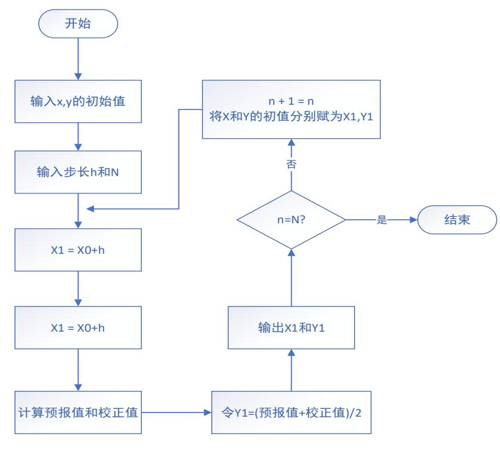
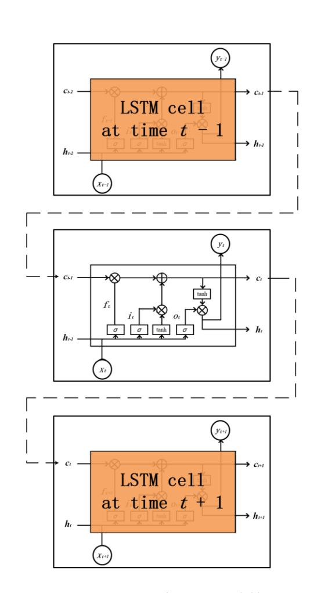
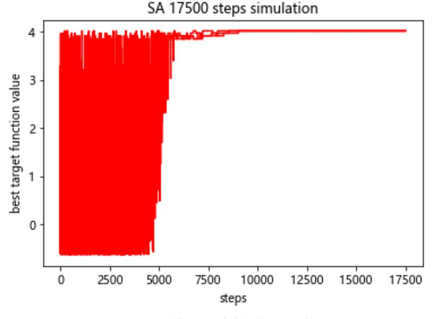

## 中国研究生创新实践系列大赛

# 中国光谷•"华为杯"第十九届中国研究生 数学建模竞赛

| 学校   | 长安大学        |  |
|------|-------------|--|
|      |             |  |
| 参赛队号 | 22107100039 |  |
|      | 1.任欣宇       |  |
|      | 2.王家璇       |  |
|      | 3.赵可        |  |

## 中国研究生创新实践系列大赛

# 中国光谷•"华为杯"第十九届中国研究生 数学建模竞赛

题 目

## 草原放牧策略研究

#### 摘 要:

农业是第一产业,是人类衣食之源、生存之本,是全世界人民进行一切生产活动 的首要条件。其中,草原是畜牧业扎根的发展环境,如何使发展兼顾畜牧业产能利益 和生态环境保护成为了研究人员探索的一项重要课题。因此,有关畜牧业可持续发展 的研究一直以来都是需要攻破的重点方向之一。本文基于题目提供的内蒙古锡林郭勒 盟草原放牧监测点信息、土壤物理和化学性质以及气候等数据,构建土壤性质植被与 生物量影响的数学模型、沙漠化程度指数预测模型与土地状态相关的预测模型,并进 行了合理的优化,对草原放牧可持续发展相关的数学和统计学知识有了较为深刻的理 解。

**不同放牧策略对与草原土壤物理性质和植被生物量影响程度(问题一)**,本题 从机理分析的角度,建立微分方程模型进行求解。首先根据题目已知内容从放牧方式 和放牧强度两个方面量化放牧策略。其次,考虑在无人干扰的情况下,土壤物理性质 主要受到气象因素的影响,其主要考虑的物理性质,即土壤湿度,存在降水、入渗、 蒸发、蒸腾等是一系列循环往复的过程。通过分析锡林格勒草原具体年份的年降水量, 结合土壤一植被一大气系统的水分平衡基本方程,建立锡林格勒草原**土壤水分动态模** 型。包括降水量、土壤蒸发量、植被截流量、土壤水渗透量等数学模型,建立放牧策 略与土壤湿度和植被生物量的一阶线性微分方程组。最后结合改进的欧拉方法求解一 阶微分方程组。并采用题目提供的附件中的数据对模型对植物生物量和土壤湿度进行 验证。

**对未来不同深度的土壤湿度的预测(问题二)**,本题结合给定的土壤湿度数据、 土壤蒸发数据和降水等数据变量,并选取相应的**时间序列预测**回归模型进行求解。首 先假设保持目前放牧策略不变,不同深度土壤湿度具有时序特征,使用**滑动窗口**的原 理进行时间序列划分,建立监督学习回归分析的数据,尝试建立 **BP 神经网络**模型, 但将题目所给数据代入后得出全连接的神经网络模型在已给数据中划分的测试集上 的拟合度较低、误差较大;为提高模型预测准确度,本题又建立了**长短时记忆网络** (LSTM)模型与带有注意力机制的双向长短时记忆网络(Attention-BiLSTM)模型 预测 2022 年、2023 年不同深度的土壤湿度。经过超参数优化和模型对比后得出 Attention-BiLSTM 模型在测试集的 R<sup>2</sup>、MSE、MAE、MAPE 各项指标都明显好于 其他神经网络,因此本题采用 R<sup>2</sup>为 0.88 的 Attention-BiLSTM 模型,得出 2022 年、 2023 年不同深度的结论。

**对草原土壤化学性质影响的预测(问题三)**,本题结合给定的锡林浩特国家气候 观象台生态监测样地实验数据,使用各放牧小区在不同时间的放牧强度、株/丛数和 重量作为自变量建立模型,使用**数据透视表**方法进行特征表格转换,运用**主成分分析** 

1

法 (PCA) 对数据预处理后的变量降维,得出 12 个主成分因子,建立集成学习模型, 集成随机森林和 XGBoost 两种机器学习模型同时训练和预测 5 种草原土壤化学性质, 分析了输入输出维度和结构,并建立了回归预测模型的评价指标。同时,为验证预测 算法的有效性,对随机森林、XGBoost 和支持向量机 (SVM) 3 种常见的预测方法 进行实现,进行模型对比。模型训练的过程中使用了交叉验证和网格搜索的方法保证 模型的最优化和健壮性。最终,虽然随机森林、XGBoost 和支持向量机模型预测的准 确程度都较好,但均明显弱于集成学习模型。因此,本题采用随机森林和 XGBoost 两种机器学习模型的集成学习模型对 2022 年锡林郭勒草原监测样地的 5 种草原土壤 化学性质进行预测。

对沙漠化指数预测模型与土壤板结化的定量描述(问题四),本题根据给定的模型定性描述出发,对两个模型分别进行量化描述。对于沙漠化指数预测模型,通过收集三个方面包括九个指标因子的数据进行因子强度转换,采用1-9比例标度法对指标的相对重要性进行量化,并通过层次分析法(ACP)将进行指标融合,从而得到因子权重系数,结合不同时间点不同放牧强度监测点对应的数据,即得出特定时空下不同放牧强度下的沙漠化程度指数。对于土壤板结化模型,根据问题一得到的不同放牧强度下对应的土壤物理性质与问题三中得到的土壤化学性质模型可得到影响土壤板结化的土壤湿度与土壤有机物含量,通过主成分分析(PCA)进行特征降维,得到3个主成分因子,将特征加权相加,即得出土壤板结化的定量描述。分别对上述两模型进行加权,计算不同放牧强度下的加权和,使得沙漠化指数与土壤板结化指数最小的放牧强度则为推荐策略。

**对实验草场内放牧羊数量的最大阈值的计算(问题五)**,本题结合附件给定的锡 林郭勒草原生态监测样地实验数据,结合问题三获取的草原各放牧小区土壤物理性质 和化学性质、问题四求得的不同放牧强度下各监测点的沙漠化程度指数以及题目给定 的锡林郭勒草原近 10 年包括年降水量在内的气候数据,根据**特征重要性理论**选取特 征,建立了基于**模拟退火算法**优化的**随机森林**模型,找到在不同降水量(300mm, 600mm、900 mm 和 1200mm)的情形下和草原沙漠化程度尽可能低的情况下最优的 放牧羊数量,作为可持续发展的放牧羊数量阈值,得出结论。

对土壤的基本性质进行预测(问题六),问题六要求根据示范区牧户的放牧策略 和问题四得到的最佳放牧策略对土壤的基本性质进行预测,包括土壤湿度、肥力、化 学性质和植被覆盖度等。首先需要对附件中提供的数据进行处理,转化为方面强度量 化的统一单位,然后根据放牧强度确定实验所在的小区进行数据整合和预处理,最终 采用问题二建立的模型对数据进行预测,对预测结果进行可视化展示。

关键词: 微分方程; 欧拉方法; 时间序列预测; LSTM; 双向神经网络; 注意力机制; 主成分分析; 随机森林; XGBoost; 集成模型; 层次分析法; 模拟退火算法

# 目录

| →, | 问题重述                     | 6    |
|----|--------------------------|------|
|    | 1.1 问题背景                 | 6    |
|    | 1.2 问题提出                 | 6    |
| 二, | 模型假设                     | 8    |
| 三、 | 问题一模型建立及求解               | 9    |
|    | 3.1 问题一分析与思路             | 9    |
|    | 3.2 模型建立                 |      |
|    | 3.2.1 放牧策略量化             | 9    |
|    | 3.2.2 确定变量               | . 10 |
|    | 3.2.3 变量间关系推导            | . 13 |
|    | 3.2.4 搭建微分方程模型           | . 14 |
|    | 3.3 模型求解                 | . 14 |
|    | 3.4 模型验证                 | . 16 |
|    | 3.4.1 数据处理               | . 16 |
|    | 3.4.2 验证结果               | . 18 |
|    | 3.5 问题小结                 | . 19 |
| 四、 | 问题二模型建立及求解               | . 20 |
|    | 4.1 问题二分析与思路             | . 20 |
|    | 4.2 数据分析                 |      |
|    | 4.2.1 土壤湿度数据分析           | . 21 |
|    | 4.2.2 植被指数 NDVI 数据分析     | . 24 |
|    | 4.2.3 相关性分析              | . 25 |
|    | 4.2.4 数据缺失值、重复值处理        | . 28 |
|    | 4.2.5 滑动窗口转换             | . 29 |
|    | 4.2.6 数据标准化              | . 30 |
|    | 4.2.7 数据集划分              | . 30 |
|    | 4.3 BP 神经网络              | . 30 |
|    | 4.3.1 BP 神经网络概述          | . 30 |
|    | 4.3.2 BP 神经网络训练过程        | . 31 |
|    | 4.4 LSTM 神经网络            | . 32 |
|    | 4.5 带有注意力机制的双向 LSTM 神经网络 | . 34 |
|    | 4.5.1 注意力机制              | . 34 |
|    | 4.5.2 双向 LSTM 网络         | . 34 |
|    | 4.6 模型训练                 | . 35 |
|    | 4.7 模型评价                 | . 36 |
|    | 4.8 模型对比                 | . 37 |
|    | 4.9 预测结果                 | . 39 |
|    | 4.10 问题小结                | . 40 |
| 五、 | 问题三模型建立及求解               | . 41 |

|    | 5.1 问题三分析与思路                    | .41  |
|----|---------------------------------|------|
|    | 5.2 数据分析                        | . 42 |
|    | 5.3 数据预处理                       | . 46 |
|    | 5.3.1 群落结构数据处理                  | . 46 |
|    | 5.3.2 放牧强度编码处理                  | . 47 |
|    | 5.3.3 主成分分析                     | . 47 |
|    | 5.4 随机森林                        | . 49 |
|    | 5.5 XGBoost                     | . 50 |
|    | 5.6 支持向量机                       | . 51 |
|    | 5.7 集成学习                        | . 52 |
|    | 5.8 模型训练                        | . 52 |
|    | 5.9 模型对比                        | . 53 |
|    | 5.10 预测结果                       | . 54 |
|    | 5.11 问题小结                       | . 54 |
| 六、 | 问题四模型建立及求解                      | . 56 |
|    | 6.1 问题四分析与思路                    | . 56 |
|    | 6.2 沙漠化程度指数预测                   | . 57 |
|    |                                 |      |
|    | 6.2.1 因子强度 ${\mathcal Q}_i$ 的率定 | . 57 |
|    | 6.2.2 计算因子权重系数                  | . 58 |
|    | 6.2.3 计算沙漠化指数预测值                | . 59 |
|    | 6.3 量化土壤板结化模型                   | . 60 |
|    | 6.4 指标融合                        | . 61 |
|    | 6.5 结果分析                        | . 61 |
|    | 6.6 问题小结                        | . 62 |
| 七、 | 问题五模型建立及求解                      | . 63 |
|    | 7.1 问题五分析与思路                    |      |
|    | 7.2 数据分析                        | . 63 |
|    | 7.3 数据预处理                       | . 66 |
|    | 7.4 模拟退火算法                      | . 67 |
|    | 7.5 模型训练                        | . 68 |
|    | 7.6 问题小结                        |      |
| 八、 | 问题六模型建立及求解                      |      |
|    | 8.1 问题六分析与思路                    | . 70 |
|    | 8.2 数据处理                        | . 70 |
|    | 8.3 结果可视化                       | . 71 |
|    | 8.4 问题小结                        | . 74 |
| 九、 | 模型评价与推广                         | . 75 |
|    | 9.1 模型的优点                       | . 75 |
|    | 9.2 模型的缺点                       | . 75 |
|    | 9.3 模型推广                        | .75  |
| +, | 参考文献                            | . 76 |

| 十一、 实验中用到的部分重要代码 | 77 | 7 |
|------------------|----|---|
|------------------|----|---|

## 一、问题重述

#### 1.1 问题背景

农业是第一产业,是提供支撑国民经济建设与发展的基础产业。草原上的植被以 禾本科植物为主的草地,在畜牧业中有很重要的地位。我国具有地大物博的自然资源, 现存天然草原有4亿hm<sup>2</sup>,占国土总面积的41.7%,其中可利用草地的面积为3.3亿hm<sup>2</sup>, 是我国面积最大的陆地生态系统[1]。草原在维护生物多样性、涵养水土、净化空气 、固碳、调节水土流失和沙尘暴等方面具有重要的生态功能。近年来有研究表明,适 度的放牧可以改善草原土壤质量、提高草原生物的多样性,但过度放牧会造成土地荒 漠化,对草原造成不可逆的永久损伤,从而使得畜牧业的经济效益大幅降低,影响国 家的食品供给安全和农业安全[2]。因此,在国家"绿水青山就是金山银山"的思想 指引下,越来越多的研究人员开始进行草原可持续发展相关的研究。

内蒙古锡林郭勒草原是温带草原中具有代表性和典型性的草原,是中国四大草原 之一。锡林郭勒草原是中国四大草原之一的内蒙古天然草原的主体,是最具代表性的 由東草和根茎草(针茅、羊草)组成的温带真草原,也是东亚地区保存最完整的部分 [3]。然而,据统计,1983~1991年,锡林郭勒草原退化面积曾经高达48%[4]。因 此,研究人员着手研究锡林郭勒草原的气候、土地的物理性质和化学性质,保证生态 环境良性健康发展,预防锡林郭勒草原的沙漠化,在发展中寻求环保之道,保护当地 的生态环境。

#### 1.2 问题提出

本文立足于锡林郭勒草原生态环境和畜牧业产业发展之间隐含的关系,以题目给 定的在锡林郭勒草原收集的大量有关牧民放牧行为和当地生态环境变化相关的数据 作为分析对象,通过数据挖掘技术来建立草原土地状态的数学模型,并设计大数据算 法计算牧民放牧对草原生态环境影响的条件,在保证牧民放牧的经济利益和产业发展 的同时,使其更好地保护自然环境和当地的草原生态,达到可持续发展的目的。下面 将对该数学问题进行提出和描述。

问题一:问题一要求根据题目提供的数据和模型,建立描述放牧强度对土壤湿度 和植物生物量的影响的数学模型。由于数据的缺失和不完善,无法通过数据分析建立 其变量之间的联系。需要通过确定各个变量之间的关系建立微分方程组来描述。

问题二:问题二要求根据给定的土壤湿度数据、土壤蒸发数据和降水等数据变量, 选取相应的进行求解预测。面对大量样本大量数据的情况,需要寻找适合于时间序列 预测的数据挖掘技术,选择训练集和测试集对预测模型进行训练和测试,得出未来 2022年、2023年不同深度土壤湿度的预测结果。根据时序特征,使用滑动窗口进行 时间序列划分,形成监督学习回归分析的数据,并建立模型,经过训练和预测,得出 2022年、2023年不同深度土壤湿度,填写表格。

问题三:问题三要求建立牧民采用不同放牧策略对锡林郭勒草原土壤化学性质影响的数学模型,并结合题目给定的数据预测锡林郭勒草原监测样地在不同放牧强度下 2022年同期的土壤化学性质。输入题目给定的不同放牧小区的放牧强度、株/丛数和 重量,建立机器学习模型,优化模型,进行训练和预测,得出在不同放牧强度下 2022 年土壤同期有机碳、无机碳、全 N、土壤 C/N 比等值,填写表格。

问题四:问题四要求将给定的沙漠化指数预测模型与土壤板结化模型进行定量描述,并给出量纲化的数值,表征不同放牧强度下对应的沙漠化与板结化程度,最后给出合适的放牧策略。结合问题一、三得出的不同放牧强度下土壤的物理性质与化学性质,以及附件所给数据,分别采用主成分分析法和层次分析法对两模型进行指标融合,赋予权重,得出量化的模型之后,在不同放牧强度下计算两模型的加权和,以制定最优策略。

问题五:问题五要求根据给定的锡林郭勒草原地区气候数据和问题三、问题四获 取和计算的锡林郭勒草原各放牧小区土壤物理性质、化学性质和牧放牧样地群落结构 等数据建立模型,在题目给定的降水量(300mm,600mm、900mm 和1200mm)的 情形作为条件时,以可持续发展为目标,兼顾生态环境保护和经济效益,对实验草场 内放牧羊的数量的最大阈值进行求解。

问题六:问题六要求根据附件 13 和问题四求解的放牧强度作为放牧策略,建立 预测模型对 2023 年 9 月相关的土壤物理性质进项预测。

## 二、模型假设

(1) 假设题目所给出的各变量数据全部真实可靠且有效;

(2) 假设各样本均存在偶然性,即不好的样本可以允许被剔除;

(3) 假设草原土地的物理、化学等性质与附件中给定的牧民活动以外其余变量的 关系可忽略;

(4) 假设附件中的样本以及要预测的未来年份和月份的样本测试条件与测试环境相同;

(5) 假设优化过程中各观测数据样本是独立的,不存在相互影响;

(6) 假设机器学习实验过程中计算机实验的环境不变。

## 三、问题一模型建立及求解

#### 3.1 问题一分析与思路

问题一要求建立放牧策略(放牧方式与放牧强度)对土壤物理性质和植物生物量影响的模型,其中土壤物理性质主要指土壤湿度。

放牧方式包含五种分别是:全年连续放牧、禁牧、选择划区轮牧、轻度放牧、生长季 放牧;放牧强度分为四种:对照、轻度放牧、中度放牧、重度放牧。在建立模型前需要考 虑放牧方式和放牧强度对放牧策略进行量化,考虑放牧方式和放牧强度中存在相似概念 的,比如禁牧和对照(无牧)都是全年无牧的情况,而其他不同程度的放牧方式都可以与 选择划区轮牧、轻度放牧、生长季放牧的放牧强度建立一定的关联关系。因此在问题一模 型建立量化放牧策略时可以以放牧强度为主要量化标准。由附件中提供的放牧与植物生长 的关系模型和土壤-植被-大气系统的水平衡基本方程,推导得到草原土壤水分动态模型。 最终结合影响土壤湿度的降水量、土壤水渗透量、土壤蒸发量和植被截流量等因素的关系 模型构建一阶微分方程组。确定放牧策略对土壤湿度和植物生物量的影响。问题一求解思 路如图 3-1 所示。


#### 3.2 模型建立

#### 3.2.1 放牧策略量化

放牧策略包括放牧方式和放牧强度两个方面。其中放牧方式有全年连续放牧、禁牧、 选择划区轮牧、轻度放牧、生长季休牧。放牧强度有对照、轻度放牧强度、中度放牧强度、 重度放牧强度。其中禁牧放牧方式与对照放牧强度量化时是一致的,对照即为无牧的情况, 若以0和1为量化标准,禁牧与对照都为0;全年连续放牧方式与重度放牧强度可以量化 为 1, 而轮牧、休牧和轻度放牧都意味着一年中有几个月不放牧,都可以转化为不同的放 牧强度。若从这样的角度去考虑,放牧方式的五种等级可以与放牧强度构成一定的关联关 系。转换为数学表达方式即如下。

记M为放牧策略, W表示放牧方式, S表示放牧强度。放牧策略可以表示为:

$$M = aW + bS$$

其中 a 与 b 表示放牧方式和放牧强度对放牧策略的影响程度。因为,放牧方式与放牧强度存在关联关系

$$S = cW$$

故放牧策略可以表示为:

$$M = kS$$

其中 $k = (b + \frac{a}{c})$ 表示待确定的权重。

由于系数 k 很难确定,本文中假设 k = 1,即放牧策略可以完全使用放牧强度进行量化。 根据题目中提供的信息。放牧强度采用单位面积牲畜密度来表示。具体量化结果如表 1 所 示。其中,羊指的是牲畜单位。

| $1 \times J^{-1}$ | 从仅来咱里们泪不 |
|-------------------|----------|
| 放牧策略              | 量化       |
| 对照                | 0 羊/天/公顷 |
| 轻度放牧              | 2 羊/天/公顷 |
| 中度放牧              | 4 羊/天/公顷 |
| 重度放牧              | 8 羊/天/公顷 |

表 3-1 放牧策略量化结果

#### 3.2.2 确定变量

无人干扰的野外天然环境状态下,影响土壤含水量即土壤湿度的主要原因包括降水、 气温、日照、湿度等气象要素和植被类型[5]。水分在土壤一作物一大气生态圈中通过降水 、入渗、蒸发等形式周而复始地循环,其过程十分复杂。根据题目提供的土壤-植被-大气 系统的水分平衡基本方程(1),可以知道,土壤的水分变化量由降水量(P)、地下水毛管 上升量(<sup>G<sub>u</sub></sup>)、土壤水渗透量<sup>G<sub>d</sub></sup>、实际蒸发量(<sup>Et<sub>a</sub></sup>)、入径流量(<sup>R<sub>in</sub></sup>)、出径流量(<sup>R<sub>out</sub>)和植被 截流量(<sup>IC<sub>store</sub>)等因素[6]。</sup></sup>

$$\Delta W = P + G_u + R_{in} - (Et_a + G_d + R_{out} + IC_{store}) \tag{1}$$

根据题目附件中提供的降水量数据,将其汇总为锡林浩特每年的降水量。对 2012-2021 年的降水量进行描述性统计。描述性统计主要是通过制表和图形等手段来描述数据的主要 特征,主要有频数统计,集中趋势分析等可以反应出数据的一般水平。描述性统计结果如 表 3-2 和图 3-2 和 3-3 所示。


图 3-2 锡林浩特年降水量


图 3-3 降水量频数分布图

| 统计量 | 统计结果       |
|-----|------------|
| 最大值 | 1685.03    |
| 最小值 | 302.01     |
| 平均值 | 842.291    |
| 标准差 | 494.71     |
| 中位数 | 735.085    |
| 方差  | 244737.606 |
| 峰度  | -1.216     |
| 偏度  | 0.49       |

表 3-2 降水量数据的描述性统计量结果

内蒙古锡林浩特草原棋气候类型属于大陆性气候中的温带半干旱草原气候,根据题目 中提供的锡林浩特草原概况得知,其平均年降雨量在 340mm 左右,与本文的分析结果存 在偏差,这可能是由于本文所采用数据年限时间为 2012-2021 年不具有全局代表性。但从 总体规律上看,依然满足典型草原类型气候的降水特征。年平均降雨量处于平均值以下的 年份达到 50%,主要降水时间在每年的 6-9 月份,占到全年降水量的 70%左右,其余月份 降水强度较小,且年降雨量最大值与最小值偏差达到 1383mm。

根据相关研究可知[7],典型草原地势较为平坦,水分的循环主要以垂直方向的水分 交换为主,土壤中的绝大部分水分是通过降水积累,且降水量较大的时间比较集中,水分 横向流失交换的比例较小。因此,在典型草原类型中,土壤的入径流和出径流可以视为相 等,且降水产生的径流可以忽略不计入。

并且,锡林浩特草原地下水埋藏较深,因此地下水毛管上升量对土壤含水量变化的影 响可以忽略不计。

另外,植被截流量也与降水量有很密切的联系,除了降水量外,还包含植被覆盖度和 叶面积指数。植被覆盖度指的是植物群落覆盖在地表程度的综合评价指标,叶面积指数 (LAI)指的是在单位土地面积中,植物叶面面积占土地面积的比例,叶面积指数是反应植物 群体生长状况的重要评价指标。他们之间存在着这样的关系:降水量小、植被覆盖率高、 叶面积指数大,植物截流量就大。

至于实际蒸散量,在本文中可以理解为土壤蒸发量。

综上述分析,问题一建立的放牧策略对土壤湿度和植物生物量影响程度的模型变量确 定为:降水量(P)、土壤水渗透量<sup>G</sup><sub>d</sub>、实际蒸发量(<sup>Et</sup><sub>a</sub>)、植被截流量(<sup>IC</sup><sub>store</sub>)、叶面积指数 (LAI)、植被覆盖度,如图 3-4 所示。


图 3-4 问题一模型变量

#### 3.2.3 变量间关系推导

根据 1.2.2 确定的模型变量,由于典型草原入径流量、出径流量和地下水毛管上升量 可以忽略不计,故公式(1)可改写为:

$$\Delta W = P - (Et_a + G_d + IC_{store}) \tag{2}$$

公式(2)即为典型草原土壤水分动态模型。

其中,植被截流量<sup>IC</sup>store的计算与降水量、植被覆盖度和叶面积指数相关。其模型可表示为:

$$IC_{store} = FVC \times IC_{\max}[1 - \exp(-kR_{cum} / IC_{\max})]$$
(3)

其中, FVC 为植被覆盖度; <sup>IC</sup>max 指的是最大截流量; <sup>k</sup> 为植被密度的校正系数; <sup>R</sup>cum 是累计降雨量,可以用公式(2)中的 P 表示; LAI 是叶面积指数,且植被密度校正系数 (k)和最大截流量(<sup>IC</sup>max)都与LAI 有关, <sup>IC</sup>max 可以通过其进行估算。具体估算方式 如下:

$$IC_{\rm max} = 0.935 + 0.498 \times LAI - 0.00575 \times LAI^2$$
(4)

植被覆盖度 FVC 的定义是绿色植被在地面的垂直投影面积占统计区域总面积的百分比。根据经验公式可以被表示为:

$$FVC = \frac{VI - VI_{soil}}{VI_{veg} - VI_{soil}}$$
<sup>(5)</sup>

*FVC*表示植被覆盖度,VI表示植被指数。VI可以是 NDVI,也可以是其他任何一种 植被指数。<sup>VI</sup>soil 表示完全裸露土壤所在区域的 VI 值,<sup>VI</sup>veg 表示植被完全覆盖区域的 VI 值。对于多数裸地表面,<sup>VI</sup>soil 理论值应该是 0,但是受大气效应和地表水分等因素影响, 其值一般在-0.1~0.2 之间。植被覆盖度的估算公式为:

$$FVC = \frac{VI}{VI_{veg}} \tag{6}$$

根据相关研究[8],内蒙古草地锡林浩特南部下垫面植被覆盖度模型可以被描述为:

$$FVC = (MNDVI - 0.014) / (0.0783 - 0.014)$$
<sup>(7)</sup>

该模型取样地点为内蒙古锡林浩特南部,处于纬度 43.62°N,经度 116.7°N.采用像元二 分模型方法构建,时间分辨率为 16,空间分辨率为 30。遥感资料来自于 Landsat5 TM 影像 数据。该模型的拟合精度采用 R-squared 指标衡量达到 0.865。因此,在问题一搭建的微分 方程模型中,植被指覆盖度模型采用公式(7)计算进行表示。

#### 3.2.4 搭建微分方程模型

ſ

根据题目给出的已知条件,放牧与植物生物量之间额关系模型可以表示为:

$$\frac{dw}{dt} = 0.049w(1 - \frac{w}{4000}) - 0.0047Sw$$
(8)

w为植被生物量, S为单位面积的载畜率, 即量化后的放牧策略。

因此,根据1.2.3 变量间公式推导的结果,结合公式(2)(3)(4)(7)(8)组成 放牧策略对土壤湿度和植物生物量影响的一阶微分方程组模型。如下所示。

$$\begin{cases} \Delta W = p - (Et_a + G_d + IC_{store}) \\ IC_{store} = FVC * IC_{max} [1 - \exp(-kR_{cum} / IC_{max})] \\ IC_{max} = 0.935 + 0.498 * LAI - 0.00575 * LAI^2 \\ FVC = (NDVI - 0.014) / (0.0783 - 0.014) \\ \frac{dw}{dt} = 0.049w(1 - \frac{w}{4000}) - 0.0047Sw \end{cases}$$

#### 3.3 模型求解

问题一建立的模型可以采用改进欧拉公式的解法进行求解。

改进欧拉法是对欧拉算法的改进。欧拉算法是求解方程组数值解的方法。数值解法的本质就是将连续的问题转化为再给定离散点上的差分方程。在常微分方程解的存在区间 [*a*,*b*]内,取*n*+1个结点,在这些结点上把常微分方程的初值问题离散化为差分方程的相应问题,再求出这些点上的差分方程值作为相应的微分方程的近似值[9]。欧拉公式如下所示:

$$y_{k+1} = y_k + h^* f(x_k, y_k)$$

其中所指的微分方程如下。

$$\begin{cases} y'(x) = f(x, y) \\ y|_{x=0} = y_0 \end{cases}, (a = x_0 \le x_1 \le \dots \le x_n = b) \end{cases}$$

在欧拉公式中, $y_0$ 为起始值是已知的。等距步长 $h = x_{k+1} - x_k$ ,步长取得越小,运算精度越高,但运算量就会增大。

改进欧拉法会具有比欧拉法更高的计算精度同时不会增加较高的运算量。改进欧拉方 程分为两部分,先由欧拉格式计算得一个初步的近似值[10]

称之为预报值记为:

$$\overline{y}_{n+1} = y_n + hf(x_n, y_n)$$

再将上述<sup>-</sup>/<sub>y<sub>n+1</sub></sub>代入下述公式得到校正值。

$$y_{n+1} = y_n + \frac{h}{2} [f(x_n, y_n) + f(x_{n+1}, y_{n+1})]$$

这个公式是欧拉算法的梯形方法。通过这个公式计算得到的校正值如下:

$$y_{n+1} = y_n + \frac{h}{2} [f(x_n, y_n) + f(x_{n+1}, \overline{y}_{n+1})]$$

将其改写为平均化(平均斜率形式):

$$\begin{cases} y_p = y_n + hf(x_n, y_n) \\ y_c = y_n + hf(x_{n+1}, y_p) \end{cases}$$
$$y_{n+1} = \frac{1}{2}(y_p + y_c)$$

改进欧拉方法求解微分方程组的具体流程如图 3-5 所示。



图 3-5 改进欧拉方程的求解过程

#### 3.4 模型验证

根据附件提供的数据对问题一建立的微分方程模型进行验证。首先需要对数据进行处理。再根据变量间的关系式计算出相应的值。对模型进行仿真,输出仿真结果。

#### 3.4.1 数据处理

附件 15 中提供的锡林格勒草原不同放牧强度下的群落结构监测数据,由于放牧测却 的量化单位为单位面积载畜率/天。附件 15 提供的数据中存在同一天内不同植物的生物量, 在问题一中,需要对附件 15 中的数据进行统计,将同一监测时间的放牧强度一致的数据 进行累加,最终分别形成四种不同放牧强度的植物生物量时间序列数据。植物生物量数据 处理结果展示如下图组 3-6 所示。


图 3-6 不放牧强度下植物生长量的变化

降水量数据由附件 8 中的数据进行提取; 土壤蒸发量数据由附件 4 提供; 植被截流量 通过模型(3)计算得到, 其中 FVC 由模型(7)计算得到, 植被指数 NDVI 由附件 6 提供, 叶面积指数由附件 10 提供; 部分数据计算和处理结果如下表 3-3 所示。

| 测定时间<br>2019 年 | 放牧强度 | 生物量     | 降水量   | LAI   | NDVI  | FVC   | $IC_{store}$ | $Et_a$ | $\Delta W$ |
|----------------|------|---------|-------|-------|-------|-------|--------------|--------|------------|
| 05-10          | 0    | 218.21  | 6.6   | 0.739 | 0.207 | 0.305 | 0.017        | 22.68  | 21.36      |
| 06-26          | 0    | 1469.32 | 11.94 | 0.827 | 0.266 | 0.28  | 0.127        | 21.56  | 97.57      |
| 07-24          | 0    | 2050.18 | 32.26 | 0.964 | 0.329 | 0.28  | 0.155        | 20.25  | 102.33     |
| 05-10          | 2    | 318.91  | 6.6   | 0.739 | 0.207 | 0.36  | 0.002        | 22.68  | 199.05     |
| 06-26          | 2    | 1458.73 | 11.94 | 0.827 | 0.266 | 0.285 | 0.253        | 21.56  | 512.14     |
| 07-24          | 2    | 1652.28 | 32.26 | 0.964 | 0.329 | 0.416 | 0.111        | 20.25  | 608.71     |
| 05-10          | 4    | 303.73  | 6.6   | 0.739 | 0.207 | 0.425 | 0.052        | 22.68  | 177.18     |
| 06-26          | 4    | 1436.02 | 11.94 | 0.827 | 0.266 | 0.379 | 0.413        | 21.56  | 713.75     |
| 07-24          | 4    | 1659.14 | 32.26 | 0.964 | 0.329 | 0.260 | 0.705        | 20.25  | 742.06     |
| 05-10          | 8    | 251.67  | 6.6   | 0.739 | 0.207 | 0.549 | 0.386        | 22.68  | 284.08     |
| 06-26          | 8    | 1083.2  | 11.94 | 0.827 | 0.266 | 0.652 | 0.513        | 21.56  | 415.5      |
| 07-24          | 8    | 1349.69 | 32.26 | 0.964 | 0.329 | 0.502 | 0.772        | 20.25  | 501.82     |
|                |      |         |       |       |       |       |              |        |            |

表 3-3 部分数据计算和处理结果

#### 3.4.2 验证结果

输入数据后,问题一建立的模型开始对放牧策略与植被生物量和土壤湿度的影响开始 仿真。模型验证的结果如下图 7 和图 8 所示。

根据图 3-7 和图 3-8 可以看出,当放牧强度处于轻牧时,植物生物量与对照实验无牧并 无较大差别,土壤湿度由于降水季节性原因在轻牧放牧强度下也无较大波动。中牧与重牧 放牧强度相比较无牧的情况下明显减少了植物生物量。这说明轻度放牧有助于植物群落的 保持和繁衍,有利于保持生态平衡。重度放牧则不顾生物圈生态平衡,破坏草原植物生态 系统,无法做到可持续发展。对于土壤湿度来说,随着放牧强度的增加,土壤湿度有缓慢 的增加趋势,这可以解释为动物在土地表面的踩踏行为,促进了地表和地下水环境的流动, 增加了土壤湿度。


图 3-7 放牧强度对植物生物量的影响


图 3-8 放牧强度对土壤湿度的影响

#### 3.5 问题小结

问题一的目的是要建立放牧策略对土壤湿度和植物生物量影响的数学模型。首先拿到数据观察以后,发现无法从数据分析的角度对变量间的关系进行量化。因此决定采用微分方程进行建模。首先需要量化放牧策略,从放牧方式和放牧强度两个角度,将放牧策略量化为单位面积载畜率,从对照到重牧分别为0、2、4、8(羊/天/公顷)。随后根据题目提供的放牧强度和植物生长量之间的关系、土壤-植被-大气系统的水平衡方程,确定模型的主要变量为降水量(P)、土壤水渗透量(*G*<sub>d</sub>)、实际蒸发量(*Et*<sub>a</sub>)、植被截流量(*IC*<sub>sore</sub>)、叶

面积指数(*LAI*)、植被覆盖度。其次,通过分析锡林格勒典型草原的气候状况和基本地理特征,以及查询文献确定各个主要变量间的关系模型,形成草原土壤水分动态模型,结合放牧强度与植物生物量关系模型,构建一阶线性微分方程组。最终利用改进欧拉方程方法进行求解,根据题目已知数据和查阅的数据对模型进行验证。

## 四、问题二模型建立及求解

#### 4.1 问题二分析与思路

问题二要求结合给定的土壤湿度数据、土壤蒸发数据和降水等数据变量,并选取相应的回归模型进行求解,计算 2022 年、2023 年不同深度的土壤湿度。

我们发现,土壤湿度数据、土壤蒸发数据和降水等数据变量有时间序列的特征,具有 时序特点的数据集通常需要使用滑动窗口将时序数据转换成监督学习的数据集。本问题的 目标就是找到影响土壤部分物理性质内部隐含的时序特征,预测未来的土壤湿度。本文运 用相关性分析、长短时记忆网络(LSTM)模型与带有注意力机制的双向长短时记忆网络 (Attention-BiLSTM)等方法,结合文献综合建模。确定 2022 年、2023 年不同深度的土壤 湿度。操作流程图如下图 4-1 所示:


图 4-1 问题二操作流程

#### 4.2 数据分析

附件 3、4、6、10 提供了 2012 年到 2020 年锡林郭勒草原指定地点(北纬 44.125,东 经 115.375)牧场土壤的湿度、蒸发量、植被指数 NDVI 以及叶面积指数 LAI。这些数据以 月为单位。本小节按照要求,主要对土壤的湿度和植被生物量(植被指数 NDVI)进行简 要分析。

#### 4.2.1 土壤湿度数据分析

土壤湿度表格数据包含 8 列,分别为月份、年份、经度(lon)、纬度(lat)、10cm 湿度(kg/m<sup>2</sup>)、40cm 湿度(kg/m<sup>2</sup>)、100cm 湿度(kg/m<sup>2</sup>)和 200cm 湿度(kg/m<sup>2</sup>)。其中,10cm 湿度(kg/m<sup>2</sup>)、40cm 湿度(kg/m<sup>2</sup>)、100cm 湿度(kg/m<sup>2</sup>)和 200cm 湿度(kg/m<sup>2</sup>)这 4 条特征是要观察的有效变量。数据从 2012 年 1 月到 2020 年 3 月,以月为单位,共 123 条观测记录。这些数据的特征类型和简要统计学描述如表 4-1 所示:

表 4-1 土壤湿度数据特征类型和简要统计学描述

| ID | 特征名                          | 类型    | 标准差    | 平均值     | 最大值    | 最小值    |
|----|------------------------------|-------|--------|---------|--------|--------|
| 1  | 10cm 湿度(kg/m <sup>2</sup> )  | float | 2.849  | 14.567  | 22.1   | 9.64   |
| 2  | 40cm 湿度(kg/m <sup>2</sup> )  | float | 7.476  | 42.383  | 61.7   | 29.71  |
| 3  | 100cm 湿度(kg/m <sup>2</sup> ) | float | 14.536 | 55.351  | 93.45  | 42.36  |
| 4  | 200cm 湿度(kg/m <sup>2</sup> ) | float | 0.976  | 167.218 | 168.56 | 164.48 |

其中,每个年份的土壤湿度数据的标准差、平均值、最大值、最小值分别可以使用箱 线图清晰直观地可视化表示。每个年份 10cm 湿度(kg/m<sup>2</sup>)、40cm 湿度(kg/m<sup>2</sup>)、100cm 湿度 (kg/m<sup>2</sup>)和 200cm 湿度(kg/m<sup>2</sup>)的箱线图如图 4-2~图 4-5 所示:


图 4-2 10cm 湿度(kg/m<sup>2</sup>)箱线图


图 4-4 100cm 湿度(kg/m<sup>2</sup>)箱线图


我们发现,10cm的土壤湿度在近10年间基本保持上下浮动但较为稳定,40cm和100cm的土壤湿度有增长的趋势,其中100cm的土壤湿度有显著的增长趋势。而200cm的土壤湿度在近10年间保持持续下降的趋势。

接着,通过直方图和曲线近似拟合图结合的方式,查看不同年份、不同厘米数的土壤 深度的分布图。通过频率分布直方图可以看出土壤深度在不同年份上的分布情况。不同年 份、不同厘米数土壤深度的直方图和曲线图如图 4-6~图 4-9 所示:


图 4-6 10cm 湿度(kg/m<sup>2</sup>)直方图和曲线拟合图


图 4-7 40cm 湿度(kg/m<sup>2</sup>)直方图和曲线拟合图


图 4-9 200cm 湿度(kg/m²)直方图和曲线拟合图

## 4.2.2 植被指数 NDVI 数据分析

植被指数 NDVI 表格数据包含 5 列,分别为月份、年份、经度(lon)、纬度(lat)和植被指数(NDVI)。其中,植被指数(NDVI)特征是要观察的有效变量。数据从 2012 年 1 月到 2020 年 4 月,以月为单位,共 124 条观测记录。这项数据的特征类型和简要统计学描述如表 4-2 所示:

|    | 表 4-2 植被  | b指数 NDV | I数据特征 | 类型和简要约 | 記计学描述 |        |
|----|-----------|---------|-------|--------|-------|--------|
| ID | 特征名       | 类型      | 标准差   | 平均值    | 最大值   | 最小值    |
| 1  | 植被指数 NDVI | float   | 0.147 | 0.238  | 0.605 | -0.017 |

植被指数 NDVI 数据的标准差、平均值、最大值、最小值以及分布情况也使用箱线图 和直方图与曲线拟合图清晰直观地可视化表示。每个年份植被指数 NDVI 的箱线图以及植 被指数 NDVI 数据的频率分布及其曲线拟合图如图 4-10 和图 4-11 所示:


图 4-10 植被指数(NDVI)箱线图

从以上箱线图中,可以看到,除2022年仅观测冬季导致植被较少以外,植被指数(NDVI) 的中位数在2021年达到了最高点,平均值和中位数也大致有着逐年上升的趋势。在大多 数年份,植被指数较为稳定。


4.2.3 相关性分析

将土壤的湿度、蒸发量、植被指数 NDVI 以及叶面积指数 LAI 表格中的数据按照相同 的年份、月份进行联表合并,得到了一个新的表格,这个表格全面地反映了锡林郭勒草原 指定观测地点的土地物理性质。如果某个月份的数据只有部分表格中提供,则这些不完整 的数据不会在连接后的表格中出现。经过联表处理,锡林郭勒草原土壤物理性质共 123 条 观测记录。

为了更好地理解锡林郭勒草原土壤物理性质,对这一表格进行相关性分析。

(1) Pearson 相关系数

在统计学中, Pearson 相关系数[11](Pearson correlation coefficient, PCC)也称为Pearson's r或Pearson 积矩相关系数 (Pearson product-moment correlation coefficient, PPMCC),用来 衡量两组数据或多组数据两两之间的线性相关性。

Pearson 相关系数是两个变量的协方差与其标准差的乘积之比。因此,Pearson 相关系数本质上是协方差的归一化测量。所以,Pearson 相关系数的值始终介于-1 和 1 之间。与协方差本身一样,该测量只能反映变量的线性相关性,而忽略许多其他类型的关系。

Pearson 相关系数的公式如下所示:

$$\rho_{(x,y)} = \frac{\operatorname{cov}(x,y)}{\sigma_x \sigma_y}$$

热力图 (Heatmap) [12]是数据的一种二维视觉表示方法,其中不同的颜色及其深浅程度代表不同的值。热力图可以与各种数据一起使用,对数据分析人员来说是一种有用的视觉辅助工具,可以快速传播统计或数据驱动的信息。当分析诸如变量的相关性这类数据两两之间的关系时,通常会使用热力图。

使用热力图对锡林郭勒草原土壤物理性质数据的 Pearson 相关系数进行数据可视化, 如图 4-12 所示:


图 4-12 土壤物理性质数据 Pearson 相关系数热力图

(2) Spearman 相关系数

Spearman 相关系数(Spearman's rank correlation coefficient)是统计学中相关性的一种 非参数测量方法,体现了两个变量的等级之间的统计相关性。Spearman 相关系数描述了使 用单调函数可以描述两个变量之间的关系的程度。

当被比较的两个变量单调相关时, Spearman 相关系数为1, 即使它们的关系不是线性的。这意味着所有 *x* 值大于给定数据点的数据点也将具有更大的 *y* 值。Spearman 相关系数的公式如下所示:

$$r_s = \rho_{\mathbf{R}(X),\mathbf{R}(Y)} = \frac{\operatorname{cov}(\mathbf{R}(X),\mathbf{R}(Y))}{\sigma_{\mathbf{R}(X)}\sigma_{\mathbf{R}(Y)}}$$

使用热力图对锡林郭勒草原土壤物理性质数据的 Spearman 相关系数进行数据可视化,

#### 如图 4-13 所示:


图 4-13 土壤物理性质数据 Spearman 相关系数热力图

作为一般规则,进行数据探索时,通常同时计算 Pearson 相关系数和 Spearman 相关系数。这是因为两者之间的任何差异都可以进一步阐明变量之间的关系,以及数据本身的任何异常。当猜测变量的关系可能是线性的时候,或在区间尺度上测量数据的时候,Pearson 相关系数更加合适;当猜测变量的关系是单调的时候,或以序数尺度测量数据,亦或者当异常值比大多数数据点大几个数量级的时候,Spearman 相关系数更加合适。

从图上可以明显地看到,高层植被(LAIH,m2/m2)这项特征没有 Pearson 相关系数和 Spearman 相关系数。回看表格进行检查,发现高层植被(LAIH,m<sup>2</sup>/m<sup>2</sup>)特征在所有年份、月 份全为0,是一项无用的特征。

除此之外,土壤蒸发量(W/m<sup>2</sup>)和土壤蒸发量(mm)两项特征完全相关,而土壤蒸发量和 湿度之间的相关性很低。植被指数与较低厘米数的湿度相关性较为密切。这都给后续的分 析和建模带来了灵感和方向。

#### 4.2.4 数据缺失值、重复值处理

部分情况下,使用统计调查或传感装置收集的样本中会出现数据缺失的现象。造成该 现象的原因可能是数据的收集或采集时,系统装置没有能够实时感应到数据的变化并及时 将其记录,或由于通讯设备故障导致数据上传失败,也可能是数据处理、统计、汇总的过 程中出现错误。统计学中将数据缺失记录称为不完全观测,这类数据缺失会对模型结果产 生较大的影响。因此需要对含有空值的变量数据进行缺失数据处理。

有些时候,收集的数据也可能出现重复值。这是由于有些收集手段,如互联网爬虫, 存在信息交互的延时,也可能是因为收集数据的外接传感器出现了一些存储上的故障。所 以,在拿到数据进行分析之前,需要对数据进行重复值删除的处理。

通过观察,发现本题中给定的土壤的湿度、蒸发量、植被指数 NDVI 以及叶面积指数 LAI 数据中没有缺失值和重复值。所以,经过缺失值和重复值的删除操作后,观测记录仍为 123 条。

根据上述的相关性分析,土壤蒸发量(W/m<sup>2</sup>)和土壤蒸发量(mm)两项特征由于相关性为 1,将其中一列土壤蒸发量(mm)移除;高层植被(LAIH,m<sup>2</sup>/m<sup>2</sup>)不随着年份、月份的时序变 化而改变,所以也将其删除。

#### 4.2.5 滑动窗口转换

由于获取的锡林郭勒草原土壤物理性质数据是一系列时间序列数据,为了解决时间序 列预测问题,需要提取土壤物理性质数据的时间序列特征。这个操作完成后,模型对数据 的理解就会遵循时序规律。由于时间序列的特点,滑动窗口用于将土壤物理性质观测值转 换为监督学习数据集。根据这一分析和设计,使用滑动窗口的原理对数据进行处理,其原 理如图 4-14 所示。


图 4-14 滑动窗口时间序列转换原理图

从土壤物理性质数据表的开始,滑动窗口将前 n-1 个观测记录作为输入特征 fea<sub>1</sub>,将 时间 n 对应的观测记录作为对应的目标值 tar<sub>1</sub>。然后,向前移动一步,并执行相同的操作 以获得 fea,和 tar<sub>2</sub>。重复上述步骤,直到最后一组观测值成为目标表的最后一组目标值。

因此,将时间序列中的土壤物理性质数据转换为监督学习数据集后,该监督学习数据 集的每一行的特征值为第 *t-n* 个到第 *t-*1 个时间戳的观测记录,目标值为在第 *t* 个时间戳的 观测记录。

#### 4.2.6 数据标准化

在训练之前,通常需要将数据从原始值进行标准化,使其缩放到均值为0、方差为1 的范围内,以便为模型更好地理解数据的关系创造良好的条件。数据标准化对于促进和改 进数据的使用至关重要,特别是与数据可移植性(即在不影响其内容的情况下传输数据的 能力)和互操作性(即集成两个或多个数据集的能力)有关的方面。数据标准化有助于减 少与数据质量差相关的挑战,包括增加的运营成本、无法联系到的客户和错误的决策。

标准化方法如以下公式所示:

$$x^* = \frac{x - x}{\sigma}$$

式中, $\sigma$ 为标准差,x为x的平均值。

#### 4.2.7 数据集划分

在对转换为监督学习数据集后的土地物理性质数据进行随机打乱后,将数据分成训练 集和测试集,用于训练和测试。80%的数据用于模型训练,其余用于测试。

#### 4.3 BP 神经网络

#### 4.3.1 BP 神经网络概述

BP(Back Propagation,反向传播)神经网络是神经网络中较为基础的网络,是一种按误差逆传播算法训练的多层神经网络,利用梯度搜索技术使得网络的输出值和实际输出值的误差均方差最小。

其中,误差采用逆传播,输出结果采用正向传播。逆传播指 BP 神经网络利用输出后的误差向上一个输入层反传,以调整前输入层的权值和阈值使误差最小。BP 神经网络模型包括输入层、隐藏层和输出层。

一个输入为 d 维变量和输出为 l 维的 BP 神经网络模型如图 4-15 所示。图中的隐藏层 实际建模的时候可以有多层。


图 4-15 BP 神经网络模型图

在图中,输入层单元到隐藏层单元的通道权重由v表示,例如输入层第i个单元到隐藏 层第h个单元的信息通道为v<sub>ih</sub>。隐藏层单元到输出层单元的信息通道权重由*w*表示。例如 隐藏层第h个单元到输出层第*j*个单元的信息通道权重为*w<sub>hj</sub>*。由于其对非线性关系较强的 映射能力,在求解函数逼近问题、模式识别、分类以及数据压缩领域都被研究者们广泛使 用。

#### 4.3.2 BP 神经网络训练过程

首先,定义一个有 n 个神经元的输入层、p 个神经元的隐含层、q 个神经元的输出层。 定义向量如下表 4-3 所示。

|         | 农 -5 DI 行红网络向重足入农 |                  |  |  |  |
|---------|-------------------|------------------|--|--|--|
| 向量名     | 解释                | 定义               |  |  |  |
| 输入向量    | 样本特征值特征个数         | x                |  |  |  |
| 隐藏层输入向量 | 隐藏层与输出层连接权值       | ${\cal V}_{ih}$  |  |  |  |
| 隐藏层输出向量 | 隐藏层各神经元的阈值        | $arnothing_{hj}$ |  |  |  |
| 输出向量    | 样本目标值特征个数         | У                |  |  |  |

表 4-3 BP 神经网络向量定义表

首先,需要将 BP 神经网络进行初始化,给各层级结点及连接权值赋初值,一般初值 是取在-1 和1之间的随机数。设定误差函数 e、计算精度值<sup>*ε*</sup>和最大学习次数 M。

然后,随机选择若干个样本作为输入,并输入其原本对应的期望输出。对于隐含层, 计算其对应的神经元个数及输入和输出,通过神经网络中输出的数据和实际真实数据进行 对比,计算误差函数并得到输出层神经单元的偏导数。若输出层误差满足最小误差要求则 结束,若不满足则还需要计算隐含层单元误差及其神经单元偏导数,再结合输出层神经单

元偏导数修正连接权值。重复以上步骤,直到误差达到神经网络预设的精度ε或着超过最 大学习次数 M,结束算法过程

具体算法流程图如图 4-16 所示。


图 4-16 BPNN 算法流程图

#### 4.4 LSTM 神经网络

LSTM(Long Short-Term Memory,长短时记忆)神经网络是循环神经网络[13](Recurrent Neural Network, RNN)的一种,可以从时间序列中学习长期依赖关系,广泛应用于深度 学习。LSTM 神经网络专为输入数据按时间序列排序的实际应用程序而设计。其中,序列 中要预测的值前几个时刻的信息对于训练效果是必不可少的。简单的 RNN 无法处理长距 离依赖,其隐藏层只有一个状态 h,对短期输入非常敏感。LSTM 在 RNN 中加入了一个状态 c,称为 cell state,这样就可以保存长期的状态。

LSTM 中的节点使用内部状态作为数据内存存储单元。它们可以在多个时间步长上存储和检索信息。输入值、先前的输出和内部状态都用于节点计算。计算结果不仅用于提供输出值,还用于更新状态。LSTM 节点与普通神经网络节点一样,具有确定计算中使用的输入数据权重的参数,但 LSTM 也具有称为门的参数,用于控制节点内的信息流。这些门的参数包括训练产生的权重和偏差。

LSTM 神经网络的结构如图 4-17 所示:

在时间*t*, *h*<sub>t</sub>代表短期记忆, *c*<sub>t</sub>代表长期记忆。遗忘门的作用是控制网络下次更新状态时需要丢弃的信息量。遗忘门的状态更新公式为:

$$f_t = \sigma(W_f \cdot [h_{t-1}, x_t] + b_f)$$

输入门的作用是控制和选择神经网络的输入数据的哪一部分应该保留在单元中。输入 门的状态更新公式为:

$$i_{t} = \sigma \left( W_{i} \cdot [h_{t-1}, x_{t}] + b_{i} \right)$$
$$\tilde{c}_{t} = \tanh(W_{c} \cdot [h_{t-1}, x_{t}] + b_{c})$$
$$c_{t} = f_{t} * c_{t-1} + i_{t} * \tilde{c}_{t}$$

输出门的作用是从神经网络的当前单元状态中控制和选择要输出的数据。输出门的状态更新公式为:

$$o_{t} = \sigma \left( W_{o} \left[ h_{t-1}, x_{t} \right] + b_{o} \right)$$
$$h_{t} = o_{t} * \tanh(c_{t})$$

上述等式和图中符号的含义如下:

 $f_t$ :遗忘门在时间t的激活向量

 $i_t$ : 输入门在时间t的激活向量

 $o_t$ : 输出门在时间t的激活向量

 $x_t$ : LSTM 单元在时间t的输入向量

 $y_t$ : LSTM 单元在时间t的输出向量

 $c_t$ : *t*的 cell 状态信息

 $\tilde{c}_t$ : *t*时刻的 cell 输入激活向量

W:更新状态时 LSTM 单元的权重

b: 计算过程中的偏置项

 $h_t$ : LSTM 单元在时间t的隐藏状态向量

LSTM 门的值从 0 到 1 不等,代表允许通过多少信息,所以使用 Sigmoid 函数 ( $\sigma$ ) 作为激活函数。



图 4-17 LSTM 神经网络结构图

#### 4.5 带有注意力机制的双向 LSTM 神经网络

#### 4.5.1 注意力机制

在神经网络中,注意力机制是一种模仿人类认知事物的注意力的技术。这种效果增强 了输入数据的某些部分,同时减少了其他部分。注意力机制的动机是网络应该更多地关注 数据的小但重要的部分。学习哪一部分数据比另一部分更重要取决于上下文,这一行为通 过梯度下降训练。

神经网络被认为是一种计算机模拟大脑神经元动作的模型,注意力机制也是一种尝试 实现相同的动作,即选择性地专注于一些相关的事情,而忽略深度神经网络中的其他事情。 神经网络的注意力层接受三个输入:查询、值和键。这些输入通常是相同的,其中查询是 一个键并且键和值是相等的。

#### 4.5.2 双向 LSTM 网络

双向长短时记忆(BiLSTM, Bidirectional LSTM)网络[14]是使 LSTM 神经网络在向后(从未来到过去)或向前(从过去到未来)两个方向上都具有序列信息的模型。

在双向 LSTM 网络中,输入在两个方向上流动,使得 BiLSTM 与常规 LSTM 不同。使

用常规LSTM,输入流指向一个方向,向后或向前。但是,在双向LSTM 网络中,可以使输入双向流动,以保留未来和过去的信息。

BiLSTM 网络拥有来自后向层和前向层的信息流。BiLSTM 通常用于需要序列到序列 任务的地方。这种网络可用于文本分类、语音识别和预测模型。

#### 4.6 模型训练

BP 神经网络模型、LSTM 模型和 Attention-BiLSTM 模型训练的流程图如图 4-18 所示。 首先,对时间序列数据进行预处理,以构建监督学习数据集。然后,为模型选择一组超参数。之后,将偏移的土壤物理性质数据输入模型。

对于每一轮 epoch 的训练,将训练集划分 80%用于模型训练,将剩下的 20%作为验证 集(validation set),计算并记录所构建模型这个 epoch 在验证集上的 loss 和评价指标。如 果输出的 loss 值能够满足我们的期望,模型将被保留。否则,重复上述过程,直到模型能 够满足我们准确预测未来土壤物理性质的需求。最后,保存具有最优超参数选择的模型。 模型训练的过程如图 4-19 所示:


图 4-19 神经网络模型训练过程

由于求未来的草原土壤物理性质是一个回归问题,使用 ReLU 作为神经网络隐藏层的 激活函数,并将 tanh 设置为 LSTM 的激活函数。

$$ReLU(x) = \begin{cases} 0, & x \le 0\\ x, & x > 0 \end{cases}$$
$$tanh(x) = \frac{e^{x} - e^{-x}}{e^{x} + e^{-x}}$$

在训练的每个 epoch 中,随机选择训练集的 80%数据输入网络,剩余的 20%用于验证。 平均绝对误差 (Mean Absolute Error, MAE) 用作神经网络的损失函数,均方误差 (Mean Squared Error, MSE) 用于验证每个 epoch 训练性能的指标。在每个 epoch 之后,数据集都 会被打乱。在训练过程中,早停策略(Early Stopping)用于控制训练 epoch 的数量,以防 止模型过拟合。如果验证集上的 MSE 连续 10 个 epoch 没有下降,则认为模型在当前超参数组合下达到了最优训练效果。

输入模型的表的特征数量由滑动窗口的长度 n 决定,这意味着调整 n 会影响模型的训练效果。因此,除了改变模型的超参数外,还需要仔细选择和调整之前预处理阶段的滑动窗口大小,以使模型发挥最佳精度,如图 4-20 所示。


图 4-20 滑动窗口长度 n 选择过程

模型中的超参数,包括批(batch)大小、全连接层的层数及其神经元数量和 LSTM 层的大小被不断调整,使模型在验证数据上的性能达到预期。

另外,dropout 方法也用于防止神经网络过拟合。通过在每个训练批次中忽略一定数量的特征,可以显着减少过拟合(overfitting)。这种方法可以减少隐藏层节点之间的交互, 使模型更具泛化性。

#### 4.7 模型评价

本题的目的是分析锡林郭勒草原土壤物理性质的变化趋势,这是一个回归预测问题。 为了衡量模型预测的实际效果,4个评价指标,包括均方误差(MSE)、均方根误差(RMSE)、 R-squared (R2,也称为决定系数)和 MAPE (平均绝对百分比误差)进行计算,以分析 BP 神经网络、LSTM 网络和 Attention-BiLSTM 网络输出的预测结果与真实值之间的差异。 在计算之前,所需的数据都进行了逆标准化。

R2 表示变量方差的百分比由预测值解释。R2 的最大值为1,意味着所有预测值都等于真实值。R2 值越小,模型拟合效果越差。

$$R^{2} = 1 - \frac{\sum_{i=1}^{i=s} (\hat{a}_{i} - a_{i})^{2}}{\sum_{i=1}^{i=s} (a_{i} - \bar{a}_{i})^{2}}$$

MSE 是指一系列数据的估计值与真实值之间的误差的平方和。MSE 值越小,模型预测的结果越准确。

$$MSE = \frac{\sum_{i=1}^{i=s} (\hat{a}_i - a_i)^2}{s}$$

RMSE 即 MSE 的平方根。这样,数字会在数量级上更加直观。

$$RMSE = \sqrt{\frac{\sum_{i=1}^{i=s} (\hat{a}_i - a_i)^2}{s}}$$

MAPE 表示数据集中每个条目的绝对百分比误差的平均值,显示预测数量与实际数量相比的准确程度。

$$MAPE = \frac{100\%}{n} \sum_{i=1}^{i=s} \left| \frac{\hat{a}_i - a_i}{a_i} \right|$$

#### 4.8 模型对比

对 BP 神经网络、LSTM 网络和 Attention-BiLSTM 网络分别按照上述步骤进行训练和在测试集上的预测后,3种模型的最佳超参数选择和最佳滑动窗口长度分别如表 4-4~表 4-6 所示。

表 4-4 BP 神经网络的最佳超参数和最佳滑动窗口长度

| 名称         | 取值      |
|------------|---------|
| 隐藏层数       | 4       |
| 隐藏层1神经元数   | 128     |
| 隐藏层 2 神经元数 | 64      |
| 隐藏层 3 神经元数 | 64      |
| 隐藏层 4 神经元数 | 32      |
| Batch size | 64      |
| Epoch      | 97      |
| 优化器        | RMSProp |
| 滑动窗口长度     | 68      |
|            |         |

表 4-5 LSTM 网络的最佳超参数和最佳滑动窗口长度

| 名称          | 取值   |
|-------------|------|
| 隐藏层数        | 2    |
| 隐藏层1神经元数    | 64   |
| 隐藏层 2 神经元数  | 32   |
| LSTM 层 size | 64   |
| Batch size  | 32   |
| Epoch       | 105  |
| 优化器         | Adam |
| 滑动窗口长度      | 48   |

| 名称          | 取值   |  |
|-------------|------|--|
| 隐藏层数        | 2    |  |
| 隐藏层1神经元数    | 64   |  |
| 隐藏层 2 神经元数  | 16   |  |
| LSTM 层 size | 64   |  |
| Batch size  | 64   |  |
| Epoch       | 144  |  |
| 优化器         | Adam |  |
| 滑动窗口长度      | 72   |  |

表 4-6 Attention-BiLSTM 网络的最佳超参数和最佳滑动窗口长度

这3种模型在测试集上的 R<sup>2</sup>、MSE、RMSE 和 MAPE 如表 4-7 所示。

|    | 表 4-7 3 种模型在测 | 试集的模型 | 型评价  |  |
|----|---------------|-------|------|--|
| 茣型 | R2            | MSE   | RMSE |  |

| 模型 模型            | R2    | MSE    | RMSE  | MAPE   |
|------------------|-------|--------|-------|--------|
| BP 神经网络          | 0.477 | 17.581 | 4.193 | 7.939% |
| LSTM             | 0.556 | 15.729 | 3.966 | 7.289% |
| Attention-BiLSTM | 0.716 | 10.074 | 3.174 | 5.540% |
|                  |       |        |       |        |

可以看出,Attention-BiLSTM 在测试集上的4种评价指标的表现都是最好的。这是因为,双向LSTM 既可以捕捉正向的时间序列关系,也可以捕捉反向的时间序列关系;注意力机制可以让神经网络注意到哪些特征更加重要,从而为它们赋予更高的权重,提升预测的准确程度。

Attention-BiLSTM 模型训练过程中 loss 下降趋势图如图 4-21 所示。在第 144 个周期, 早停(Early Stopping)策略发挥作用,验证集的 loss 不再下降,此刻停止训练,防止了过 拟合的发生。


图 4-21 Attention-BiLSTM 模型 loss 下降趋势图

接下来,分析 Attention-BiLSTM 模型在测试集上的表现。由于数据量较大,可视化所 有数据的图像无法清楚显示,所以取 15 组测试集的数据,每组数据包括 4 项,分别为任

务要预测的 10cm 湿度(kg/m2)、40cm 湿度(kg/m2)、100cm 湿度(kg/m2)和 200cm 湿度(kg/m2) 这 4 项特征。

折线图对比图中,蓝色折线代表真实值,橙色折线代表预测值。真实值和预测值的折 线图对比图如图 4-22 所示。


图 4-22 Attention-BiLSTM 模型真实值与预测值对比图

由图上的信息可以得知,Attention-BiLSTM 模型在测试集上的拟合程度很好,不失为一种非常合适的模型,可以用于预测 2022 年、2023 年不同深度的土壤湿度。

#### 4.9 预测结果

保存训练好的 Attention-BiLSTM 模型,对 2022 年、2023 年 10cm、40cm、100cm 和 200cm 的土壤湿度进行预测,得到下列结果。为了与给定的数据精度相同,预测结果保留 2 位小数。

| 表 4-7 预测结果     |     |         |         |          |          |  |
|----------------|-----|---------|---------|----------|----------|--|
| 年份             | 月份  | 10cm 湿度 | 40cm 湿度 | 100cm 湿度 | 200cm 湿度 |  |
| <del>т</del> 0 | שית | (kg/m2) | (kg/m2) | (kg/m2)  | (kg/m2)  |  |
|                | 04  | 18.03   | 39.01   | 93.73    | 164.46   |  |
|                | 05  | 19.87   | 49.84   | 94.51    | 164.49   |  |
|                | 06  | 20.94   | 53.53   | 94.10    | 164.47   |  |
|                | 07  | 18.49   | 54.34   | 95.22    | 164.38   |  |
| 2022           | 08  | 17.33   | 53.33   | 95.40    | 164.18   |  |
|                | 09  | 14.28   | 48.38   | 96.31    | 164.14   |  |
|                | 10  | 14.26   | 46.62   | 96.22    | 164.04   |  |
|                | 11  | 13.93   | 47.65   | 98.31    | 163.97   |  |
|                | 12  | 14.95   | 51.45   | 98.78    | 163.95   |  |
|                | 01  | 15.34   | 49.55   | 98.78    | 163.81   |  |
|                | 02  | 15.04   | 48.02   | 98.78    | 163.81   |  |
| 2023           | 03  | 15.49   | 47.79   | 99.76    | 163.81   |  |
| 2025           | 04  | 17.59   | 47.98   | 99.28    | 163.77   |  |
|                | 05  | 16.99   | 53.83   | 99.34    | 163.67   |  |
|                | 06  | 20.25   | 58.61   | 100.22   | 163.60   |  |

| 07 | 21.56 | 58.74 | 100.89 | 163.59 |
|----|-------|-------|--------|--------|
| 08 | 20.81 | 54.94 | 101.86 | 163.50 |
| 09 | 14.53 | 50.23 | 101.86 | 163.43 |
| 10 | 13.83 | 50.65 | 102.20 | 163.43 |
| 11 | 12.05 | 48.00 | 103.94 | 163.36 |
| 12 | 11.39 | 48.93 | 104.76 | 163.36 |

#### 4.10 问题小结

问题二首先对锡林郭勒草原土壤物理性质数据进行分析,使用了箱线图、直方图、热力图等方法分析了物理性质数据的统计量和相关性,对重复数据与无效数据进行删除,保证剔除后剩余数据的可用性。针对数据的时序特征,用滑动窗口方法将时间序列数据转换为监督学习数据集。在模型实现上,采用了 BP 神经网络、LSTM 网络和 Attention-BiLSTM 网络方法,分别调节超参数,选取最佳模型,并在测试集上使用上述 3 种方法分别使用 4 种回归预测的评价指标(MSE、RMSE、R<sup>2</sup>和 MAPE)进行对比分析,对模型进行检验,得出 Attention-BiLSTM 网络的准确性最高。因此,将使用该方法得出的 2022 年、2023 年不同深度的土壤湿度作为问题二的结论。

## 五、问题三模型建立及求解

#### 5.1 问题三分析与思路

问题三要求结合给定的锡林浩特国家气候观象台生态监测样地实验数据,使用各放牧 小区在不同时间的放牧方式或强度、株/丛数和重量作为自变量,进行特征降维或筛选,建 立模型,使用机器学习的方法,训练模型,对模型进行优化,预测锡林郭勒草原监测样地 (12个放牧小区)在不同放牧强度下 2022 年土壤同期的 SOC 土壤有机碳、SIC 土壤无机 碳、STC 土壤全碳、全氮 N 和土壤 C/N 比共 5 种草原土壤化学性质。

由于题目给定了提供的数据均使用选择划区轮牧的放牧方式,并放牧强度分为:对照 (NG,0羊/天/公顷)、轻度放牧强度(LGI,2羊/天/公顷)、中度放牧强度(MGI,4 羊/天/公顷)和重度放牧强度(HGI,8羊/天/公顷),这里只考虑放牧强度和其他放牧采 用的放牧样地群落结构作为自变量,对其进行分析。问题三的流程图如图 5-1 所示:


图 5-1 问题三操作流程

#### 5.2 数据分析

针对给定的内蒙古自治区锡林郭勒盟典型草原不同放牧强度土壤碳氮监测数据集,进行观察。这个数据集提供了从 2012 年 8 月 15 日至 2020 年 8 月 15 日锡林郭勒盟典型草原不同年份、不同放牧小区、不同放牧强度的条件下土壤的 5 种化学性质,共 132 条观测记录。这些数据的特征类型和简要统计学描述如表 5-1 所示。"/"表示空值。

| 表 5-1 草原土壤碳氮监测数据特征类型和简要统计学描述 |                  |        |       |        |        |        |
|------------------------------|------------------|--------|-------|--------|--------|--------|
| ID                           | 特征名              | 类型     | 标准差   | 平均值    | 最大值    | 最小值    |
| 1                            | year             | int    | /     | /      | 2020   | 2012   |
| 2                            | 放牧小区 (plot)      | string | /     | /      | /      | /      |
| 3                            | 放牧强度 (intensity) | string | /     | /      | /      | /      |
| 4                            | SOC 土壤有机碳        | float  | 3.490 | 14.849 | 23.250 | 7.628  |
| 5                            | SIC 土壤无机碳        | float  | 4.025 | 7.594  | 15.25  | 0.3    |
| 6                            | STC 土壤全碳         | float  | 3.220 | 22.443 | 31.540 | 15.503 |
| 7                            | 全氮 N             | float  | 0.436 | 1.812  | 2.783  | 0.841  |
| 8                            | 土壤 C/N 比         | float  | 3.566 | 13.139 | 21.593 | 8.059  |

将放牧小区和放牧强度这两种字符串(string)类型的数据进行数量统计,使用柱状图进行可视化。柱状图是用矩形条表示数据类别的图形,矩形条的长度和高度与它们所代表的值成比例。柱状图可以水平或垂直绘制,描述了离散类别之间数量的比较。图的一个轴代表被比较的特定类别,而另一个轴代表与这些类别对应的测量值。放牧小区和放牧强度的柱状图统计可视化如图 5-2、图 5-3 所示。


图 5-2 放牧小区 (plot) 分布柱状图

42


图 5-3 放牧强度 (intensity) 分布柱状图

可以看出,放牧小区和放牧强度的分布均匀。经过统计计算,得知每种放牧小区都有 11项,每种放牧强度都有 33 项。

接着,对于 5 种化学性质,计算 Pearson 相关系数和 Spearman 相关系数,并用热力图 可视化表示,如图 5-4 和图 5-5 所示。


图 5-45 种化学性质 Pearson 相关系数热力图


图 5-5 5 种化学性质 Spearman 相关系数热力图

从图上可以得知,土壤 C/N 比和 SIC 土壤无机碳、全氮 N 和 SOC 土壤有机碳这两组 特征有明显的正相关性,而土壤 C/N 比和 SOC 土壤有机碳具有明显的负相关性。SOC 土壤有机碳和 STC 土壤全碳、全氮 N 和 STC 土壤全碳等特征组合之间的相关性较低。

针对土壤 C/N 比和 SIC 土壤无机碳、全氮 N 和 SOC 土壤有机碳以及土壤 C/N 比和 SOC 土壤有机碳这 3 组相关性较强的特征组合,使用散点图分别对它们具体的变化趋势进行可 视化。散点图是一种图表类型,通常用于观察和直观地显示变量之间的关系。变量的值由 点表示,点在垂直和水平轴上的位置将告知相应数据点的值。因此,散点图利用笛卡尔坐 标来显示数据集中变量的值。散点图可视化如图 5-6~图 5-8 所示:


图 5-6 土壤 C/N 比和 SIC 土壤无机碳散点图


图 5-7 全氮 N 和 SOC 土壤有机碳散点图


图 5-8 土壤 C/N 比和 SOC 土壤有机碳散点图

#### 5.3 数据预处理

### 5.3.1 群落结构数据处理

除了上述分析的典型草原不同放牧强度土壤碳氮监测数据以外,题目还提供了内蒙古 自治区锡林郭勒盟典型草原轮牧放牧样地群落结构监测数据集,范围从 2016 年 6 月 1 日 至 2020 年 9 月 17 日。由题意可以知道,这个数据集中"放牧小区 Block"特征和上述分 析的数据集中的"放牧小区 (plot)"特征同义。因此,将这两张表格中的特征进行整合, 以获取更高的预测准确度。

锡林郭勒盟典型草原轮牧放牧样地群落结构监测数据的特征类型和简要统计学描述 如表 5-2 所示:

| ID | 特征名           | 类型       | 非空数量 | 标准差    | 平均值    | 最大值   | 最小值  |
|----|---------------|----------|------|--------|--------|-------|------|
| 1  | 年份            | int      | 8796 | /      | /      | 2020  | 2016 |
| 2  | 轮次            | string   | 8796 | /      | /      | /     | /    |
| 3  | 处理            | string   | 8796 | /      | /      | /     | /    |
| 4  | 日期            | datetime | 8796 | /      | /      | /     | /    |
| 5  | 植物种名          | string   | 8796 | /      | /      | /     | /    |
| 6  | 植物群落<br>功能群   | string   | 8796 | /      | /      | /     | /    |
| 7  | 放牧小区<br>Block | string   | 8796 | /      | /      | /     | /    |
| 8  | 重复            | int      | 8796 | /      | /      | 5     | 1    |
| 9  | 营养苗           | float    | 8636 | 14.398 | 18.604 | 80.0  | 1.0  |
| 10 | 生殖苗           | float    | 1004 | 30.940 | 52.978 | 714.0 | 1.0  |
| 11 | 株/丛数          | float    | 8601 | 46.833 | 24.086 | 640.0 | 0.0  |

表 5-2 草原轮牧放牧样地群落结构数据特征类型和简要统计学描述

| 12 | 丛幅 1  | float | 3219 | 5.200  | 5.825  | 60.0   | 0.2  |
|----|-------|-------|------|--------|--------|--------|------|
| 13 | 丛幅 2  | float | 2998 | 4.614  | 5.558  | 48.0   | 0.2  |
| 14 | 鲜重(g) | float | 8610 | 55.209 | 29.402 | 610.51 | 0.01 |
| 15 | 干重(g) | float | 8796 | 30.647 | 15.562 | 381.22 | 0.01 |

简要观察数据集,有些特征如生殖苗、丛幅等缺失值较多,故不考虑将其纳入建模选 取变量的范围。根据数据的特点,选择营养苗、株/丛数、鲜重(g)和干重(g)这 4 项特征作 为后续建模使用的变量。

由于上述收集的数据是关于草原轮牧放牧样地群落结构的数据,这里将空值用0填充。

使用数据透视表(pivot table)的方法,将表格转换为以放牧小区 Block 为行名、不同 植物种名为列名、具体数值为营养苗、株/丛数、鲜重(g)和干重(g)共 4 项特征的表格。数 据透视表是计算、汇总和分析数据的强大工具,可查看数据中的比较、模式和趋势。数据 透视表是一组值的表,它聚合了一个或多个离散类别中更广泛的表(例如来自数据库、电 子表格或商业智能程序)的各个项目,通过这种方法获取的表格可能包括总和、平均值或 其他统计信息。

经过数据透视转换,获得了一张具有 168 项特征的新表格。这张表格的每一行为一个 放牧小区名(G6、G8、G9……),每一列为一项植物种名的营养苗、株/丛数、鲜重(g)和 干重(g)数据信息。

#### 5.3.2 放牧强度编码处理

原始数据中的放牧强度(intensity)特征为字符串(string)类型的类别特征,因此,将这些特征进行独热(one-hot)编码处理。

采用独热编码后,这些字符串会被转换为 0-1 序列。转换后的新表格的所有列的名称 会变成这些字符串的每一种可能取值。原表格的某一行出现的字符串会在新表格的对应行 中的同名列标记为1。否则,没有出现的字符串会在新表中标记为 0。

#### 5.3.3 主成分分析

接着,将透视转换的表格进行特征降维。由于这张表格具有 168 项特征,特征数量过 多,影响后续建模训练的效率,采用主成分分析(Principal Component Analysis, PCA)方 法对数据进行降维处理。

主成分分析是一种降维方法,通常用于降低大型数据集的维数,通过将大量变量转换 为仍然包含大型数据集中大部分信息的较小变量。减少数据集的变量数量以牺牲准确性为 代价,降维的目的是为了简单而在合理的范围内牺牲一点准确性。较小的数据集更易于探 索和可视化,并且使机器学习算法的数据分析更加轻松快捷,无需处理无关变量。因此, 总而言之,主成分分析的主要思路即减少数据集的特征变量数量,同时保留尽可能多的信 息。

主成分分析法的主要操作为首先对原始数据进行标准化处理,计算样本协方差矩阵。 计算相关系数 R 的特征值:

$$\lambda = (\lambda_1, \lambda_2, ..., \lambda_p)$$

计算特征向量

$$a_i = (a_{i1}, a_{i2}, \dots a_{in}), i = 1, 2, \dots p$$

最后,选择重要的主成分并写出主成分表达式。对于具有 3 个变量 x、y 和 z 的 3 维据集,协方差矩阵是一个 3\*3 的矩阵:

$$\begin{pmatrix} \operatorname{cov}(x,x) & \operatorname{cov}(x,x) & \operatorname{cov}(x,x) \\ \operatorname{cov}(y,x) & \operatorname{cov}(y,y) & \operatorname{cov}(y,z) \\ \operatorname{cov}(z,x) & \operatorname{cov}(z,y) & \operatorname{cov}(z,z) \end{pmatrix}$$

将数据进行 PCA 处理,选择保留原数据 99%的特征。经过 PCA 处理后,数据剩余 12 项特征。它们的 Pearson 相关系数和 Spearman 相关系数的热力图可视化如图 5-9 和图 5-10 所示。


图 5-9 经过 PCA 处理后的透视转换的表格 Pearson 相关系数热力图


图 5-10 经过 PCA 处理后的透视转换的表格 Spearman 相关系数热力图

容易得知,经过 PCA 处理后的数据特征相关性非常低。这 12 条特征将成为后续建模的基础。

接着,将 PCA 处理后的透视表数据和 one-hot 编码处理后的放牧小区数据连接在一起, 经过标准化,分割成 80%的训练集和 20%的测试集,准备后续的机器学习建模。

#### 5.4 随机森林

随机森林是常用机器学习算法,它结合了多个决策树的输出以达到单个结果。它的易 用性和灵活性推动了它的采用,因为它可以处理分类和回归问题。

随机森林模型是由多棵决策树组成的。决策树从一个基本问题开始,这个问题构成了 树中的决策节点,作为分割数据的一种手段。每个问题都有助于个人做出最终决定,这将 由叶节点表示。符合标准的观察将遵循"是"分支,而那些不符合标准的将遵循备用路径。 决策树寻求找到对数据进行子集的最佳分割,它们通常通过分类和回归树(CART)算法 进行训练。诸如基尼不纯度(Gini Impurity)、信息增益或均方误差(MSE)等指标可用 于评估拆分的质量。

随机森林算法由决策树的集合组成,集成中的每棵树都由从训练集中抽取的具有替换的数据样本组成,称为引导样本。在该训练样本中,有三分之一留作测试数据,称为袋外(out-of-bag, oob)样本,我们稍后再讨论。然后通过特征装袋注入另一个随机性实例,为数据集增加更多多样性并减少决策树之间的相关性。根据问题的类型,预测的确定会有所不同。对于回归任务,单个决策树将被平均。对于分类任务,多数票,即最常见的分类变量将产生预测的类别。最后,oob 样本然后用于交叉验证,最终确定该预测。随机森林的训练流程如图 5-10 所示。


图 5-10 随机森林训练流程

#### 5.5 XGBoost

XGBoost 英文全称 Extreme Gradient Boosting, 是一个可扩展的分布式梯度提升决策树 (GBDT) 机器学习库。XGBoost 支持并行树提升, 是用于回归或分类问题的领先机器学习 模型。

XGBoost 可以利用现代多核计算机的所有处理能力,在大型数据集上训练是可行的。 XGBoost 通常与作为基础学习器的树一起使用,该决策树由一系列二元问题组成,最终预 测发生在叶子上。XGBoost 是一种集成方法,迭代地构建树,直到满足停止标准。XGBoost 使用 CART (分类和回归树)决策树。CART 是在每个叶子中包含实值分数的树,无论它 们是用于分类还是回归。如有必要,可以将实值分数转换为类别进行分类。

XGBoost 是 Gradient Boosting 的更正则化的形式。XGBoost 使用高级正则化(L1 和 L2),提高了模型泛化能力。与 Gradient Boosting 相比,XGBoost 提供了更高的性能。 它的训练速度非常快,可以跨集群并行化。XGBoost 训练过程可视化如图 5-11 所示[15]。


图 5-11 XGBoost 训练过程可视化

### 5.6 支持向量机

支持向量机(Support Vector Machine, SVM)是最流行的监督学习算法之一,用于分 类和回归问题。SVM 算法的目标是创建可以将 n 维空间划分为类的最佳决策边界,以便我 们将来可以轻松地将新数据点放入正确的类别中。这个最佳决策边界称为超平面。SVM 选 择有助于创建超平面的极值点/向量。这些极端情况被称为支持向量,因此算法被称为支持 向量机。

SVM 可以有两种类型:

(1)线性支持向量机:线性支持向量机用于线性可分的数据,也就是说,如果一个数据集可以用一条直线分为两类,那么这样的数据称为线性可分数据,模型称为线性支持向量机模型。

(2)非线性支持向量机:非线性支持向量机用于非线性分离的数据,这意味着如果 一个数据集不能用直线进行分类,那么这种数据称为非线性数据,模型称为非线性支持向 量机模型。

线性支持向量机和非线性支持向量机的可视化如图 5-12 所示[16]。


图 5-12 线性和非线性支持向量机训练过程可视化

#### 5.7 集成学习

在统计学和机器学习中,集成方法使用多种学习算法来获得比单独的任何组成学习算 法更好的预测性能。与通常是无限的统计力学中的统计集成不同,机器学习集成仅由一组 具体的有限替代模型组成,但通常允许在这些替代模型中存在更灵活的结构。

集成学习是机器学习的一种通用方法,它通过组合来自多个模型的预测来寻求更好的 预测性能。尽管可以为预测建模问题开发看似无限数量的集成,但有三种类别的方法在集 成学习领域占主导地位。集成学习方法的三个主要类别是 bagging、stacking 和 boosting, 对每种方法都有详细的了解并在预测建模项目中考虑它们是很重要的。与评估单个模型的 预测相比,评估集成的预测通常需要更多的计算。从某种意义上说,集成学习可以被认为 是一种通过执行大量额外计算来补偿较差学习算法的方法。另一方面,另一种选择是在一 个非集成系统上做更多的学习。与通过增加单一方法的资源使用来提高计算、存储或通信 资源的相同增加相比,尽管较慢的算法也可以从集成技术中受益,集成系统可能更有效地 提高整体准确性决策树等快速算法通常用于集成方法。以此类推,集成技术也被用于无监 督学习场景。

#### 5.8 模型训练

针对数据集,分别建立随机森林、XGBoost、支持向量机(SVM)和随机森林与 XGBoost 的集成学习算法讲行建模,对每个模型均进行最优化参数选择,分别进行训练。

训练过程中,使用交叉验证和网格搜索的方法确保模型具有最佳的参数选择,也具有 良好的健壮性。

交叉验证是一种用于估计机器学习模型技能的统计方法,它通常用于应用机器学习来 比较和选择给定预测建模问题的模型,因为它易于理解、易于实现,并且导致技能估计通 常比其他方法具有更低的偏差。该过程有一个称为 k 的参数, 它指的是给定数据样本将 被分成的组数。因此,该过程通常称为 k 折交叉验证。

交叉验证的一般程序如下:

- (1) 随机打乱数据集。
- (2) 将数据集拆分为 k 个组。
- (3) 对于每个唯一组:
  - 1. 将1组作为测试数据集。
  - 2. 将剩余的组作为训练数据集。
  - 3. 在训练集上拟合模型并在测试集上对其进行评估。
  - 4. 保留评估分数并丢弃模型。
  - 5. 使用模型评估分数的样本总结模型的技能。

重要的是,数据样本中的每个观察都被分配到一个单独的组中,并在整个过程中保持 在该组中。这意味着每个样本都有机会在测试集中使用1次,并用于训练模型 k-1 次。 网格搜索是一种穷举算法,它通过遍历所有候选参数来尝试每一种组合的可能性。 经过训练,分别对3种模型找到了最佳的参数组合,如表 5-3~表 5-5 所示。

| 表 5-3 随机森林最佳参数 | 改选择  |
|----------------|------|
| 特征名            | 最佳取值 |
| n_estimators   | 110  |
| max depth      | 7    |

| min_samples_split | 5 |
|-------------------|---|
| min_samples_leaf  | 7 |

| 表 5-4 XGBoost 最佳参数; | 选择   |
|---------------------|------|
| 特征名                 | 最佳取值 |
| n_estimators        | 70   |
| max_depth           | 10   |
| min_child_weight    | 4    |
| gamma               | 0.1  |
| subsample           | 0.7  |
| colsample_bytree    | 0.8  |

| 主。    | 士持台具扣具结会粉选权 |
|-------|-------------|
| 衣 3-3 | 支持向量机最佳参数选择 |

| 特征值     | 最佳取值 |
|---------|------|
| kernel  | rbf  |
| С       | 1    |
| gamma   | 1    |
| epsilon | 0.1  |

## 5.9 模型对比

随机森林、XGBoost、支持向量机(SVM)和随机森林与 XGBoost 的集成学习算法这 4 种模型在测试集上的 R<sup>2</sup>、MSE、RMSE 和 MAPE 如表 5-6 所示。

| 表 5-64 种模型在测试集的模型评价 |        |        |       |        |  |
|---------------------|--------|--------|-------|--------|--|
| 模型                  | R2     | MSE    | RMSE  | MAPE   |  |
| 随机森林                | 0.542  | 15.499 | 3.936 | 8.606% |  |
| XGBoost             | 0.645  | 13.240 | 3.638 | 8.289% |  |
| 支持向量机               | 0.662  | 12.114 | 3.480 | 8.175% |  |
| 随机森林与 XGBoost 集成学   | 习0.687 | 11.973 | 3.460 | 8.039% |  |

可以看出,随机森林与 XGBoost 的集成学习模型在测试集上的 4 种评价指标的表现都 是最好的。

折线图对比图中,蓝色折线代表真实值,橙色折线代表预测值。真实值和预测值的折 线图对比图如图 5-13 所示:


图 5-13 随机森林与 XGBoost 集成学习模型真实值与预测值对比图

由图上的信息可以得知,随机森林与 XGBoost 集成学习模型在测试集上的拟合程度很好,不失为一种非常合适的模型,可以用于预测锡林郭勒草原监测样地(12个放牧小区) 在不同放牧强度下 2022 年土壤同期有机碳、无机碳、全氮 N、土壤 C/N 比的值。

#### 5.10 预测结果

保存训练好的随机森林与 XGBoost 集成学习模型,对 2022 年不同放牧强度下土壤同期有机碳、无机碳、全氮 N、土壤 C/N 比的值进行预测,得到下列结果。为了与给定的数据精度相同,预测结果保留 2 位小数。

| 放牧  | Plot | SOC   | SIC   | STC   | Ν    | 土壤    |
|-----|------|-------|-------|-------|------|-------|
| 强度  | 放牧小区 | 土壤有机碳 | 土壤无机碳 | 土壤全碳  | 全氮   | C/N 比 |
|     | G17  | 20.76 | 1.42  | 22.18 | 2.38 | 9.73  |
| NG  | G19  | 10.35 | 9.24  | 19.59 | 1.40 | 13.99 |
|     | G21  | 18.38 | 5.87  | 24.25 | 2.29 | 10.58 |
|     | G6   | 13.45 | 9.90  | 23.35 | 1.44 | 16.21 |
| LGI | G12  | 14.57 | 8.97  | 23.54 | 1.21 | 19.45 |
|     | G18  | 17.74 | 8.98  | 26.72 | 1.93 | 13.84 |
|     | G8   | 16.63 | 6.83  | 23.46 | 2.04 | 11.50 |
| MGI | G11  | 15.73 | 11.91 | 27.64 | 1.50 | 18.42 |
|     | G16  | 12.24 | 11.75 | 23.99 | 1.46 | 16.43 |
|     | G9   | 16.31 | 4.53  | 20.84 | 2.09 | 9.97  |
| HGI | G13  | 15.72 | 11.16 | 26.88 | 1.90 | 14.14 |
|     | G20  | 18.60 | 1.60  | 20.20 | 2.34 | 8.63  |

表 5-7 预测结果

#### 5.11 问题小结

问题三首先对锡林郭勒盟典型草原不同放牧强度土壤碳氮监测数据和轮牧放牧样地 群落结构监测数据进行分析,使用了柱状图、散点图、热力图等方法分析了化学性质数据 的统计量和相关性,并使用数据透视表将轮牧放牧样地群落结构监测数据转换成合适的格式,对空值进行填充,扩充了数据集的特征丰富程度。使用主成分分析(PCA)方法对数据进行降维。在模型实现上,采用了随机森林、XGBoost、支持向量机(SVM)和随机森林与XGBoost 的集成学习算法共3种方法,分别使用网格搜索的方法调节参数,选取最佳模型,在测试集上使用上述3种方法分别使用4种回归预测的评价指标(MSE、RMSE、R<sup>2</sup>和 MAPE)进行对比分析,并使用交叉验证的方法确保评价指标的真实性和模型的健壮性,对模型进行检验,得出随机森林与XGBoost集成学习模型的准确性最高的结论。因此,将使用该方法得出的锡林郭勒草原监测样地(12个放牧小区)在不同放牧强度下 2022 年土壤同期有机碳、无机碳、全氮 N、土壤 C/N 比的值作为问题三的结论。

## 六、问题四模型建立及求解

#### 6.1 问题四分析与思路

问题四要求我们通过附件中给出的数据将题目中给出的沙漠化程度指数预测模型与土 壤板结化模型的定性定义转换为定量定义,并计算出对应的量纲化数值。结合问题3中给 出的不同放牧策略对锡林郭勒草原土壤化学性质影响的数学模型,给出使得沙漠化程度指 数与板结化程度最小的放牧策略模型。

对于沙漠化程度指数模型,基于问题中的定义,文献[17]给出了详细的参数率定的方法 ,通过对气象、地表、人文三个方面共九个因子的数据收集计算模型因子强度参数,并采 用层次分析法进行指标融合,从而计算不同放牧强度下监测点的沙漠化程度指数值。对于 土壤板结化模型,其与土壤有机物、土壤湿度和土壤容重相关,结合第三问中得出的不同 放牧强度下的土壤平均有机物含量,以及套用第一问模型所得出的不同放牧强度下不同深 度土壤湿度,通过主成分分析获得各特征对应的影响系数并归一化权重,将原特征加权相 加,得到板结化指数。得出量化的模型之后,给出两个模型的权重建立模型,并得出使得 沙漠化程度指数与板结化程度指数最小的放牧策略。算法流程图如图 6-1 所示。


#### 6.2 沙漠化程度指数预测

预测沙漠化程度指数的模型如下式所示,题中已对公式参数进行了详尽的介绍,此处 不再重复。

$$SM = \eta * \sum_{i=1}^{n} S_{Q_i} = \eta * \sum_{i=1}^{n} (Q_i * W_{c_i})$$

因子强度 $Q_i$ 的确定需要分别用到气象、地表、人文等数据的支持,我们从锡林郭勒的

年鉴中即网络上可以获取所需的数据。根据附件提供的草原轮牧放牧样地群落结构监测数据。可以划分出不同放牧强度所对应的时间,按照不同放牧强度的时间选取不同时间段 年鉴的数据和网络上收集的数据,以实现准确预测不同放牧强度下的沙漠化程度指数。

## 6.2.1 因子强度 $Q_i$ 的率定

由问题中所述,因子强度由 3 个方面的因素所计算而来,这 3 个方面分别表征为 9 个 因子,组成沙漠化指数预测指标体系,对指标因子体系的表达形式如下图 6-2 所示:


图 6-2 沙漠化程度指数因子体系

以 2020 年 7 月收集到的锡林郭勒盟的数据为例,将数据按照文献中方法转换为因子强度,数据集转换结果见表 6-1。

| 表 6-1 因子强度转换结果 |           |      |  |  |  |
|----------------|-----------|------|--|--|--|
| 指标因子           | 值         | 因子强度 |  |  |  |
| 风速             | 3.0864m/s | 1    |  |  |  |
| 降水             | 171.96mm  | 0    |  |  |  |

| 气温       | 21.06°C         | 0.197 |
|----------|-----------------|-------|
| 植被盖度     | 26.8%           | 0.58  |
| 地表水资源    | 0.45*104m3/km2  | 1     |
| 地下水位(平均) | 9m              | 1     |
| 人口数量     | 5.294person/km2 | 0     |
| 牲畜数量     | 0.006unit/km2   | 0     |
| 社会经济水平   | 41936yuan/年     | 1     |

#### 6.2.2 计算因子权重系数

使用层次分析法确定指标权重,需要分析 3 个方面的指标对沙漠化指数预测的影响, 通过拆解层次指标,构建判断矩阵进行两两配对,形成指标的量化权。首先通过专家的打 分情况构建决策矩阵,分析每个指标在评价体系中的重要性。通过 1-9 比例标度法对指标 的相对重要性进行量化,构建两两相比较的判断矩阵。1-9 比例标度法通过不同数字标度 不同重要性。1,3,5,7,9 分别表示同样重要,稍微重要,明显重要,强烈重要,极端重要。 2,4,6,8 表示两相邻判断的中值。重要性判断表如下表所示:

| 标度值 | 含义        | 标度值        | 含义        |
|-----|-----------|------------|-----------|
| 1   | 两者同等重要    | 3          | 前者比后者稍微重要 |
| 5   | 前者比后者重要   | 7          | 前者比后者很是重要 |
| 9   | 前者比后者绝对重要 | 2, 4, 6, 8 | 介于两者之间    |

表 6-2 重要性判断指标表

通过分析及判断,得到了因子间的判断矩阵。如表 6-3,表 6-4,表 6-5,表 6-6 所示。

|      | 表    | 6-3 层次分析 | f详细结果1 |       |        |
|------|------|----------|--------|-------|--------|
|      | 人文因素 | 地表因素     | 气象因素   | 特征向量  | 权重值(%) |
| 人文因素 | 1    | 5        | 0.167  | 0.941 | 19.925 |
| 地表因素 | 0.2  | 1        | 0.143  | 0.306 | 6.473  |
| 气象因素 | 6    | 7        | 1      | 3.476 | 73.601 |

|      |      | 表 6-4 层次分 | 分析详细结果 2 |       |        |
|------|------|-----------|----------|-------|--------|
|      | 人口数量 | 牲畜数量      | 经济收入     | 特征向量  | 权重值(%) |
| 人口数量 | 1    | 5         | 0.167    | 0.941 | 31.329 |
| 牲畜数量 | 0.2  | 1         | 5        | 1     | 33.292 |
| 经济收入 | 6    | 0.2       | 1        | 1.063 | 35.378 |

|     |     | 表 6-5 | 层次分析详细结 | 言果 3  |        |
|-----|-----|-------|---------|-------|--------|
|     | 植被  | 地表水   | 地下水位    | 特征向量  | 权重值(%) |
| 植被  | 1   | 5     | 5       | 2.924 | 68.542 |
| 地表水 | 0.2 | 1     | 5       | 1     | 23.441 |

|      | 植被  | 地表水 | 地下水位 | 特征向量  | 权重值(%) |
|------|-----|-----|------|-------|--------|
| 地下水位 | 0.2 | 0.2 | 1    | 0.342 | 8.017  |

|    |    | 表     | 長6-6 层次分析详 | 羊细结果 4 |        |
|----|----|-------|------------|--------|--------|
|    | 风速 | 降水    | 气温         | 特征向量   | 权重值(%) |
| 风速 | 1  | 0.167 | 0.167      | 0.303  | 6.404  |
| 降水 | 6  | 1     | 7          | 3.476  | 73.508 |
| 气温 | 6  | 0.143 | 1          | 0.95   | 20.088 |

构建完判断矩阵以后,通过拆解层次指标,层次分析法(方根法)形成指标的量化权 重,下图展示了层次分析法的权重计算结果,根据结果对各个指标的权重进行分析。


图 6-3 权重计算结果

#### 6.2.3 计算沙漠化指数预测值

由此,我们已经得到了因子强度以及因子权重系数,并设定调节参数η初始值为1,根 据文献计算方法,将修正参数调整为,从而得出2020年7月无牧条件下的锡林郭勒盟的 沙漠化指数预测值模型,如下式所示:

SM = 0.73\*(1\*0.06+0.197\*0.2) + 0.06\*(0.58\*0.68+1\*0.23+1\*0.08) + 0.2\*1\*0.35

计算结果为 0.184826,由此可以得出结论,无牧条件下的荒漠化指数区间为 0-0.20 之间,按照沙漠化程度指数划分标准,次放牧强度下处于非沙漠化状态。

通过替换不同放牧强度对应时间段监测点的数据,重复以上操作,即可得出不同放牧 强度下对应的监测点沙漠化预测指数。结果如下表所示:

| 表 6-7 不同放牧务 | €件下荒漠化指数 |
|-------------|----------|
| 放牧强度        | 荒漠化指数    |
| 无牧条件        | 0.18483  |
| 轻牧条件        | 0.28313  |
| 中牧条件        | 0.44353  |
| 重牧条件        | 0.781227 |

#### 6.3 量化土壤板结化模型

已知土壤板结化数学模型的定性描述为:

平均有机物含量 O

B = f(W, C, O)

由于土壤湿度 W 与有机物含量 O 呈正比例相关,与容重 C 呈反比例相关,需要考察 不同土壤性质影响土壤板结化的程度,鉴于土壤湿度与容重的反相关关系,且缺乏监测点 土壤容重的数据,我们将容重视为常数,对模型无影响。

由第三问中放牧策略影响草原土壤化学性质的数学模型可得出不同放牧强度下的土壤 平均有机物含量,如表 6-8 所示。由于模型具有一定的随机性,以下数据可能出现较小的 浮动。

 表 6-8 不同放牧强度下平均有机物含量

 放牧强度
 无牧
 轻牧
 中牧
 重牧

20.16

19.33

20.02

18.95

同样的,由第一问中放牧策略影响草原土壤物理性质的数学模型可得出不同放牧强度 下的不同深度的土壤湿度,如表 6-9 所示。由于模型具有一定的随机性,以下数据可能出 现较小的浮动。

|       | 表 6-9 不同族 | 故牧强度下不同? | 采度土壤湿度 |        |
|-------|-----------|----------|--------|--------|
| 湿度/深度 | 10cm      | 40cm     | 100cm  | 200cm  |
| 无牧    | 10.26     | 38.99    | 58.46  | 180.49 |
| 轻牧    | 11.28     | 39.42    | 57.32  | 172.58 |
| 中牧    | 11.33     | 37.18    | 52.76  | 176.43 |
| 重牧    | 10.34     | 35.14    | 50.92  | 169.48 |

融合土壤湿度与土壤有机物含量等特征,进行主成分分析,保留 3 个主成分,得出影 响板结化程度的特征权重[0.71,0.14,0.15]。将原特征加权相加,归一化后得到板结化指数, 如表 6-10 所示:

| 表 6-10 不同放牧条 | 件下土壤板结化指数 |
|--------------|-----------|
| 放牧强度         | 板结化指数     |
| 无牧条件         | 0.60745   |
| 轻牧条件         | 0.55824   |
| 中牧条件         | 0.42713   |
| 重牧条件         | 0.29871   |

#### 6.4 指标融合

结合荒漠化指数与板结化指数,按下式进行加权,输出其两者加权和。

 $\begin{cases} SUM = x * SM + y * B\\ x = \frac{\max(B) - \min(B)}{\max(SM) - \min(SM)}\\ y = \frac{1}{x} \end{cases}$ 

其中, SUM 为两者加权和, SM 和 B 分别为沙漠化指数与土壤板结化指数, 根据题目 要求给出最佳放牧策略, 定义目标函数为:

$$F = \min(SUM(SM, B))$$

代入不同放牧强度下的沙漠化指数与板结化指数,得出结果,如表 6-11 所示。

| <u>— 很 0-11</u> 个内风权差 | 专门 门 用 刻 川川久 们 |
|-----------------------|----------------|
| 放牧强度                  | 加权和            |
| 无牧条件                  | 1.66382        |
| 轻牧条件                  | 1.3461         |
| 中牧条件                  | 1.0217         |
| 重牧条件                  | 1.1822         |

表 6-11 不同放牧条件下指数加权和

#### 6.5 结果分析

由上述 6.4 节计算结果即可确定最佳放牧策略,在中牧条件下沙漠化程度指数与板结 化程度加权和最小。在此策略下,土壤平均有机物含量 20.02,板结化指数 0.427,沙漠化 指数 0.444,土壤湿度在不同深度 10cm、40cm、100cm、200cm 下分别为 11.33、37.18、 52.76、176.43。在此状态下,遵循可持续发展的原则,中等偏上的放牧强度意味着较高的 经济收入,且不会超过环境的承载能力。

#### 6.6 问题小结

问题四首先对题中给出的沙漠化指数预测模型与定性的土壤板结化模型进行参数分析,根据表达式中的参数建立模型指标体系。对于沙漠化指数预测模型,根据指标体系收集了三个方面九个因子的数据并根据文献的方法转换为因子强度,通过 1-9 比例标度法与层次分析法确定权重系数,进行指标融合,从而得出量化的模型表达式,即可计算出不同放牧强度下的量纲化数值。对于土壤板结化模型,结合问题一与问题三中建立的数学模型获取不同放牧强度对应的土壤物理性质与化学性质,通过主成分分析降维,得出影响板结化程度的特征权重,将原特征加权相加,归一化后得到板结化指数。最后通过计算上述模型的加权和,求得最优放牧强度,使得沙漠化指数与土壤板结化指数加权和最小。

## 七、问题五模型建立及求解

#### 7.1 问题五分析与思路

问题五要求根据给定的锡林郭勒草原地区气候等数据建立模型,在题目给定的降水量 (300mm,600mm、900 mm 和1200mm)的情形作为条件时,以可持续发展为目标,兼 顾生态环境保护和经济效益,对实验草场内放牧羊的数量的最大阈值进行求解。

由于问题三和问题四已经获取和计算了锡林郭勒草原各放牧小区土壤物理性质、化学性质和各放牧样地群落结构等数据,故问题五的建模将在这些数据的基础上进行。问题五 是一个对模型的一项自变量(特征值)进行最优化的问题,故采用启发式算法进行求解。 问题五的流程图如图 7-1 所示:


图 7-1 问题五操作流程

#### 7.2 数据分析

首先,读取题目给定的锡林郭勒盟气候数据。数据涵盖了锡林郭勒盟 2012 年到 2022 年的气候信息。这些信息的特征类型和简要统计学描述如表 7-1 所示:

|    |           | 4P-4/1 |      | 正八王作   | 的又元百马  |        |         |
|----|-----------|--------|------|--------|--------|--------|---------|
| ID | 特征名       | 类型     | 非空数量 | 标准差    | 平均值    | 最大值    | 最小值     |
| 1  | 平均气温(℃)   | float  | 127  | 14.264 | 3.774  | 25.000 | -9.810  |
| 2  | 平均最高气温(℃) | float  | 127  | 14.389 | 10.36  | 32.030 | -3.970  |
| 3  | 均最低气温(℃)  | float  | 127  | 14.133 | -3.996 | 18.700 | -17.235 |

表 7-1 锡林郭勒盟气候数据特征类型和简要统计学描述

| 4  | 最高气温极值(℃)       | float | 127 | 13.302  | 20.494   | 39.390   | 10.110   |
|----|-----------------|-------|-----|---------|----------|----------|----------|
| 5  | 低气温极值(℃)        | float | 127 | 15.193  | -11.712  | 14.280   | -27.055  |
| 6  | 平均气温≥18℃的天数     | int   | 127 | 10.189  | 7.039    | 31       | 0        |
| 7  | 平均气温≥35℃的天数     | int   | 127 | 0.000   | 0.000    | 0        | 0        |
| 8  | 平均气温≤0℃的天数      | int   | 127 | 13.111  | 11.992   | 31       | 0        |
| 9  | 平均露点温度(℃)       | float | 127 | 12.112  | -6.415   | 15.160   | -16.955  |
| 0  | 降水量(mm)         | float | 127 | 141.223 | 78.858   | 891.790  | 6.985    |
| 11 | 最大单日降水量(mm)     | float | 127 | 21.234  | 19.067   | 89.920   | 3.810    |
| 12 | 降水天数            | int   | 127 | 5.468   | 9.606    | 29       | 6        |
| 13 | 平均海平面气压(hPa)    | float | 127 | 11.438  | 1018.389 | 1039.730 | 1007.780 |
| 14 | 最低海平面气压(hPa)    | float | 127 | 9.238   | 1005.905 | 1027.800 | 997.650  |
| 15 | 平均站点气压(hPa)     | float | 127 | 4.964   | 900.86   | 911.730  | 896.285  |
| 16 | 积雪深度(mm)        | float | 127 | 57.91   | 65.6706  | 200.660  | 20.320   |
| 17 | 平均能见度(km)       | float | 127 | 3.275   | 24.804   | 29.400   | 22.505   |
| 18 | 最小能见度(km)       | float | 127 | 5.430   | 14.171   | 26.230   | 9.415    |
| 19 | 最大能见度(km)       | float | 127 | 0.977   | 29.531   | 29.930   | 29.930   |
| 20 | 平均风速(knots)     | float | 127 | 1.014   | 6.390    | 9.670    | 5.650    |
| 21 | 平均最大持续风速(knots) | float | 127 | 1.790   | 11.044   | 15.540   | 9.735    |
| 22 | 单日最大平均风速(knots) | float | 127 | 3.224   | 19.306   | 27.200   | 17.500   |
| 23 | 平均最大瞬时风速(knots) | float | 127 | 3.592   | 21.446   | 28.160   | 18.877   |
| 24 | 最大瞬时风速极值(knots) | float | 127 | 6.981   | 34.493   | 47.000   | 31.150   |
|    |                 |       |     |         |          |          |          |

计算这些数据之间的 Pearson 相关系数和 Spearman 相关系数,其中,重点关注降水量和其他气象信息数据之间的相关性。气象信息数据之间的 Pearson 相关系数和 Spearman 相关系数的热力图可视化如图 7-2 所示。

|                 |         | 577.5      | 28         | 100        | - Contra   | 10000        |               | -           |            |         |             |        | in the second | 1100000                                 | 274.3       | 1-1-1-1  |          | ~         |           | 2000       | Second         | -               | -               | and a           |  |
|-----------------|---------|------------|------------|------------|------------|--------------|---------------|-------------|------------|---------|-------------|--------|---------------|-----------------------------------------|-------------|----------|----------|-----------|-----------|------------|----------------|-----------------|-----------------|-----------------|--|
| 平均气温(°C)        | 1       |            |            | 0.97       | 0.98       | 0.78         |               | -0.96       | 0.96       | -0.26   | -0.04       | 0.13   | -0.97         | -0.88                                   | -0.77       |          | 0.39     | 0.39      | 0.037     | 0.36       | 0.43           | 0.34            |                 | 0.69            |  |
| 平均最高气温(°C)      | 1       |            | 0.99       | 0.97       | 0.98       | 0.77         |               | -0.96       | 0.96       | -0.27   | -0.052      | 0.12   | -0.96         | -0.88                                   | -0.77       |          | 0.4      | 0.39      | 0.031     | 0.36       | 0.43           | 0.34            | 0.69            | 0.69            |  |
| 平均最低气温(°C)      | 1       | 0.99       |            | 0.96       | 0.99       | 0.81         |               | -0.95       | 0.97       | -0.25   | -0.017      | 0.16   | -0.96         | -0.87                                   | -0.77       |          | 0.39     | 0.39      | 0.051     | 0.33       | 0.4            | 0.32            |                 | 0.68            |  |
| 最高气温极值(℃)       | 0.97    | 0.97       | 0.96       |            | 0.93       | 0.68         |               | -0.95       | 0.89       | -0.29   | -0.083      | 0.067  | -0.93         | -0.9                                    | -0.73       |          | 0.36     | 0.33      | -0.0024   | 4 0.46     |                | 0.42            |                 | 071             |  |
| 最低气温极值(℃)       | 0.98    | 0.98       | 0.99       | 0.93       |            | 082          |               | -0.93       | 0.97       | -0.22   | -0.013      | 0.18   | -0.95         | -0.84                                   | -0.77       |          | 0.42     | 0.4       | 0.089     | 0.3        | 0.36           | 0.27            |                 | 0.66            |  |
| 平均气温≥18℃的天数     | 0.78    |            | 0.81       | 0.68       | 0.82       |              |               | -0.63       | 0.85       | -0.069  | 0.14        | 0.3    | -0.79         | -0.64                                   | -0.73       | -0.13    | 0.32     | 0.33      | 0.096     | 0.033      | 0.074          | 0.069           | 0.24            | 0.38            |  |
| 平均气温≥35℃的天数     |         |            |            |            |            |              |               |             |            |         |             |        |               |                                         |             | ÷ 11     |          |           |           |            |                |                 |                 |                 |  |
| 平均气温≤0℃的天数      | -0.96   | -0.96      | -0.95      | -0.95      | -0.93      | -0.63        |               | 1           | -0.88      | 0.31    | 0.12        | -0.037 | 0.91          | 0.86                                    | 0.7         | 0.34     | -0.39    | -0.37     | -0.029    | -0.43      | -0.49          | -0.38           | -0.74           | -0.73           |  |
| 平均露点温度(℃)       | 0.96    | 0.96       | 0.97       | 0.89       | 0.97       | 0.85         |               | -0.88       |            | -0.19   | 0.072       | 0.26   | -0.92         | -0.8                                    | -0.73       |          | 0.38     | 0.39      | 0.073     | 0.17       | 0.23           | 0.21            | 0.49            | 0.57            |  |
| 降水量(mm)         | -0.26   | -0.27      | -0.25      | -0.29      | -0.22      | -0.069       |               | 0.31        | -0.19      | 1       | 0.69        | 072    | 0.25          | 0.32                                    | 0.19        | -0.32    | -0.16    | -0.2      | 0.077     | -0.3       | -0.33          | -0.3            |                 | -0.4            |  |
| 最大单日降水量(mm)     | -0.04   | -0.052     | 2-0.017    | -0.083     | -0.013     | 0.14         |               | 0.12        | 0.072      | 0.69    | 1           |        | 0.026         | 0.071                                   | -0.022      |          | -0.21    | -0.2      | -0.025    | -0.27      | -0.29          | -0.21           | -0.22           | -0.13           |  |
| 降水天数            | 013     | 0.12       | 0.16       | 0.067      | 0.18       | 03           |               | -0.037      | 0.26       | 0.72    | 0.59        |        |               |                                         |             |          |          |           | 0.12      |            |                |                 |                 |                 |  |
| 平均海平面气压(hPa)    |         |            | -0.96      | -          | _          | -            |               | 0.91        | .0.92      | 0.25    |             |        |               | 0.92                                    | _           |          |          |           | -0.064    |            | _              |                 |                 |                 |  |
| 中国海平面(正(hPa)    | 0.00000 |            | -0.87      |            |            |              |               | 0.86        |            |         |             |        |               |                                         |             |          |          |           | -0.024    |            |                |                 |                 |                 |  |
|                 |         |            |            |            |            |              |               |             |            |         |             |        |               |                                         |             |          |          |           |           |            |                |                 |                 |                 |  |
| 平均站点气压(hPa)     |         | 200        | -0.77      |            |            |              |               | 0.7         |            |         | -           |        |               | 0.81                                    |             |          |          |           | -0.09     |            |                |                 |                 |                 |  |
| 积雪深度(mm)        |         |            |            |            |            |              |               | 0.34        |            |         |             |        |               | 0.36                                    |             |          |          |           | 0.16      |            |                |                 |                 |                 |  |
| 平均能见度(km)       | 0.39    | 0.4        | 0.39       | 0.36       | 0.42       | 0.32         |               | -0.39       | 0.38       | -0.16   | -0.21       | 0.0094 | -0.42         | -0.36                                   | -0.37       | -0.39    | 1        | 0.77      | 0.6       | 0.27       | 0.27           | 0.2             | 0.65            | 0.63            |  |
| 最小龍见度(km)       | 0.39    | 0.39       | 0.39       | 0.33       | 0.4        | 0.33         |               | -0.37       | 0.39       | -0.2    | -0.2        | -0.023 | -0.39         | -0.3                                    | -0.3        | -0.46    |          | 1         | 0.29      | 0.18       | 0.22           | 0.21            | 0.48            | 0.57            |  |
| 最大能见度(km)       | 0.037   | 0.031      | 0.051      | -0.002     | 40.089     | 0.096        |               | -0.029      | 0.073      | 0.077   | -0.025      | 0.12   | -0.064        | -0.024                                  | -0.09       | 0.16     | 06       | 0.29      | 1         | 0.051      | -0.0034        | 4-0.074         | ž               |                 |  |
| 平均风速(knots)     | 0.36    | 0.36       | 0.33       | 0.46       | 0.3        | 0.033        |               | -0.43       | 0.17       | -0.3    | -0.27       | -0.18  |               |                                         |             | -0.37    | 0.27     | 0.18      | 0.051     |            | 0.95           | 0.68            | 0.9             | 0.65            |  |
| 平均最大持续风速(knots) | 0.43    | 0.43       | 0.4        |            | 0.36       | 0.074        |               | -0.49       | 0.23       | -0.33   | -0.29       | -0.18  |               |                                         |             |          | 0.27     | 0.22      | -0.0034   | 0.95       |                | 0.73            | 0.95            | 0.68            |  |
| 单日最大平均风速(knots) | 0.34    | 0.34       | 0.32       | 0.42       | 0.27       | 0.069        |               | -0.38       | 0.21       | -0.3    | -0.21       | -0.17  | -0.4          |                                         | -0.37       |          | 0.2      | 0.21      | -0.074    | 0.68       | 0.73           | 1               | 0.66            | 0.53            |  |
| 平均最大瞬时风速(knots) | 0.69    | 0.69       | 0.65       | 0.77       | 06         | 0.24         |               | -0.74       | 0.49       |         | -0.22       | -0.24  | -0.74         | -0.78                                   | -0.7        |          | 0.65     | 0.48      |           | 0.9        | 0.95           | 0.66            | 1               | 0.79            |  |
| 最大瞬时风速极值(knots) | 0.69    |            | 0.68       |            |            | 0.38         |               | -0.73       |            | -0.4    | -0.13       | -0.2   |               | -0.69                                   |             | -0.35    |          |           |           | 0.65       | 0.68           |                 | 079             | 1               |  |
|                 | (),)E   | B('C)      | (C)        | E("C)      | (LC)       | 天数           | 天数            | 天数          | £(,,c)     | (uuu    | (uuu        | 降水天数   | hPa)          | hPa)                                    | hPa)        | (mm      | (km)     | (km)      | (km)      | nots)      | nots)          | nots)           | hots)           | nots)           |  |
|                 | 中心に通い   | 平均最高气温(°C) | 平均最低气温(°C) | 最高气温极值(°C) | 最低气温极值(°C) | P均气温≥18°C的天器 | 平均气温 235°C的天数 | 平均气温s0°C的关数 | 平均藏点温度(°C) | 降水量(mm) | 最大单日降水量(mm) | な歴     | Edul)出版图示规的   | 最低海平面气压(hPa                             | 平均站点气压(hPa) | 短期実施(mm) | 平均能见窗(km | 最小能见度(km) | 最大能见度(km) | 平均风速(knots | 平均最大持续风速(knots | 单日最大平均风速(knots) | 平均最大瞬时风速(knots) | 最大聯时风速极值(knots) |  |
|                 |         | 品也         | 中均         | 運動         | 聖臣         | 动气道。         | 均气温。          | 東記に通        | 「日本」       |         | 記大単日        |        | 計測な正          | 十二月二十二月二十二月二十二月二十二月二十二月二十二月二十二月二十二月二十二月 | 来的结         | 臣        | 开        | 一座        | B         | サ          | 最大持续           | 最大平均            | 最大期的            | 即区旧族            |  |
|                 |         |            |            |            |            | ₽ <b>-</b>   | 旪             |             |            |         | ALC.        |        | 1             | -10                                     |             |          |          |           |           |            | 同志             | 田田              | 市村              | R               |  |

图 7-2 气象信息数据 Pearson 相关系数热力图


图 7-3 气象信息数据 Spearman 相关系数热力图

可以看出,降水量与平均气温、平均气温≥35℃的天数和平均露点温度等数据具有正 相关性,与气压、风速等数据具有负相关性。这些数据使我们更好地理解锡林郭勒地区草 原气候性质的规律和本质。

#### 7.3 数据预处理

将除降水量(mm)以外的上述气象信息数据、锡林郭勒草原土壤物理性质、化学性质和各放牧样地群落结构数据进行组合,形成了一张大的表格。由于后续准备使用模拟退火算法优化的随机森林方法进行降维,将这张大的表格按照随机森林的特征重要性方法,使用 SelectKBest 方法降维,得到一张处理后的表格,这张特征表格共有 35 项特征。

再把题目预测时需要指定的变量,即降水量(mm)特征加入这张表格,此时的表格 共 36 项特征。将表格的特征进行标准化处理,并将其按行打乱,划分为 80%的训练集和 20%的测试集,以备后续的建模。

#### 7.4 模拟退火算法

模拟退火算法(Simulated Annealing, SA)是一种受冶金退火技术启发的全局搜索优 化算法。"退火"是一种技术,将金属加热到高温并缓慢冷却以改善其物理性能。当金属变 热时,分子会以快速的速度随机重新排列。随着金属开始冷却,重新排列过程的速度要慢 得多。最后,所得金属将是所需的可加工金属。时间和金属在特定时间的能量因素将监督 整个过程。

在机器学习中,模拟退火算法模仿这个过程,用于在特征选择过程中找到最优(或最 具预测性)的特征。在特征选择方面,一组特征表示材料(金属)中分子的排列,迭代次 数代表时间。因此,随着迭代次数减少,温度降低。先前的迭代和当前的迭代之间的预测 性能变化代表了材料能量的变化。

模拟退火是一种随机全局搜索优化算法,这意味着它在非线性目标函数上也能很好地 运行,而其他局部搜索算法在这种情况下不能很好地运行。

模型并计算预测性能(也称为目标函数)。为了"扰乱"特征,模型中随机包含或排除了 一小部分特征。然后,再次计算这组新特征的预测性能。如果新集的性能提高,则接受新 特征集。如果新特征集的性能较差,则计算接受概率(也称为 Metropolis 接受标准)。计 算接受概率后,生成一个介于0和1之间的随机数。如果随机数大于接受概率,则拒绝新 的特征集,并继续使用先前的特征集。如果随机数小于接受概率,则接受新特征集。此过 程的随机性影响有助于模拟退火在寻找全局最优时不会陷入局部最优。继续为选定的迭代 次数执行此操作,直到返回最优解。

模拟退火算法的流程图如图 7-3 所示。


图 7-3 模拟退火算法流程图

#### 7.5 模型训练

根据 36 个特征值的最大值和最小值数据,将这些数值设置为模拟退火算法的取值上限和下限。模拟退火算法的开始温度设置为 100,结束温度设置为 1\*10<sup>-6</sup>,模拟退火因子(SA Factor)选择 0.9, SA Link 的长度设置为 100。接下来,使用模拟退火算法优化随机森林模型的预测结果。

给定数据中的放牧强度按照题目中定义的对照(NG,0羊/天/公顷)、轻度放牧强度(LGI,2羊/天/公顷)、中度放牧强度(MGI,4羊/天/公顷)和重度放牧强度(HGI,8 羊/天/公顷)转换为数值。优化模型过程中,在模型的目标值沙漠化程度指数小于0.2(即题目定义的非沙漠化)的前提下,争取放牧羊数量达到最大。

使用网格搜索的方法调节参数,随机森林的参数选择如表 7-2 所示。

|                   | 最佳取值 |  |
|-------------------|------|--|
| n_estimators      | 120  |  |
| max_depth         | 10   |  |
| min_samples_split | 3    |  |
| samples_leaf      | 3    |  |

表 7-2 随机森林最佳参数选择

运算过程中,模拟退火算法共筛选了 17500 组可能的取值,在第 8283 次优化时计算 出了模型的最好结果。优化迭代的过程如图 7-4 所示。




运算结果如表 7-3 所示。

|    |         | 私75 起井:               | 4 不     |       |
|----|---------|-----------------------|---------|-------|
| ID | 降水量(mm) | 放牧羊数量最大阈值<br>(羊/天/公顷) | 沙漠化程度指数 | 沙漠化程度 |
| 1  | 300     | 2.81                  | 0.17    | 非沙漠化  |
| 2  | 600     | 3.64                  | 0.11    | 非沙漠化  |
| 3  | 900     | 4.09                  | 0.09    | 非沙漠化  |
| 4  | 1200    | 6.21                  | 0.01    | 非沙漠化  |

表 7-3 运算结果

#### 7.6 问题小结

问题五首先对锡林郭勒盟典型草原不同年份、月份的气候数据进行分析,使用了热力 图等方法分析了气候数据的统计量和相关性。由于后续建模采用随机森林方法,使用随机 森林的特征重要性理论对数据进行降维,选取了 36 个特征。在模型实现上,采用了使用 模拟退火算法优化的随机森林算法,控制模型的目标值,即沙漠化程度指数小于 0.2 (题 目定义的非沙漠化),使得放牧羊数量达到最大。使用网格搜索的方法调节参数,选取最 佳模型。使用这一模型,输入 300mm、600mm、900mm 和 1200mm 降水量的数据,预测 了这些降水量的前提下放牧羊数量的最大阈值。将使用上述方法计算出的各降水量前提下 放牧羊数量的最大阈值作为问题五的结论。

## 八、问题六模型建立及求解

#### 8.1 问题六分析与思路

问题六要求分别在两种不同的放牧策略下预测 2023 年 9 月的土地状态,其中一种是附件 13 提供的示范牧户放牧策略,另一种是问题四求解得到的最佳放牧策略。对于附件 13 提供的示范牧户放牧策略,表 2 中并没有直接说明放牧强度或放牧方式的数据,数据中存在的变量是放牧压力(只羊/km<sup>2</sup>),问题六需要先将这一数据转化为量化的放牧策略,即放牧强度,再结合相应的放牧强度确定其放牧小区;对于问题四确定的放牧策略,以同样的方式确定其放牧小区和其他相关信息。最后结合问题二建立的预测模型,对 2023 年 9 月的数据进行预测。

具体分析思路的流程图如下图 8-1 所示。


图 8-1 问题六操作流程

#### 8.2 数据处理

需要进行预测的放牧策略有两种,第一部分是附件 13 中提供的示范牧民的放牧方式, 文件中提供数据为放牧压力,单位为千平方米的羊只数,在文章中采用"羊/km<sup>2</sup>"表示。 放牧强度的单位为"羊/天/公顷"。

公顷和平方千米存在以下的换算方式:

1公顷= $0.01km^2$ 

因此放牧压力和放牧强度存在以下关系:

放牧强度=
$$\frac{放牧压力}{100}$$

按照上述关系确定示范牧区的放牧强度为表 8-1 所示。

|        | 10-1 | MEREK/ | 从认为这 |      |
|--------|------|--------|------|------|
|        | 牧户1  | 牧户 2   | 牧户 3 | 牧户 4 |
| 2018 年 | 2.76 | 2.3    | 6.02 | 2.46 |
| 2019 年 | 2.72 | 2.1    | 4.92 | 2.46 |
| 2020 年 | 2.56 | 2.0    | 5.2  | 2.56 |

表 8-1 示范牧区牧户放牧强度

有四个牧户的放牧强度每年都不一样,观察可知处于中度放牧强度的频数为 9,再结 合问题四中给出的放牧方案,确定示范牧区的放牧强度为中度放牧强度。根据中度放牧强 度确定了实验小区为 G8,G11 和 G16。结合附件 14 和附件 15 的数据筛选实验小区为 G8, G11 和 G16 的中度放牧强度的实验数据,进行整合。

#### 8.3 结果可视化

以下用图示的方式展示中度放牧强度下对 2023 年 9 月示范区的土壤肥力预测结果如图 8-2 和表 8-2 所示、土壤湿度预测结果如图 8-3 和表 8-3 所示、植被覆盖等指标的预测结果 如图 8-4 和表 8-4 所示。示范区植被覆盖强度预测结果如图 8-5 所示。


图 8-2 2023 年 9 月示范区土壤肥力预测结果柱状图

| 放牧小区 | SOC 土壤有机碳 | SIC 土壤无机碳 | STC 土壤全碳 | 全氮 N | 土壤 C/N 比 |
|------|-----------|-----------|----------|------|----------|
| G8   | 15.65     | 11.57     | 27.22    | 1.98 | 13.74747 |
| G11  | 16.85     | 3.76      | 20.61    | 2.03 | 10.15271 |
| G16  | 11.96     | 11.33     | 23.29    | 1.51 | 15.42384 |

表 8-2 2023 年 9 月示范区土壤肥力预测结果


图 8-3 示范区土壤湿度预测结果

| 年月      | 10cm 湿度(kg/m2) | 40cm湿度(kg/m2) | 100cm 湿度(kg/m2) | 200cm湿度(kg/m2) |
|---------|----------------|---------------|-----------------|----------------|
| 2022-01 | 12.45          | 52.14         | 93.45           | 164.48         |
| 2022-02 | 12.1           | 52.14         | 93.45           | 164.48         |
| 2022-03 | 14.96          | 52.13         | 93.44           | 164.48         |
| 2022-04 | 18.03          | 39.01         | 93.73           | 164.46         |
| 2022-05 | 19.87          | 49.84         | 94.51           | 164.49         |
| 2022-06 | 20.94          | 53.53         | 94.1            | 164.47         |
| 2022-07 | 18.49          | 54.34         | 95.22           | 164.38         |
| 2022-08 | 17.33          | 53.33         | 95.4            | 164.18         |
| 2022-09 | 14.28          | 48.38         | 96.31           | 164.14         |
| 2022-10 | 14.26          | 46.62         | 96.22           | 164.04         |
| 2022-11 | 13.93          | 47.65         | 98.31           | 163.97         |
| 2022-12 | 14.95          | 51.45         | 98.78           | 163.95         |
| 2023-01 | 15.34          | 49.55         | 98.78           | 163.81         |
| 2023-02 | 15.04          | 48.02         | 98.78           | 163.81         |
| 2023-03 | 15.49          | 47.79         | 99.76           | 163.81         |
| 2023-04 | 17.59          | 47.98         | 99.28           | 163.77         |
| 2023-05 | 16.99          | 53.83         | 99.34           | 163.67         |
| 2023-06 | 20.25          | 58.61         | 100.22          | 163.6          |
| 2023-07 | 21.56          | 58.74         | 100.89          | 163.59         |
| 2023-08 | 20.81          | 54.94         | 101.86          | 163.5          |
| 2023-09 | 14.53          | 50.23         | 101.86          | 163.43         |

表 8-3 2023 年 9 月示范区土壤湿度预测结果


图 8-4 示范区植被指数预测结果

| 年月      | 植被指数(NDVI) |
|---------|------------|
| 2022-01 | 0.01       |
| 2022-02 | 0.01       |
| 2022-03 | 0.187      |
| 2022-04 | 0.191      |
| 2022-05 | 0.206      |
| 2022-06 | 0.245      |
| 2022-07 | 0.348      |
| 2022-08 | 0.503      |
| 2022-09 | 0.519      |
| 2022-10 | 0.367      |
| 2022-11 | 0.25       |
| 2022-12 | 0.109      |
| 2023-01 | 0.008      |
| 2023-02 | 0.116      |
| 2023-03 | 0.192      |
| 2023-04 | 0.198      |
| 2023-05 | 0.209      |
| 2023-06 | 0.255      |
| 2023-07 | 0.507      |
| 2023-08 | 0.568      |
| 2023-09 | 0.504      |

表 8-4 2023 年 9 月示范区植被指数预测结果


图 8-5 示范区植被覆盖强度预测结果

### 8.4 问题小结

问题六基于问题二建立的模型的基础上进行预测。在预测之前要确定具体的放牧策略, 根据放羊压力和放牧强度之间的单位转化,确定了示范区牧户放牧强度为中牧。再根据问 题四得到的最佳放牧策略,确定两种放牧策略分别对应的实验小区并整合相关数据进行处 理。将整合处理好的数据输入到问题二搭建好的模型中进项训练,训练好的模型输入 2023 年9月对应的小区的放牧策略实现对其土壤相关性质的预测。最后,将最终的预测结果数 据进行可视化展示。

## 九、模型评价与推广

#### 9.1 模型的优点

本文在充分考虑问题的基础上,建立了多个模型,并经过充分的对比检验,选择效果 最好的模型处理结果作为结论,综合 Python、SPSS Pro、MATLAB、Excel 等数据处理软 件或统计分析软件分别解决了不同的问题,并取得了理想的结果。

(1)本文采用了较为创新的模型方法,以深度学习神经网络为主导,分别建立了带有注意力机制的双向长短时记忆网络(Attention-BiLSTM)、随机森林和 XGBoost 的集成学习模型以及模拟退火算法优化的随机森林模型等创新性的算法,在 R<sup>2</sup>、MSE、MAE、MAPE 等各项指标上都取得了较好的检验效果,并且目前使用上述几种模型的方法进行放牧策略的研究甚少,也是本文提出的一大创新点。

(2)针对样本较为复杂的问题,从数据本身和统计学的角度,本文建立多种机器学习模型求解问题,例如使用随机森林、XGBoost、支持向量机(SVM)等方法建立回归预测模型 对草原土壤物理或化学性质进行预测,并且提出了集成学习模型的方式以改善预测效果, 明显优于传统的机器学习模型,这也是本文的一大亮点。

(3) 对变量的选取及未知数据的预测,每一问都提出了多个模型,在对比优缺点后选出效果最好的模型参与问题实现,并和处理同类问题的其他算法对比,最后详细阐述使用该模型的原因与其得到的结果,使结果更具说服力与代表性。

#### 9.2 模型的缺点

(1)由于附件中样本数量部分过多、部分较少,给数据量化处理过程带来许多困难,并且在数据预处理与筛选过程中,会遗漏部分可能存在影响的变量信息,对模型准确度造成影响,可能会出现一些可以接受的误差。

(2) 由于题目给定的数据表格数量较多,受到相关的知识面所限,仅使用统计学、大数据和机器学习等知识可能无法注意到一些专业的数据背后隐藏的特征,导致模型的预测效果下降。

(3)由于专业限制,本文并未对锡林郭勒草原可持续发展问题作深入分析,大多数工作仅基于数据,若能融合农学和经济学专业相关知识,可以对该问题进行更加透彻的分析。

#### 9.3 模型推广

本文模型多处满足实际需求,如筛选变量时满足代表性的需求,预测模型同时保证拟 合优度、准确性和相关性的要求,建立优化模型时实现精度速度"双优化"的目标。

本文立足于整体的角度,提出了一整套采用统计学、数学、数据挖掘和机器学习的技术分析和预测锡林郭勒草原土壤的物理性质、化学性质、沙漠化程度与经济效益的关系和可持续发展问题的数学方法。从数据预处理到筛选主要影响变量、提出适合于锡林郭勒草原放牧问题的预测模型、并最终通过建立优化模型实现目的,过程中每一步都是对上一步结论的结合与下一步思路的承接。

本文主要研究关于锡林郭勒草原放牧可持续发展问题在相关变量作用下的预测及优 化,但建立的模型具有普适性,也可以预测或优化其余的潜在影响因素的性质。

本文提出的模型对于不同的数据具有普适性,有推广到农学和经济学领域其他问题的 潜力,即本文模型具有较高的推广价值。

## 十、参考文献

- [1] 郭振宁,孙世贤,擅建国,郭月峰,祁伟,王涵,张久飞.放牧强度对荒漠草原土壤含水量及群 落特征的影响[J].中国草地学报,2022,44(06):27-35.DOI:10.16742/j.zgcdxb.20210444.
- [2] 王云霞,修长柏,曹建民.气候因子与过度放牧在内蒙古牧区草地退化演变中的作用[J].农业技术经济,2015(08):112-117.DOI:10.13246/j.cnki.jae.2015.08.012.
- [3] <u>https://en.unesco.org/biosphere/aspac/xilingol</u>
- [4] 刘钟龄; 王炜; 郝敦元; 王存柱. 内蒙古草原退化与恢复演替机理的探讨. 植物生态学报. 1996, 20 (5): 449-450.
- [5] 宫海静,王德利. 草地放牧系统优化模型的研究进展[J]. 草业学报,2006,15(6):1-8. DOI:10.3321/j.issn:1004-5759.2006.06.001.
- [6] 许宏斌,辛晓平,宝音陶格涛,等. 放牧对呼伦贝尔羊草草甸草原生物量分布的影响[J]. 草地学报,2020,28(3):768-774. DOI:10.11733/j.issn.1007-0435.2020.03.022.
- [7] 殷国梅,刘永志,青格乐,等. 放牧强度对土壤水分影响的对应分析[J]. 畜牧与饲料科 学,2015,36(8):1-4,10. DOI:10.3969/j.issn.1672-5190.2015.08.001.
- [8] 刘二华,周广胜,周莉. 基于文献整合的中国不同下垫面植被覆盖度遥感估算模型数据 集[J]. 中国科学数据,2019,4(4):172-180. DOI:10.11922/csdata.2018.0069.zh.
- [9] Tecray.常(偏)微分方程的数值求解(欧拉法、改进欧拉法、龙格-库塔法、亚当姆斯法) https://zhuanlan.zhihu.com/p/435769998
- [10] 无比机智的永哥. 常微分方程的数值解法系列三改进欧拉法. (预估校正法)<u>https://blog.csdn.net/honyniu/article/details/110911640</u>
- [11]许阳,任盛,刘鑫,李若,李宗恩,王智勇.基于皮尔逊相关系数法的台区窃电精准分析[J].大众用电,2021,36(08):14-15.
- [12] https://www.investopedia.com/terms/h/heatmap.asp.
- [13]张志豪,周嘉琪,马国祥,曾婷.基于LSTM神经网络的喀什地区流腮预测模型[J].现代电子 技术,2022,45(19):127-132.DOI:10.16652/j.issn.1004-373x.2022.19.024.
- [14] 唐菲菲,唐天俊,朱洪洲,胡川,马英,李昕.结合注意力机制和 Bi-LSTM 的降雨型滑坡位移 预测[J].测绘通报,2022(09):74-79+104.DOI:10.13474/j.cnki.11-2246.2022.0267.
- [15] https://blog.quantinsti.com/xgboost-python/
- [16]<u>https://www.analyticsvidhya.com/blog/2021/06/support-vector-machine-better-understandin</u> g/
- [17]刘敦利. 基于栅格尺度的土地沙漠化预警模式研究[D].新疆大学,2010.

## 十一、实验中用到的部分重要代码

```
import numpy as np
import matplotlib.pyplot as plt
import pandas as pd
import seaborn as sns
#%%
root path = "数据集/基本数据/"
#%%
shidu = pd.read excel(root path + "附件 3、土壤湿度 2022—2012 年.xlsx")
shidu
#%%
zhengfaliang = pd.read excel(root path + "附件 4、土壤蒸发量 2012—2022 年.xlsx")
zhengfaliang
#%%
zhibeizhishu = pd.read_excel(root_path + "附件 6、植被指数-NDVI2012-2022 年.xlsx")
zhibeizhishu
#%%
yemianji = pd.read excel(root path + "附件 10、叶面积指数(LAI) 2012-2022 年.xlsx")
yemianji
#%%
yemianji["月份"] = yemianji["日期"].apply(lambda x: int(str(x)[-2:]))
yemianji["年份"] = yemianji["日期"].apply(lambda x: int(str(x)[:4]))
yemianji = yemianji.drop("日期", axis=1)
yemianji
#%%
x = pd.merge(shidu, zhengfaliang, on=["年份", "月份", "经度(lon)", "纬度(lat)"])
х
#%%
x = pd.merge(x, zhibeizhishu, on=["年份", "月份", "经度(lon)", "纬度(lat)"])
x = pd.merge(x, yemianji, on=["年份", "月份", "经度(lon)", "纬度(lat)"])
Х
#%%
x = x.dropna()
x = x.drop duplicates()
Х
#%%
x.describe()
import numpy as np
import matplotlib.pyplot as plt
import pandas as pd
```

```
import seaborn as sns
#%%
root path = "数据集/基本数据/"
#%%
shidu = pd.read excel(root path + "附件 3、土壤湿度 2022—2012 年.xlsx")
shidu
#%%
shidu.describe()
#%%
shidu.info()
#%%
# seaborn boxplot
plt.figure(figsize=(10, 6))
# font size 20
plt.rcParams['font.size'] = 20
sns.boxplot(x="年份", y="10cm 湿度(kg/m2)", data=shidu)
plt.savefig("10cm 湿度(kgm2) boxplot.png")
plt.show()
plt.figure(figsize=(10, 6))
sns.boxplot(x="年份", y="40cm 湿度(kg/m2)", data=shidu)
plt.savefig("40cm 湿度(kgm2) boxplot.png")
plt.show()
plt.figure(figsize=(10, 6))
sns.boxplot(x="年份", y="100cm 湿度(kg/m2)", data=shidu)
plt.savefig("100cm 湿度(kgm2) boxplot.png")
plt.show()
plt.figure(figsize=(10, 6))
sns.boxplot(x="年份", y="200cm 湿度(kg/m2)", data=shidu)
plt.savefig("200cm 湿度(kgm2) boxplot.png")
plt.show()
#%%
# hist
plt.figure(figsize=(10, 6))
# sns hist
sns.distplot(shidu["10cm 湿度(kg/m2)"], bins=20)
plt.savefig("10cm 湿度(kgm2) hist.png")
plt.show()
plt.figure(figsize=(10, 6))
sns.distplot(shidu["40cm 湿度(kg/m2)"], bins=20)
plt.savefig("40cm 湿度(kgm2) hist.png")
plt.show()
plt.figure(figsize=(10, 6))
```

```
sns.distplot(shidu["100cm 湿度(kg/m2)"], bins=20)
plt.savefig("100cm 湿度(kgm2) hist.png")
plt.show()
plt.figure(figsize=(10, 6))
sns.distplot(shidu["200cm 湿度(kg/m2)"], bins=20)
plt.savefig("200cm 湿度(kgm2) hist.png")
plt.show()
#%%
zhengfaliang = pd.read excel(root path + "附件 4、土壤蒸发量 2012—2022 年.xlsx")
zhengfaliang
#%%
zhibeizhishu = pd.read excel(root path + "附件 6、植被指数-NDVI2012-2022 年.xlsx")
zhibeizhishu
#%%
zhibeizhishu.describe()
#%%
zhibeizhishu.info()
#%%
# seaborn boxplot
plt.figure(figsize=(10, 6))
# font size 20
plt.rcParams['font.size'] = 20
sns.boxplot(x="年份", y="植被指数(NDVI)", data=zhibeizhishu)
plt.savefig("植被指数(NDVI) boxplot.png")
plt.show()
#%%
# hist
plt.figure(figsize=(10, 6))
# sns hist
sns.distplot(zhibeizhishu["植被指数(NDVI)"], bins=20)
plt.savefig("植被指数(NDVI) hist.png")
plt.show()
#%%
yemianji = pd.read_excel(root_path + "附件 10、叶面积指数(LAI) 2012-2022 年.xlsx")
yemianji
#%%
yemianji["月份"] = yemianji["日期"].apply(lambda x: int(str(x)[-2:]))
yemianji["年份"] = yemianji["日期"].apply(lambda x: int(str(x)[:4]))
yemianji = yemianji.drop("日期", axis=1)
yemianji
#%%
x = pd.merge(shidu, zhengfaliang, on=["年份", "月份", "经度(lon)", "纬度(lat)"])
Х
```

```
#%%
x = pd.merge(x, zhibeizhishu, on=["年份", "月份", "经度(lon)", "纬度(lat)"])
x = pd.merge(x, yemianji, on=["年份", "月份", "经度(lon)", "纬度(lat)"])
х
#%%
x = x.dropna()
x = x.drop_duplicates()
Х
#%%
# 按年份升序排序, 然后按月份升序排序
x = x.sort values(by=["年份", "月份"])
Х
#%%
x = x.reset index().iloc[:, 1:]
Х
#%%
x = x.iloc[:, 4:]
х
#%%
plt.figure(figsize=(19, 19))
#['font.size'] = 15
plt.rcParams['font.size'] = 15
# font yahei
plt.rcParams['font.family'] = 'Microsoft YaHei'
sns.heatmap(x.corr(), annot=True)
plt.savefig("corr pearson.png")
plt.show()
#%%
x.columns
#%%
plt.figure(figsize=(19, 19))
#['font.size'] = 15
plt.rcParams['font.size'] = 15
# font yahei
plt.rcParams['font.family'] = 'Microsoft YaHei'
sns.heatmap(x.corr(method="spearman"), annot=True)
plt.savefig("corr spearman.png")
plt.show()
#%%
def series to supervised(data, n in=1, n out=1, dropnan=True):
    .....
    将时间序列数据转换为监督学习问题
    :param data: 时间序列数据
```

```
:param n in: 输入的时间步数
     :param n out: 输出的时间步数
     :param dropnan: 是否删除缺失值
     :return: 转换后的数据
     .....
    n_vars = 1 if type(data) is list else data.shape[1]
     df = pd.DataFrame(data)
     cols, names = list(), list()
     # 输入序列(t-n, ... t-1)
     for i in range(n_in, 0, -1):
          cols.append(df.shift(i))
         names += [('var%d(t-%d)' % (j + 1, i)) for j in range(n_vars)]
     # 预测序列(t, t+1, ... t+n)
     for i in range(0, n \text{ out}):
         cols.append(df.shift(-i))
         if i == 0:
              names += [('var%d(t)' % (j + 1)) for j in range(n_vars)]
         else:
              names += [('var\%d(t+\%d)'\%(j+1,i)) \text{ for } j \text{ in range}(n \text{ vars})]
     # 拼接
     agg = pd.concat(cols, axis=1)
     agg.columns = names
     # 删除缺失值
    if dropnan:
          agg.dropna(inplace=True)
    return agg
#%%
# 将数据转换为监督学习问题
reframed = series to supervised(x, 72, 22)
reframed
#%%
x = reframed.iloc[:, :-22 * 9]
Х
#%%
y = reframed.iloc[:, -22 * 9:]
У
#%%
shidu_y = [i for i in y.columns if "var1" in i or "var2" in i or "var3" in i or "var4" in i]
shidu y
#%%
y = y[shidu_y]
У
#%%
```

# standardization
from sklearn.preprocessing import StandardScaler

```
ss_x = StandardScaler()
x = ss_x.fit_transform(x)
ss y = StandardScaler()
y = ss_y.fit_transform(y)
#%%
# split train and test
from sklearn.model_selection import train_test_split
x_train, x_test, y_train, y_test = train_test_split(x, y, test_size=0.2)
#%%
# random forest
from sklearn.ensemble import RandomForestRegressor
rf = RandomForestRegressor(n_estimators=100)
rf.fit(x train, y_train)
y pred = rf.predict(x test)
print(rf.score(x_test, y_test))
#%%
ss y.inverse transform(y pred)
#%%
ss y.inverse transform(y test)
#%%
# xgboost
#%%
# transform to 3D
x_train = x_train.reshape((x_train.shape[0], 1, x_train.shape[1]))
x_test = x_test.reshape((x_test.shape[0], 1, x_test.shape[1]))
#%%
from tensorflow.keras.layers import *
from tensorflow.keras import Input
from tensorflow.keras import Model
from attention import Attention
# early stopping
from tensorflow.keras.callbacks import EarlyStopping
es = EarlyStopping(monitor='val loss', patience=10, mode='auto')
x = Input(shape=(1, x train.shape[-1]))
# LSTM
```

```
lstm_structure = Bidirectional(LSTM(64, return_sequences=True))(x)
```

```
lstm structure = Reshape((1, lstm structure.shape[-1]))(lstm structure)
    lstm structure = Attention()(lstm structure)
    lstm structure = Dense(128, activation='relu')(lstm structure)
    lstm structure = Dense(64, activation='relu')(lstm structure)
    lstm structure = Dense(32, activation='relu')(lstm structure)
    # flatten
    lstm structure = Flatten()(lstm structure)
    lstm structure = Dense(128, activation='relu')(lstm structure)
    lstm structure = Dense(64, activation='relu')(lstm structure)
    lstm structure = Dense(32, activation='relu')(lstm structure)
    # 输出层
    output = Dense(y train.shape[-1])(lstm structure)
    # 建模对象
    model = Model(x, output)
    # 编译
    model.compile(optimizer='rmsprop', loss='mse', metrics=['mse'])
    # 训练
    history=model.fit(x train, y train, epochs=9999, batch size=64, validation split=0.2,
callbacks=[es])
   #%%
    y pred = model.predict(x test)
    #%%
   y test = y test.reshape(y test.shape[0], y test.shape[-1])
    y pred = y pred.reshape(y pred.shape[0], y pred.shape[-1])
    #%%
    from
                 sklearn.metrics
                                         import
                                                        mean squared error,
                                                                                     r2 score,
mean absolute percentage error, mean absolute error
```

```
print(mean_squared_error(ss_y.inverse_transform(y_test), ss_y.inverse_transform(y_pred)))
print(r2_score(ss_y.inverse_transform(y_test), ss_y.inverse_transform(y_pred)))
print(mean_absolute_percentage_error(ss_y.inverse_transform(y_test),
ss_y.inverse_transform(y_pred)))
print(mean_absolute_error(ss_y.inverse_transform(y_test),
ss_y.inverse_transform(y_pred))))
print(np.sqrt(mean_squared_error(ss_y.inverse_transform(y_test),
ss_y.inverse_transform(y_pred))))
#%%
# plot loss trend
import matplotlib.pyplot as plt
plt.plot(history.history['loss'], label='train')
plt.plot(history.history['val_loss'], label='test')
plt.legend(['loss', 'validation loss'], loc='upper right')
plt.savefig('loss.png')
```

```
plt.show()
   #%%
   y test
   #%%
   ss_y.inverse_transform(y_test)
   #%%
   ss_y.inverse_transform(y_pred)
   #%%
   plt.figure(figsize=(17, 6))
   plt.plot(ss_y.inverse_transform(y_test))
   plt.plot(ss y.inverse transform(y pred))
   plt.xlabel("sample")
   plt.ylabel("value")
   plt.legend()
   # legend 放在图外的右上角
   plt.legend(["真实值", "预测值"], bbox to anchor=(1.01, 1), loc=2, borderaxespad=0.)
   plt.savefig("plot compare.png")
   plt.show()
   #%%
   ss y.inverse transform(model.predict(x[-1, :].reshape(1, 1, x.shape[-1]))).tolist()
   root_path = "数据集/监测点数据/"
   #%%
   data = pd.read excel(
       root path + "附件 14: 内蒙古自治区锡林郭勒盟典型草原不同放牧强度土壤碳氮监
测数据集(2012年8月15日-2020年8月15日)/内蒙古自治区锡林郭勒盟典型草原不同
放牧强度土壤碳氮监测数据集(2012年8月15日-2020年8月15日).xlsx")
   data
   #%%
   data.describe()
   #%%
   data.info()
   #%%
   # 放牧强度(intensity) bar plot
   sns.countplot(x="放牧强度(intensity)", data=data)
   plt.savefig("放牧强度(intensity) bar.png")
   plt.show()
   #%%
   data["放牧强度(intensity)"].value counts()
   #%%
   plt.figure(figsize=(10, 6))
   plt.rcParams['font.sans-serif'] = ['SimHei']
   # fontsize
```

```
plt.rcParams['font.size'] = 12
sns.countplot(x="放牧小区 (plot) ", data=data)
plt.savefig("放牧小区 (plot) bar.png")
plt.show()
#%%
data["放牧小区 (plot) "].value counts()
#%%
plt.figure(figsize=(10, 6))
plt.rcParams['font.sans-serif'] = ['SimHei']
# fontsize
plt.rcParams['font.size'] = 12
sns.scatterplot(x="土壤 C/N 比", y="SIC 土壤无机碳", data=data)
plt.savefig("土壤 CN 比-SIC 土壤无机碳散点图.png")
plt.show()
#%%
plt.figure(figsize=(10, 6))
plt.rcParams['font.sans-serif'] = ['SimHei']
# fontsize
plt.rcParams['font.size'] = 12
sns.scatterplot(x="全氮 N", y="SOC 土壤有机碳", data=data)
plt.savefig("全氮 N-SOC 土壤有机碳散点图.png")
plt.show()
#%%
plt.figure(figsize=(10, 6))
plt.rcParams['font.sans-serif'] = ['SimHei']
# fontsize
plt.rcParams['font.size'] = 12
sns.scatterplot(x="土壤 C/N 比", y="SOC 土壤有机碳", data=data)
plt.savefig("土壤 CN 比-SOC 土壤有机碳散点图.png")
plt.show()
#%%
shuzhi = data.iloc[:, 3:8]
shuzhi
#%%
# heatmap corr
plt.figure(figsize=(12, 12))
plt.rcParams['font.sans-serif'] = ['Microsoft YaHei']
# fontsize
plt.rcParams['font.size'] = 12
sns.heatmap(shuzhi.corr(), annot=True, cmap="YlGnBu")
plt.savefig("chemical heatmap corr.png")
plt.show()
#%%
```

```
plt.figure(figsize=(12, 12))
   plt.rcParams['font.sans-serif'] = ['Microsoft YaHei']
   # fontsize
   plt.rcParams['font.size'] = 12
   sns.heatmap(shuzhi.corr("spearman"), annot=True, cmap="YlGnBu")
   plt.savefig("chemical heatmap corr spearman.png")
   plt.show()
   #%%
   data = data.iloc[:, :-2]
   data
   #%%
   data = data.dropna()
   data = data.drop duplicates()
   data
   #%%
   y = data.iloc[:, 3:]
   у
   #%%
   x = data.iloc[:, :3]
   х
   #%%
   data15 = pd.read excel("羊.xlsx")
   data15
   #%%
   data15.describe()
   #%%
   data15.info()
   #%%
   # 对于每种放牧小区 Block, 将鲜重(g)列的数据转为一行
   xianzhong = data15.pivot table(index=["放牧小区 Block"], columns="植物种名", values="
鲜重(g)")
   xianzhong.columns = [str(i) + "鲜重" for i in xianzhong.columns]
   xianzhong
   #%%
   ganzhong = data15.pivot_table(index=["放牧小区 Block"], columns="植物种名", values="
干重(g)")
   ganzhong.columns = [str(i) + "干重" for i in ganzhong.columns]
   ganzhong
   #%%
   yingyangmiao = data15.pivot table(index=["放牧小区 Block"], columns="植物种名",
values="营养苗")
   yingyangmiao.columns = [str(i) + "营养苗" for i in yingyangmiao.columns]
   yingyangmiao
```

```
86
```

```
#%%
   zhucongshu = data15.pivot_table(index=["放牧小区 Block"], columns="植物种名",
values="株/丛数")
   zhucongshu.columns = [str(i) + "株/丛数" for i in zhucongshu.columns]
   zhucongshu
   #%%
   data15 = pd.concat([xianzhong, ganzhong, yingyangmiao, zhucongshu], axis=1)
   data15
   #%%
   # fill nan with 0
   data15 = data15.fillna(0)
   data15
   #%%
   # reset index
   data15 = data15.reset index()
   data15
   #%%
   data
   #%%
   # merge
   data_all = pd.merge(data, data15, left_on="放牧小区 (plot)", right_on="放牧小区 Block")
   data all
   #%%
   # drop 放牧小区 Block
   data all=data all.drop(["放牧小区 Block"], axis=1)
   data all
   #%%
   # fill nan with 0
   data all = data all.fillna(0)
   # drop dup
   data_all = data_all.drop_duplicates()
   data all
   #%%
   #%%
   y = data all.iloc[:, 3:8]
   У
   #%%
   x = data all.iloc[:, [0, 1, 2] + list(range(8, 176))]
   Х
   #%%
   x = pd.get dummies(x)
   Х
```

#%% **# PCA** from sklearn.decomposition import PCA  $pca = PCA(n\_components=0.999999999)$ x pca = pca.fit transform(x)x pca #%% plt.figure(figsize=(15, 15)) plt.rcParams['font.sans-serif'] = ['Microsoft YaHei'] # fontsize plt.rcParams['font.size'] = 12 sns.heatmap(pd.DataFrame(x pca).corr(), annot=True, cmap="YlGnBu") plt.savefig("PCA heatmap corr.png") plt.show() #%% plt.figure(figsize=(15, 15)) plt.rcParams['font.sans-serif'] = ['Microsoft YaHei'] # fontsize plt.rcParams['font.size'] = 12 sns.heatmap(pd.DataFrame(x\_pca).corr("spearman"), annot=True, cmap="YlGnBu") plt.savefig("PCA heatmap corr spearman.png") plt.show() #%% # standardization from sklearn.preprocessing import StandardScaler  $ss_x = StandardScaler()$ x = ss x.fit transform(x)ss y =StandardScaler()  $y = ss_y.fit_transform(y)$ #%% # split train and test from sklearn.model selection import train test split x\_train, x\_test, y\_train, y\_test = train\_test\_split(x, y, test\_size=0.2) #%% # random forest from sklearn.ensemble import RandomForestRegressor # grid search

from sklearn.model selection import GridSearchCV

rf = RandomForestRegressor(n\_estimators=1, max\_depth=10, random\_state=0)

```
rf.fit(x train, y train)
    #%%
    # predict
    y_pred = rf.predict(x_test)
    #%%
    from
                 sklearn.metrics
                                         import
                                                        r2 score,
                                                                          mean_squared_error,
mean_absolute_percentage_error
    print("R2:", r2_score(y_test, y_pred))
    print("MSE:",
                                           mean_squared_error(ss_y.inverse_transform(y_test),
ss_y.inverse_transform(y_pred)))
    print("RMSE:",
                                    np.sqrt(mean_squared_error(ss_y.inverse_transform(y_test),
ss y.inverse transform(y pred))))
    print("MAPE:",
                               mean absolute percentage error(ss y.inverse transform(y test),
ss y.inverse transform(y pred)))
    #%%
    np.sqrt(13.240)
    #%%
    # svm
    from sklearn.svm import SVR
    param grid = \{
         'C': [0.1, 1, 10, 100],
         'gamma': [1, 0.1, 0.01, 0.001],
         'kernel': ['rbf', 'poly', 'sigmoid']
    }
    svm = SVR()
    grid = GridSearchCV(svm, param_grid, cv=5)
    grid.fit(x_train, y train)
    #%%
    y_pred = grid.predict(x_test)
    #%%
    ss_y.inverse_transform(y_test)
    #%%
    ss_y.inverse_transform(y_pred)
    #%%
    plt.figure(figsize=(15, 6))
    plt.rcParams['font.sans-serif'] = ['Microsoft YaHei']
    # fontsize
    plt.rcParams['font.size'] = 20
    plt.plot(ss y.inverse transform(y test)[1:29].flatten(), label="真实值")
    plt.plot(ss y.inverse transform(y pred)[1:29].flatten(), label="预测值")
    # legend at upper right
```

```
89
```

```
plt.legend(loc="upper right")
plt.savefig("真实值与预测值对比.png")
plt.show()
root path = "数据集/基本数据/附件 8、锡林郭勒盟气候 2012-2022"
#%%
import os
file names = os.listdir(root path)
file names
#%%
data = []
for file name in file names:
    df = pd.read_excel(root_path + "/" + file_name)
    data.append(df)
data = pd.concat(data)
data
#%%
data.columns
#%%
data.describe().T.to csv("des.csv", encoding="utf-8-sig")
#%%
data.info()
#%%
data_x = data.iloc[:, 6:]
data x
#%%
# sns heatmap
plt.figure(figsize=(20, 20))
plt.rcParams['font.sans-serif'] = ['Microsoft YaHei']
# fontsize
plt.rcParams['font.size'] = 12
sns.heatmap(data_x.corr(), annot=True, cmap="RdBu")
plt.savefig("qixiang heatmap.png")
plt.show()
#%%
# sns heatmap
plt.figure(figsize=(20, 20))
plt.rcParams['font.sans-serif'] = ['Microsoft YaHei']
# fontsize
plt.rcParams['font.size'] = 12
sns.heatmap(data x.corr("spearman"), annot=True, cmap="RdBu")
plt.savefig("qixiang heatmap spearman.png")
```

plt.show()

from sopt.Optimizers.SA import SA

def lr\_cal(row): return rfr\_.predict(row)[0]