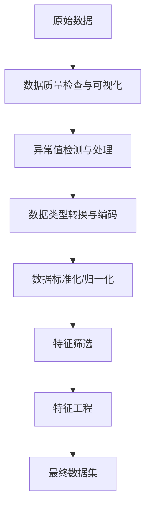

# 通用数据预处理流程模板

## 概述
本模板基于出血性脑卒中临床智能诊疗建模论文的数据预处理方法，总结出一套通用的数据预处理流程。该流程适用于包含多种数据类型（数值型、类别型）的复杂数据集，特别是医疗、金融、电商等领域的建模任务。

## 数据预处理流程概览



## 步骤详解

### 1. 数据质量检查与可视化

#### 目的
- 了解数据的整体分布和质量
- 识别数据中的潜在问题
- 为后续处理提供指导

#### 核心原理
通过描述性统计和可视化分析，全面了解数据特征，包括：
- 变量类型分布（数值型、字符型、时间型等）
- 缺失值情况
- 数据分布特征（正态性、偏态等）
- 变量间的初步关系

#### 核心代码
```python
import pandas as pd
import numpy as np
import matplotlib.pyplot as plt
import seaborn as sns
from scipy import stats

def data_overview(df):
    """数据概览分析"""
    print("=== 数据基本信息 ===")
    print(f"数据集形状: {df.shape}")
    print(f"内存使用: {df.memory_usage(deep=True).sum() / 1024**2:.2f} MB")
    
    print("\n=== 数据类型分布 ===")
    dtype_counts = df.dtypes.value_counts()
    print(dtype_counts)
    
    print("\n=== 缺失值统计 ===")
    missing_counts = df.isnull().sum()
    missing_percent = (missing_counts / len(df)) * 100
    missing_df = pd.DataFrame({
        'Missing_Count': missing_counts,
        'Missing_Percent': missing_percent
    })
    print(missing_df[missing_df['Missing_Count'] > 0])
    
    return missing_df

def plot_distributions(df, numerical_columns, max_plots=20):
    """绘制数值变量分布图"""
    numerical_columns = numerical_columns[:max_plots]  # 限制图表数量
    n_cols = 4
    n_rows = (len(numerical_columns) + n_cols - 1) // n_cols
    
    fig, axes = plt.subplots(n_rows, n_cols, figsize=(20, 5*n_rows))
    axes = axes.flatten() if n_rows > 1 else [axes]
    
    for i, col in enumerate(numerical_columns):
        if i < len(axes):
            axes[i].hist(df[col].dropna(), bins=30, alpha=0.7, edgecolor='black')
            axes[i].set_title(f'{col} 分布')
            axes[i].set_xlabel('值')
            axes[i].set_ylabel('频数')
            
            # 添加正态分布拟合曲线
            data = df[col].dropna()
            mu, sigma = stats.norm.fit(data)
            x = np.linspace(data.min(), data.max(), 100)
            y = stats.norm.pdf(x, mu, sigma)
            ax2 = axes[i].twinx()
            ax2.plot(x, y, 'r-', alpha=0.8, label='正态拟合')
            ax2.set_ylabel('密度')
    
    # 隐藏多余的子图
    for i in range(len(numerical_columns), len(axes)):
        axes[i].set_visible(False)
    
    plt.tight_layout()
    plt.show()

# 使用示例
# missing_info = data_overview(df)
# numerical_cols = df.select_dtypes(include=[np.number]).columns.tolist()
# plot_distributions(df, numerical_cols)
```

### 2. 异常值检测与处理

#### 目的
- 识别和处理数据中的异常值
- 避免异常值对模型训练的负面影响

#### 核心原理
采用拉依达准则（3σ准则）进行异常值检测：
- 计算变量的均值和标准差
- 超出 μ ± 3σ 范围的值被认为是异常值
- 使用均值或中位数替换异常值

数学公式：
- 剩余误差：$v_i = x_i - \bar{x}$
- 标准误差：$\sigma = \sqrt{\frac{1}{n-1}\sum_{i=1}^{n} v_i^2}$
- 异常值判断：$|v_j| = |x_j - \bar{x}| > 3\sigma$

#### 核心代码
```python
def detect_outliers_3sigma(df, columns=None):
    """使用3σ准则检测异常值"""
    if columns is None:
        columns = df.select_dtypes(include=[np.number]).columns
    
    outliers_info = {}
    
    for col in columns:
        data = df[col].dropna()
        mean = data.mean()
        std = data.std()
        
        # 计算异常值
        outliers = data[np.abs(data - mean) > 3 * std]
        outliers_indices = outliers.index.tolist()
        
        outliers_info[col] = {
            'outliers_count': len(outliers),
            'outliers_indices': outliers_indices,
            'outliers_values': outliers.tolist(),
            'mean': mean,
            'std': std
        }
    
    return outliers_info

def handle_outliers(df, outliers_info, method='mean'):
    """处理异常值"""
    df_cleaned = df.copy()
    
    for col, info in outliers_info.items():
        if info['outliers_count'] > 0:
            if method == 'mean':
                replacement_value = info['mean']
            elif method == 'median':
                replacement_value = df[col].median()
            elif method == 'drop':
                df_cleaned = df_cleaned.drop(info['outliers_indices'])
                continue
            
            df_cleaned.loc[info['outliers_indices'], col] = replacement_value
    
    return df_cleaned

# 使用示例
# outliers_info = detect_outliers_3sigma(df)
# df_cleaned = handle_outliers(df, outliers_info, method='mean')
```

### 3. 数据类型转换与编码

#### 目的
- 将非数值型数据转换为模型可处理的数值型数据
- 保持原始数据的语义信息

#### 核心原理
- **独热编码（One-Hot Encoding）**：适用于无序类别变量，避免引入人为的大小关系
- **标签编码（Label Encoding）**：适用于有序类别变量
- **特殊字段处理**：如血压"140/80"拆分为收缩压和舒张压

#### 核心代码
```python
from sklearn.preprocessing import LabelEncoder, OneHotEncoder
import re

def encode_categorical_features(df, categorical_columns, encoding_type='onehot'):
    """编码类别特征"""
    df_encoded = df.copy()
    encoding_info = {}
    
    for col in categorical_columns:
        if encoding_type == 'onehot':
            # 独热编码
            dummies = pd.get_dummies(df[col], prefix=col)
            df_encoded = pd.concat([df_encoded, dummies], axis=1)
            df_encoded = df_encoded.drop(col, axis=1)
            encoding_info[col] = {
                'type': 'onehot',
                'columns': dummies.columns.tolist()
            }
        elif encoding_type == 'label':
            # 标签编码
            le = LabelEncoder()
            df_encoded[col] = le.fit_transform(df[col].astype(str))
            encoding_info[col] = {
                'type': 'label',
                'encoder': le,
                'classes': le.classes_.tolist()
            }
    
    return df_encoded, encoding_info

def parse_blood_pressure(bp_string):
    """解析血压字符串，如 '140/80mmHg' -> (140, 80)"""
    if pd.isna(bp_string):
        return np.nan, np.nan
    
    # 使用正则表达式提取数字
    numbers = re.findall(r'\d+', str(bp_string))
    if len(numbers) >= 2:
        return float(numbers[0]), float(numbers[1])  # 收缩压, 舒张压
    else:
        return np.nan, np.nan

def handle_special_fields(df):
    """处理特殊字段"""
    df_processed = df.copy()
    
    # 处理血压字段（如果存在）
    if '血压' in df.columns:
        df_processed[['收缩压', '舒张压']] = df['血压'].apply(
            lambda x: pd.Series(parse_blood_pressure(x))
        )
        df_processed = df_processed.drop('血压', axis=1)
    
    return df_processed

# 使用示例
# df_processed = handle_special_fields(df)
# categorical_cols = df.select_dtypes(include=['object']).columns.tolist()
# df_encoded, encoding_info = encode_categorical_features(df_processed, categorical_cols)
```

### 4. 数据标准化/归一化

#### 目的
- 消除不同变量间量纲的影响
- 确保所有特征在相同的尺度上，提高模型训练效果

#### 核心原理
使用Min-Max标准化将数据缩放到[0,1]区间：
$$x_{norm} = \frac{x - x_{min}}{x_{max} - x_{min}}$$

选择Min-Max而非Z-score标准化的原因：
- 保持原始数据的分布特性
- 适用于小样本数据集
- 输出范围确定，便于解释

#### 核心代码
```python
from sklearn.preprocessing import MinMaxScaler, StandardScaler

def normalize_features(df, numerical_columns, method='minmax'):
    """标准化数值特征"""
    df_normalized = df.copy()
    scaler_info = {}
    
    if method == 'minmax':
        scaler = MinMaxScaler()
    elif method == 'standard':
        scaler = StandardScaler()
    
    for col in numerical_columns:
        if col in df.columns:
            original_data = df[[col]]
            normalized_data = scaler.fit_transform(original_data)
            df_normalized[col] = normalized_data.flatten()
            
            scaler_info[col] = {
                'scaler': scaler,
                'original_min': df[col].min(),
                'original_max': df[col].max(),
                'original_mean': df[col].mean(),
                'original_std': df[col].std()
            }
    
    return df_normalized, scaler_info

def check_normalization_quality(df_before, df_after, numerical_columns):
    """检查标准化质量"""
    print("=== 标准化前后统计对比 ===")
    for col in numerical_columns:
        if col in df_before.columns and col in df_after.columns:
            print(f"\n{col}:")
            print(f"  标准化前: min={df_before[col].min():.3f}, max={df_before[col].max():.3f}, "
                  f"mean={df_before[col].mean():.3f}, std={df_before[col].std():.3f}")
            print(f"  标准化后: min={df_after[col].min():.3f}, max={df_after[col].max():.3f}, "
                  f"mean={df_after[col].mean():.3f}, std={df_after[col].std():.3f}")

# 使用示例
# numerical_cols = df.select_dtypes(include=[np.number]).columns.tolist()
# df_normalized, scaler_info = normalize_features(df, numerical_cols)
# check_normalization_quality(df, df_normalized, numerical_cols)
```

### 5. 特征筛选

#### 目的
- 移除冗余和无关特征
- 降低模型复杂度，提高泛化能力
- 减少计算资源消耗

#### 核心原理
**5.1 方差过滤**
- 移除方差极小的特征（如标准差 < 0.05）
- 这些特征变化很小，对模型贡献有限

**5.2 相关性过滤**
使用多种相关性系数：
- **皮尔逊相关系数**：适用于线性关系的连续变量
- **斯皮尔曼相关系数**：适用于非正态分布或等级变量
- **肯德尔相关系数**：适用于有序变量

**5.3 并查集算法消除高相关特征**
- 将相关系数 > 阈值（如0.8）的特征视为同一组
- 每组只保留一个代表特征

#### 核心代码
```python
from scipy.stats import pearsonr, spearmanr, kendalltau

def variance_filter(df, numerical_columns, threshold=0.05):
    """方差过滤"""
    low_variance_features = []
    kept_features = []
    
    for col in numerical_columns:
        if col in df.columns:
            variance = df[col].var()
            std = df[col].std()
            
            if std < threshold:
                low_variance_features.append(col)
            else:
                kept_features.append(col)
    
    print(f"低方差特征数量: {len(low_variance_features)}")
    print(f"保留特征数量: {len(kept_features)}")
    
    return kept_features, low_variance_features

def calculate_correlation_matrix(df, columns, method='spearman'):
    """计算相关性矩阵"""
    correlation_matrix = np.zeros((len(columns), len(columns)))
    
    for i, col1 in enumerate(columns):
        for j, col2 in enumerate(columns):
            if i == j:
                correlation_matrix[i][j] = 1.0
            else:
                data1 = df[col1].dropna()
                data2 = df[col2].dropna()
                
                # 确保两个序列长度一致
                common_idx = data1.index.intersection(data2.index)
                data1 = data1.loc[common_idx]
                data2 = data2.loc[common_idx]
                
                if len(data1) > 1:
                    if method == 'pearson':
                        corr, _ = pearsonr(data1, data2)
                    elif method == 'spearman':
                        corr, _ = spearmanr(data1, data2)
                    elif method == 'kendall':
                        corr, _ = kendalltau(data1, data2)
                    
                    correlation_matrix[i][j] = abs(corr) if not np.isnan(corr) else 0
                else:
                    correlation_matrix[i][j] = 0
    
    return correlation_matrix

class UnionFind:
    """并查集实现"""
    def __init__(self, n):
        self.parent = list(range(n))
    
    def find(self, x):
        if self.parent[x] != x:
            self.parent[x] = self.find(self.parent[x])
        return self.parent[x]
    
    def union(self, x, y):
        px, py = self.find(x), self.find(y)
        if px != py:
            self.parent[px] = py

def correlation_filter(df, columns, threshold=0.8, method='spearman'):
    """基于相关性的特征过滤"""
    correlation_matrix = calculate_correlation_matrix(df, columns, method)
    
    # 使用并查集合并高相关特征
    n = len(columns)
    uf = UnionFind(n)
    
    for i in range(n):
        for j in range(i+1, n):
            if correlation_matrix[i][j] >= threshold:
                uf.union(i, j)
    
    # 每个连通分量选择一个代表
    groups = {}
    for i in range(n):
        root = uf.find(i)
        if root not in groups:
            groups[root] = []
        groups[root].append(i)
    
    selected_features = []
    for group in groups.values():
        # 选择第一个特征作为代表
        selected_features.append(columns[group[0]])
    
    print(f"原始特征数量: {len(columns)}")
    print(f"过滤后特征数量: {len(selected_features)}")
    
    return selected_features

# 使用示例
# numerical_cols = df.select_dtypes(include=[np.number]).columns.tolist()
# kept_features, low_var_features = variance_filter(df, numerical_cols)
# final_features = correlation_filter(df, kept_features)
```

### 6. 特征工程

#### 目的
- 基于业务理解创建新的有意义特征
- 处理时间相关的特征权重

#### 核心原理
**特征权重函数**：
基于业务知识（如发病到首次检查时间越短，特征越重要），设计权重函数：

$$f(x) = \frac{1}{1 + (x/24) \times k}$$ 

其中 x 为时间间隔，k 为调节参数。

#### 核心代码
```python
def create_time_weight_function(time_column, k=0.7):
    """创建时间权重函数"""
    def weight_function(x):
        return 1 / (1 + (x / 24) * k)
    
    return weight_function

def apply_feature_weights(df, feature_columns, weight_column, weight_function):
    """应用特征权重"""
    df_weighted = df.copy()
    
    for col in feature_columns:
        if col in df.columns and weight_column in df.columns:
            weights = df[weight_column].apply(weight_function)
            df_weighted[col] = df[col] * weights
    
    return df_weighted

def create_interaction_features(df, feature_pairs):
    """创建交互特征"""
    df_interaction = df.copy()
    
    for pair in feature_pairs:
        if len(pair) == 2 and pair[0] in df.columns and pair[1] in df.columns:
            new_feature_name = f"{pair[0]}_x_{pair[1]}"
            df_interaction[new_feature_name] = df[pair[0]] * df[pair[1]]
    
    return df_interaction

# 使用示例
# weight_func = create_time_weight_function('发病到首次检查时间')
# df_weighted = apply_feature_weights(df, final_features, '发病到首次检查时间', weight_func)
```

### 7. 数据质量验证

#### 目的
- 确保预处理后的数据质量
- 验证预处理步骤的有效性

#### 核心代码
```python
def validate_processed_data(df_original, df_processed):
    """验证处理后的数据质量"""
    print("=== 数据质量验证报告 ===")
    
    # 1. 基本信息对比
    print(f"原始数据形状: {df_original.shape}")
    print(f"处理后数据形状: {df_processed.shape}")
    
    # 2. 缺失值检查
    missing_original = df_original.isnull().sum().sum()
    missing_processed = df_processed.isnull().sum().sum()
    print(f"原始缺失值总数: {missing_original}")
    print(f"处理后缺失值总数: {missing_processed}")
    
    # 3. 数据类型检查
    numeric_original = len(df_original.select_dtypes(include=[np.number]).columns)
    numeric_processed = len(df_processed.select_dtypes(include=[np.number]).columns)
    print(f"原始数值型特征数: {numeric_original}")
    print(f"处理后数值型特征数: {numeric_processed}")
    
    # 4. 特征独立性检查
    if len(df_processed.select_dtypes(include=[np.number]).columns) > 1:
        corr_matrix = df_processed.select_dtypes(include=[np.number]).corr()
        high_corr_pairs = []
        for i in range(len(corr_matrix.columns)):
            for j in range(i+1, len(corr_matrix.columns)):
                if abs(corr_matrix.iloc[i, j]) > 0.8:
                    high_corr_pairs.append((corr_matrix.columns[i], corr_matrix.columns[j], 
                                          corr_matrix.iloc[i, j]))
        
        print(f"高相关性特征对数量: {len(high_corr_pairs)}")
        if high_corr_pairs:
            print("高相关性特征对（前5个）:")
            for pair in high_corr_pairs[:5]:
                print(f"  {pair[0]} - {pair[1]}: {pair[2]:.3f}")
    
    return True

# 使用示例
# validate_processed_data(df_original, df_final)
```

## 完整流程示例

```python
def complete_preprocessing_pipeline(df, target_column=None):
    """完整的数据预处理流程"""
    print("开始数据预处理流程...")
    
    # 1. 数据概览
    print("\n1. 数据概览分析")
    missing_info = data_overview(df)
    
    # 2. 异常值处理
    print("\n2. 异常值检测与处理")
    numerical_cols = df.select_dtypes(include=[np.number]).columns.tolist()
    if target_column and target_column in numerical_cols:
        numerical_cols.remove(target_column)
    
    outliers_info = detect_outliers_3sigma(df, numerical_cols)
    df_cleaned = handle_outliers(df, outliers_info, method='mean')
    
    # 3. 特殊字段处理
    print("\n3. 特殊字段处理")
    df_processed = handle_special_fields(df_cleaned)
    
    # 4. 类别特征编码
    print("\n4. 类别特征编码")
    categorical_cols = df_processed.select_dtypes(include=['object']).columns.tolist()
    if categorical_cols:
        df_encoded, encoding_info = encode_categorical_features(
            df_processed, categorical_cols, encoding_type='onehot'
        )
    else:
        df_encoded = df_processed
        encoding_info = {}
    
    # 5. 数据标准化
    print("\n5. 数据标准化")
    numerical_cols_new = df_encoded.select_dtypes(include=[np.number]).columns.tolist()
    if target_column and target_column in numerical_cols_new:
        numerical_cols_new.remove(target_column)
    
    df_normalized, scaler_info = normalize_features(df_encoded, numerical_cols_new)
    
    # 6. 特征筛选
    print("\n6. 特征筛选")
    kept_features, low_var_features = variance_filter(df_normalized, numerical_cols_new)
    final_features = correlation_filter(df_normalized, kept_features)
    
    # 7. 构建最终数据集
    if target_column:
        final_columns = final_features + [target_column]
    else:
        final_columns = final_features
    
    df_final = df_normalized[final_columns]
    
    # 8. 数据验证
    print("\n8. 数据质量验证")
    validate_processed_data(df, df_final)
    
    # 返回结果和元信息
    preprocessing_info = {
        'outliers_info': outliers_info,
        'encoding_info': encoding_info,
        'scaler_info': scaler_info,
        'removed_features': {
            'low_variance': low_var_features,
            'high_correlation': list(set(kept_features) - set(final_features))
        },
        'final_features': final_features
    }
    
    print(f"\n预处理完成！最终数据集形状: {df_final.shape}")
    return df_final, preprocessing_info

# 使用完整流程
# df_final, preprocessing_info = complete_preprocessing_pipeline(df, target_column='target')
```

## 总结

本数据预处理模板提供了一套完整、系统化的数据预处理流程，主要特点：

1. **系统性**：涵盖从数据探索到最终特征构建的完整流程
2. **针对性**：特别适用于包含多种数据类型的复杂数据集
3. **可解释性**：每个步骤都有明确的原理和目的
4. **可复用性**：代码模块化，易于在不同项目中复用
5. **质量保证**：包含多层验证机制确保数据质量

使用时可根据具体业务场景调整参数和方法，如相关性阈值、标准化方法等。该模板为后续的机器学习建模提供了高质量的数据基础。 