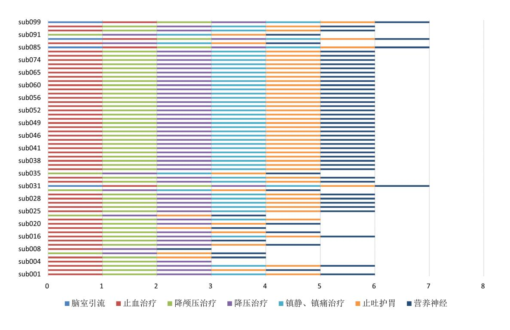

# 中国研究生创新实践系列大赛 "华为杯"第二十届中国研究生 数学建模竞赛

| 学 校  | 天津师范大学      |
|------|-------------|
| 参赛队号 | 23100650012 |
| 队员姓名 | 1. 邢雅媛      |
|      | 2. 张庆薇      |
|      | 3. 李祺       |

# 中国研究生创新实践系列大赛 "华为杯"第二十届中国研究生 数学建模竞赛

题 目 出血性脑卒中临床智能诊疗建模

# 摘 要:

出血性脑卒中是一种由于脑肿瘤破裂、脑动脉破裂所导致的脑出血疾病,又称脑溢血。 如何使用数学模型辅助临床诊疗具有重要意义。本文通过构建数理模型,分别对"血肿扩 张风险因素探索","水肿的进展预测"和"出血性脑卒中患者预后预"三个问题进行分析 和处理。

问题一:通过判断患者发病后 48 小时内血肿扩张的绝对体积是否大于 6ml,或者相对体积增加是否超过 33%,来确定患者是否发生了血肿扩张。通过计算,得出 23 个病人在发病后的 48 小时内发生了血肿扩张。

为了构建模型预测所有患者发生血肿扩张的概率,首先对涉及到的72个变量利用方 差信息对整数型变量和浮点型变量进行**非显著性特征剔除**,剩余了69个变量。接着,使 用基于并查集的**高相关性变量过滤模型**对变量进行冗余过滤,剩余47个变量。随后,通 过分析,发现不同病人的"发病到首次影像检查时间间隔"差异性较大,影响了变量间的 协同关系。我们通过建立**特征权重函数**,对不同时间间隔的病人进行了差异化处理。最后, 构建了**基于分类任务的概率预测模型**,分别对比了k近邻算法,支持向量机分类器,随机 森林分类器和梯度提升决策树,利用每个模型输出的置信度作为最终的概率预测。经过对 比,梯度提升分类器获得了最佳的效果,获得了0.0524 的 MAE 数值。此外,在实验部分, 我们设置了消融实验,分别验证了高相关性变量过滤模型,特征权重函数,并使用网格搜 索的寻优方法将模型的参数调整到最优。

问题二:问题 a 要求构建所有患者的水肿体积随时间的进展曲线。经过对数据的预分 析,发现水肿体积和时间之间存在高度的非线性关系,故而考虑使用非线性模型进行拟合。 但由于本文数据量较少,为了防止相关模型过拟合,对模型的相关参数进行了限制,并使 用网格搜索 +K 则交叉验证的方法确定最终的模型参数.经过对比,决策树获得了最佳的 效果,平均残差值为1838.8871。问题 b 是问题 a 的延申,需要在其基础上区分不同的人 群。首先利用肘部法则,确定了最佳的患者类别为 3。随后,在问题 a 的基础上,选取了 四种不同类型的聚类模型,分别是斯混合聚类,DBSCAN,BIRCH 和谱聚类。其中,谱聚类的平均轮廓系数为 0.4186,戴维森-堡丁指数为 0.8817,获得了最佳的效果,此外,还 使用 t-SNE 方法对聚类效果进行了可视化。最终,结合问题 a 建立的拟合模型,输出了前 100 个患者水肿体积真实值和曲线间的残差,经过测试,经过聚类后模型的残差值由原先 的 1838.8871 降低到了 980.245。

问题 c 要求分析不同治疗方法对水肿体积进展模式的影响。首先明确治疗方法的种类 和水肿体积进展模式的定义。依据问题 b 中得出的聚类结果和三类人群水肿体积随时间进 展曲线可以按照不同亚组分为三种模式:振荡趋缓型,波动平稳型和振荡反复型。随后分 别进行了"**类内模式共性分析**","**类间模式差异性分析**"和"**个体研究**"三种分析。问题 d 是问题 c 的延申,在探索患者水肿体积随时间进展的基础上,探究了血肿体积与水肿体积 之间的相关关系,以及二者之间是否存在**时空滞后性**。最后,通过分析二者之间的间接关 系,得出血肿体积与治疗方法之间的关系。

问题三:问题 a 要求构建预测模型,预测患者 90 天 mRS 评分。本题没有限制特征的 数量,基于对模型简单、通用、特征提取能力强大的考量,构建了基于 Stacking 的分类模 型。首先对 mRS 评分的分布进行数据分析,发现存在一定程度的类别不平衡现象,为此, 采用 Borderline-SMOTE 过采样算法进行处理;实验部分,通过与 k 近邻算法,支持向量 机分类器和随机森林分类器的对比,Stacking 获得了最佳的效果,准确率和召回分别达到 了 83.5% 和 82.1%。问题 b 是问题 a 的一个延申,需要在问题 a 的基础上加上随访数据, 但随访数据存在着随访检查数量不统一的问题。为此,对随访数据进行时间和空间上的解 耦,量化出了五个指标,分别是发病持续时间,血肿的最大体积,水肿的最大体积,血肿 扩张的持续时间和水肿扩张的持续时间。最终,结合问题 a 的模型和数据进行训练,精确 率和召回率分别由 83.5% 和 82.1% 提升到了 92.3% 和 89.4%。上述指标均使用了 K 则交叉 验证方法进行测试。在问题 c 中,对发生血肿的患者和 mRS 评分高于 4 的患者进行了主 成分分析,重点探究了血肿扩张的影响因素,并给预后的决策总结出了相关的意见。

关键字: 特征权重函数,基于分类任务的概率预测模型,网格搜索 +K 则交叉验证,肘部 法则,时空滞后性,基于 Stacking 的分类模型


# 目录

| — | 问题重 | 述                        | 5  |
|---|-----|--------------------------|----|
|   | 1.1 | 问题背景                     | 5  |
|   | 1.2 | 问题提出                     | 5  |
| = | 基本假 | 设与符号说明                   | 6  |
| Ξ | 描述性 | 统计分析及预处理                 | 7  |
|   | 3.1 | 数据宏观统计与可视化               | 7  |
|   | 3.2 | 数据预处理                    | 8  |
| 四 | 问题一 | 的求解:血肿扩张风险因素探索           | 11 |
|   | 4.1 | 问题分析                     | 11 |
|   | 4.2 | 问题 a 的求解                 | 12 |
|   | 4.3 | 问题 b 的建模与求解              | 12 |
|   |     | 4.3.1 冗余特征过滤模型的建立        | 12 |
|   |     | 4.3.2 特征权重函数             | 14 |
|   |     | 4.3.3 基于分类的概率预测模型        | 15 |
|   |     | 4.3.4 问题 b 的求解           | 16 |
| 五 | 问题二 | 的求解:水肿的进展预测模型            | 20 |
|   | 5.1 | 问题分析                     | 20 |
|   | 5.2 | 数据预分析数据预分析               | 21 |
|   | 5.3 | 问题 a 的建模与求解              | 22 |
|   |     | 5.3.1 拟合模型分析与建立          | 22 |
|   |     | 5.3.2 问题 a 的求解           | 23 |
|   | 5.4 | 问题 b 的建模与求解              | 24 |
|   |     | 5.4.1 聚类模型的建立            | 25 |
|   |     | 5.4.2 聚类模型的求解            | 26 |
|   |     | 5.4.3 有关亚组的分析            | 28 |
|   |     | 5.4.4 问题 b 的求解           | 29 |
|   | 5.5 | 问题 c: 不同治疗方法对水肿体积进展模式的分析 | 31 |
|   |     | 5.5.1 概念定义               | 31 |
|   |     | 5.5.2 模式分析               | 31 |

| 5.6   | 问题 d: 血肿体积、水肿体积和治疗方案之间的关系探究 | 35 |
|-------|-----------------------------|----|
|       | 5.6.1 血肿体积和水肿体积之间的关系探究      | 35 |
|       | 5.6.2 水肿体积、血肿体积与治疗方案之间的关系探究 | 36 |
| 六 问题三 | 的求解:出血性脑卒中患者预后预测模型          | 38 |
| 6.1   | 问题分析                        | 38 |
| 6.2   | 标签观察与分析                     | 38 |
| 6.3   | 问题 a 的建模与求解                 | 39 |
|       | 6.3.1 K则交叉验证                | 39 |
|       | 6.3.2 基于 Stacking 的分类模型建立   | 40 |
|       | 6.3.3 问题 a 的求解与分析           | 40 |
| 6.4   | 问题 b 的建模与求解                 | 42 |
|       | 6.4.1 随访数据的量化               | 42 |
|       | 6.4.2 问题 b 的求解              | 43 |
| 6.5   | 问题 c: 相关临床决策的建议             | 44 |
|       | 6.5.1 基于主成分分析法探究血肿扩张影响因素    | 44 |
|       | 6.5.2 2. 总结性建议              | 46 |
| 参考文献. |                             | 47 |
| 一 源程序 |                             | 48 |

# 1. 问题重述

## 1.1 问题背景

《中国脑卒中防治报告 2020》中显示,我国卒中发病率由 2005 年 222/10 万下降至 2019 年 201/10 万,但是出血性脑卒中患病率仍处于上升阶段。出血性脑卒中是一种由于脑肿瘤 破裂、脑动脉破裂所导致的脑出血疾病,又称脑溢血,约占所有脑卒中发病率的 10-15%。 出血性脑卒中的 30 天致死率远高于缺血性脑卒中,是我国成人致死、致残的首要因素,同 时为患者家庭带来了沉重的经济负担。出血性脑卒中会引起脑组织受损、炎症反应,并使 血肿范围扩大,导致颅内压升高和神经功能恶化,血肿周围的水肿会压迫患者的脑组织, 影响神经元功能,加重患者神经功能损伤。

脑卒中是一种可防可控的疾病,出血性脑卒中发病后血肿和水肿的发展和扩张进程的 早期识别及预测可以有效改善患者预后。通过对患者的影响检查信息、患者个人信息、治 疗方法的选择和预后数据构建智能诊疗模型深入分析,有助于明确导致出血性脑卒中预后 不良的危险因素,进一步实现个性化治疗评估和预后预测。

### 1.2 问题提出

基于上述研究背景,本文需研究和解决一下问题:

问题1: 血肿扩张风险相关特征提取和血肿扩张事件预测模型建模;

根据"表1"(字段:入院首次影像检查流水号,发病到首次影像检查时间间隔),"表 2"(字段:各时间点流水号及对应的HM\_volume),判断患者 sub001 至 sub100 发病后 48 小时内是否发生血肿扩张事件。以是否发生血肿扩张事件为目标变量,基于"表1"前 100 例患者的个人史,疾病史,发病相关(字段 E 至 W)、"表 2"中其影像检查结果(字段 C 至 X)及"表 3"其影像检查结果(字段 C 至 AG,注:只可包含对应患者首次影像检查记 录)等变量,构建所有患者发生血肿扩张概率的预测模型。

问题 2: 建立血肿周围水肿的发生及进展模型,探索治疗方法与水肿进展的关联关系; 根据"表 2"前 100 个患者的水肿体积(ED\_volume)和重复检查时间点,构建一条全体患者水肿体积随时间进展曲线(x轴:发病至影像检查时间,y轴:水肿体积,y=f(x)), 计算前 100 个患者真实值和所拟合曲线之间存在的残差。探索患者水肿体积随时间进展模式的个体差异,构建不同人群(分亚组:3-5个)的水肿体积随时间进展曲线,并计算前 100 个患者真实值和曲线间的残差。基于以上模型分析不同治疗方法对水肿体积进展模式的影响,并分析血肿体积、水肿体积及治疗方法三者之间的关系。

问题 3: 建立出血性脑卒中患者愈后预测模型, 探索影响患者预后的关键因素;

根据前 100 个患者的个人史、疾病史、发病相关及首次影像结果构建预测全部患者 90 天 mRS 评分的预测模型。根据前 100 个患者所有已知临床、治疗信息、表 2 及表 3 的影像(首次 + 随访)结果,构建所有含随访影像检查的患者的 90 天 mRS 评分。基于以上模

型,分析出血性脑卒中患者的预后(90天mRS)和个人史、疾病史、治疗方法及影像特征(包括血肿/水肿体积、血肿/水肿位置、信号强度特征、形状特征)等关联关系,为临床相关决策提出建议。

# 2. 基本假设与符号说明

- •本题中所提供的患者的个人史、疾病史、发病相关和影像结果都是准确的;
- •题目提供的训练数据和测试数据的原始分布一致;
- 不考虑除提供数据以外的变量对建模分析的影响;
- 假设 "sub003" 和"sub131" 是同一患者, 假设 "sub003" 和"sub131" 是同一患者。

| 符号                  | 意义        |
|---------------------|-----------|
| R                   | 相关性系数矩阵   |
| MSE                 | 均方误差      |
| MAE                 | 平均绝对误差    |
| R <sup>2</sup>      | 决定系数      |
| f(x)                | 特征权重函数    |
| $T_{ill}$           | 发病持续时间    |
| $V_{HM\_volume}$    | 血肿的最大体积   |
| $V_{ED\_volume}$    | 水肿的最大体积   |
| $T_{HM\_expansion}$ | 血肿扩张的持续时间 |
| $T_{ED\_expansion}$ | 水肿扩张的持续时间 |
|                     |           |

# 表1 符号说明

# 3. 描述性统计分析及预处理

本题提供了大量的数据信息,包含脑卒中患者的个人史、疾病史、发病及治疗相关信 息、多次重复的影像学检查,数据变量较多。分析数据的统计特征,并通过可视化来指导 全局的建模。其中包括数据集的可视化以及相应的统计信息,从而对数据有全局的印象。 同时,针对可视化的结果指导数据预处理。另外,由于各个基本信息的取值范围变化幅度 不一,直接放入模型中会导致效果不佳,所以还需要对数据做归一化处理,消除量纲影响, 以便后期喂入模型。

# 3.1 数据宏观统计与可视化

首先,我们对题目中所有表格属性进行宏观统计。通过遍历统计,发现变量没有缺失 值,且存有字符型变量,整型变量和浮点型变量。变量的类型分布如图1,浮点型变量多于 整型变量和字符型变量,且没有其他复杂变量类型。


图1 变量类型分布图

针对浮点型变量,我们进行直方图统计,并进行正态曲线拟合,观察变量的分布特征 和分布规律。图 2展示了"表 2-患者影像信息血肿及水肿的体积及位置"中的部分变量的 分布。


图 2 浮点型变量分布图

对浮点型变量的分布结果来看,可以总结出以下几点规律:

1. 部分变量符合标准的正态分布。

2. 部分变量的变化幅度较小,主要表现为取值全0和极小部分不为0其余取值全为0。 例如 HM\_Cerebellum\_L\_Ratio 和 ED\_Pons\_Medulla\_R\_Ratio,他们大多数值都集中在某一 值附近,存在低变化性的特征,这类标准偏差极小的变量也应在预处理操作中删除。

此外,表格中还存在着2个字符型变量:"性别"和"血压"。这类数据需要额外进行 针对性的量化处理。

#### 3.2 数据预处理

步骤 1: 去除异常值

在观察数据特征时,我们发现"表1"中"sub131"和"sub132"行的"入院首次影像 检查流水号"字段的值,与"表2"中ID为"sub131"和"sub132"行的"首次检查流水 号"不对应,这有可能影响后续操作,且未接到数据更新的通知,因此将这两行数据剔除, 在后续操作中不考虑这两行数据。同时,我们发现"表1"中"sub131"和"sub132"的 字段同"sub003"和"sub004"等同,因此,"表4"中"sub131"和"sub132"的答案用 "sub003"和"sub004"的代替

此外,对本文涉及的数据进行异常值检验,如存在异常值考虑使用拉依达准则进行 异常值剔除。具体而言,拉依达准则(3σ 准则)将对被测变量进行等精度测量,得到 x<sub>1</sub>,x<sub>2</sub>,...,x<sub>n</sub>,计算其算术平均值 x 及剩余误差 v<sub>i</sub> = x<sub>i</sub> - x(i = 1,2,..,n),并按照贝塞尔公 式计算出标准误差 σ,如果某个测量值 x<sub>j</sub>的剩余误差 v<sub>j</sub>(1≤b≤n)满足 |v<sub>j</sub>| = |x<sub>j</sub> - x| > 3σ, 则认为是含有较大误差值的坏值,应予剔除。贝塞尔公式如下式1:

$$\sigma = \left(\frac{1}{n-1}\sum_{i=1}^{n} v_i^2\right)^{\frac{1}{2}} \tag{1}$$

利用上述方法检测出两个异常值属性变量 "original\_shape\_VoxelVolumee" 和 "original\_shape\_Sphericity",如图3所示为异常数据的箱线图。如图所示,其数据分布存在很多异常值,因此考虑使用相应属性的平均值代替异常值。


图 3 浮点型变量分布图

#### 步骤 2: 属性量化

独热编码(One-Hot Encoding)是一种将分类数据变量转换为二进制向量的方法。采 用了 N 位状态位来对 N 个可能的取值进行编码,每个取值由独立的状态位来表示,在任 意时刻只有其中的一位有效。One-Hot Encoding 能够处理非数值属性。"表 1-患者列表及 临床信息.xlsx"中的字符串变量:性别,取值为"男"、"女"。在进行下一步模型建立之前, 需要对该字符串变量进行独热编码(One-Hot Encoding)处理,分别用 0 和 1 对应性别中 的"男"和"女"。

"表 1-患者列表及临床信息.xlsx"中的血压变量由两个数字组成,例如 140/80mmHg, 其中第一个数字表示收缩压,第二个数字表示舒张压。收缩压是心脑血管疾病的重要预测 因素,高收缩压会对心脏和血管系统产生更大的压力,可能会增加再次发生脑卒中的风险。 舒张压反映了动脉的弹性和血管的阻力,过低的舒张压会对脑卒中的恢复不利。研究表明, 对于中青年群体,当收缩压≥160mmHg时,脑卒中患病风险是收缩压<130mmHg的 8.13 倍,当舒张压≥110mmHg时,脑卒中患病风险是舒张压< 80mmHg的 28.54 倍,说明舒张 压是中青年脑卒中的重要危险因素之一。而在年龄 ≥60 岁的人群中,收缩压 ≥150mm Hg 时脑卒中患病风险逐渐增大,而舒张压与脑卒中之间相关性不显著。以上研究说明在研究 脑卒中与血压之间关联的时候,不能单一看待收缩压和舒张压,而是要将二者均作为重要 变量进行分析,本文首先将血压这一属性拆分为收缩压和舒张压两个属性,考虑到需要保 持变量的原有分布特性,对收缩压、舒张压进行 min-max 标准化处理,将原始数据线性缩 放到(0,1)之间。

#### 步骤 3:数据标准化处理

数据标准化处理是数据分析中数据处理时的重要步骤,数据标准化的目的是调整特征值的范围,使其缩放到指定的范围内。为了消除表示形式对处理结果的影响,本文使用min-max标准化对数据进行标准化处理。

对于离散非 0-1 型数值变量,如"表 1-患者列表及临床信息.xlsx"中的字段 G"脑出血前 mRS 评分",该变量范围从 0 到 6,数值代表脑卒中患者的功能状态和残疾程度。考虑 到该数据集的样本量偏小,并且需要保持变量的原有分布特性,对于该变量进行 min-max 标准化处理,将原始数据线性缩放到 (0,1) 之间。

对于"表 2-患者影像信息血肿及水肿的体积及位置.xlsx"中其影像检查结果(字段 C 至 X),以上变量分别描述了患者首次检查影像信息血肿及水肿的体积及位置。对于"表 3-患者影像信息血肿及水肿的形状及灰度分布.xlsx"其影像检查结果(字段 C 至 AG),首先对比"表 2-患者影像信息血肿及水肿的体积及位置.xlsx"筛选出对应患者首次影像检查的记录,筛选后的数据集记为"表 3-首次影像检查记录.xlsx"。对于"表 3-首次影像检查记录.xlsx"(字段 C 至 AG),以上变量描述了患者在首次影像检查记录中的血肿及水肿的形状及灰度分布。以上所有变量均为连续型数值变量且变量取值范围的数量级相差大。为消除数量级的影响,在进行下一步模型建立之前对以上数据进行 min-max 标准化处理。

## 步骤 4: 过滤标准差极小的浮点型变量

将标准化处理后的数据进行描述性分析,观测所有变量的取值范围与方差、平均值, 从数值角度,观察变量的基本情况。对这72个变量的最小值,最大值,平均值,方差和标 准差分别进行计算,计算结果保留三位小数,结果如表2所示。

|                                | 最小值 | 最大值 | 平均值    | 标准差   | 方差    |
|--------------------------------|-----|-----|--------|-------|-------|
| 年龄                             | 0   | 1   | 0.517  | 0.211 | 0.045 |
| 性别                             | 0   | 1   | 0.312  | 0.465 | 0.216 |
| 脑出血前 mRS 评分                    | 0   | 1   | 0.046  | 0.165 | 0.027 |
|                                |     |     |        |       |       |
| HM_volume                      | 0   | 1   | 0.155  | 0.147 | 0.022 |
| HM_ACA_R_Ratio                 | 0   | 1   | 0.064  | 0.165 | 0.027 |
| HM_MCA_R_Ratio                 | 0   | 1   | 0.365  | 0.401 | 0.161 |
|                                |     |     |        |       |       |
| original_shape_Elongation      | 0   | 1   | 0.577  | 0.201 | 0.041 |
| original_shape_Flatness        | 0   | 1   | 0.507  | 0.223 | 0.05  |
| original_shape_LeastAxisLength | 0   | 1   | 0.4355 | 0.175 | 0.03  |

表 2 变量的描述统计

根据对数据中相关变量的分布统计与可视化,可以发现,存在变量严重集中在某一值 附近的情况,对于这种方差小、变化很小的特征,需要根据阈值过滤,这里根据相关文献 中的标准差阈值 0.05 进行筛选,共过滤了 3 个变量特征,剩余 69 个变量,具体如表3所示。

# 表 3 变化幅度过小的变量

| 变量名                     | 标准差   |
|-------------------------|-------|
| HM_Cerebellum_L_Ratio   | 0.048 |
| ED_Pons_Medulla_R_Ratio | 0.048 |
| ED_Cerebellum_L_Rati    | 0.048 |

# 4. 问题一的求解: 血肿扩张风险因素探索

#### 4.1 问题分析

本问题的任务是:首先需要根据"表1"、"表2"相关字段判断患者在发病后48小时 内是否发生血肿扩张事件,其中血肿扩张的判断基于后续检查时的血肿体积比首次检查绝 对体积增加 ≥6 mL 或相对体积增加 ≥33%。其次,需要建立预测模型,预测所有患者发生 血肿扩张的概率。本题主要有以下难点:

难点一:在原数据表中,数据类型和数量级别不同,如果不对数据做任何处理,会导 致后续机器学习模型训练效果不佳。针对难点一,在进行模型建立之前需要先进行数据预 处理,主要操作包括:根据拉依达准则剔除异常值、数据标准化、非显著性特征剔除、通 过相关性分析剔除变量。

难点二:题目要求计算判断患者发病后48小时内是否发生血肿扩张事件,需要注意时间差计算:(病患在随访影像检查时间点-入院首次检查时间点+发病到首次影像检查时间间隔)≤48h。在后续任意一次随访检查中,发现血肿体积比首次检查绝对体积增加≥6ml,或相对体积增加33%时,判断该患者发生了血肿扩张。针对难点二,在进行时间差计算时,需要将时间都转化为时间戳的形式计算。

难点三:在构建模型时,应考虑变量的权重差别。使用特征权重函数可以帮助后续的 机器学习模型进行特征的区分,提高模型的可解释性。


图 4 问题一 (b) 思路流程图

#### 4.2 问题 a 的求解

为了判断患者 sub001 至 sub100 发病后 48 小时内是否发生血肿扩张事件,需要对"表 1","表 2"和"附表 1-检索表格-流水号 vs 时间"的数据进行联合处理。为了便于计算, 本文将"年/月/日/时/分/秒"的时间格式转化为时间戳格式。在具体计算时需要注意以下几 点细节:

1. **时间差计算**:将病患的在随访影像检查时间点减去入院首次检查时间点,再加上发病到首次影像检查时间间隔。

2. 单位统一:表格中的血肿体积的单位为 10<sup>-3</sup>ml。若在后续任意一次随访检查中,首次发现血肿体积比首次检查绝对体积增加大于 6ml,或相对体积增加 33% 时,判断该患者发生了血肿扩张。

经过计算,患者 sub001 至 sub100 中有 23 名患者在发病后 48 小时内发生血肿扩张事件,详细的血肿扩张发生时间记录在表4。

| 患者 ID  | 发生时间    | 患者 ID  | 发生时间    | 患者 ID  | 发生时间    | 患者 ID  | 发生时间    |
|--------|---------|--------|---------|--------|---------|--------|---------|
| sub003 | 9.5225  | sub005 | 26.4675 | sub009 | 40.056  | sub017 | 14.870  |
| sub033 | 30.813  | sub036 | 39.501  | sub038 | 15.809  | sub039 | 29.176  |
| sub048 | 12.860  | sub054 | 16.225  | sub057 | 14.615  | sub060 | 23.726  |
| sub061 | 6.541   | sub070 | 9.653   | sub076 | 15.993  | sub077 | 4.119   |
| sub079 | 27.847  | sub080 | 20.5733 | sub081 | 27.4216 | sub092 | 11.9247 |
| sub095 | 7.43166 | sub098 | 42.756  | sub099 | 17.6727 |        |         |

表4 问题 a 的答案

#### 4.3 问题 b 的建模与求解

#### 4.3.1 冗余特征过滤模型的建立

在经过方差分析剔除非显著性特征后,剩余 69 个变量。针对剩余变量的可视化结果, 发现部分变量的相关系数很高,具有高冗余性,因此,在本小节内,建立基于此的数学模型。

首先,根据本问的数据分布特点,选择适用的相关性系数计算方法。随后基于得到的 相关性系数矩阵,利用并查集的思想去除掉相关系数高的变量。常用的相关性系数矩阵法 主要包含 Pearson、Spearman、Kendall 三种典型算法,下面比较三种算法对本题的适用性。

**皮尔逊相关系数**:也称积差相关系数,一般用于分析两个连续变量之间的关系。假设 变量 *x<sub>i</sub>* 和 *Y<sub>i</sub>*,皮尔逊相关系数用于度量 *x<sub>i</sub>* 和 *Y<sub>i</sub>*之间的线性相关程度,其公式为式 2:

$$r = \frac{\sum_{i=1}^{n} (x_i - \overline{x})(y_i - \overline{y})}{\sqrt{\sum_{i=1}^{n} (x_i - \overline{x})^2} \sqrt{\sum_{i=1}^{n} (y_i - \overline{y})^2}}$$
(2)

Pearson 系数适用于:

(1) 两个变量之间是线性关系,都是连续数据;

(2) 两个变量的总体是正态分布,或接近正态的单峰分布;

(3) 两个变量的观测值是成对的,每对观测值之间相互独立。

**斯皮尔曼相关系数**:又称秩相关系数,秩次指该样本在全部样本从小到大排序中所处的位置。当变量不服从正态分布,或者是分类、等级变量时,可以采用 Spearman 相关分析,其公式为式 3:

$$r = 1 - \frac{6\sum_{i=1}^{n} d_i^2}{n(n^2 - 1)} \tag{3}$$

其中 n 是样本的数量, d 代表数据之间的等级差。斯皮尔曼相关分析通过等级排序的 方式将数值转化为了等级排序,进而应用在非正态性的数据中进行相关性检验。

**肯德尔相关系数**:又称作和谐系数,是用来度量两个有序变量之间单调关系强弱的相关系数。计算公式如下式 4。

$$\tau = \frac{n_c - n_d}{\sqrt{(n_0 - n_1)(n_0 - n_2)}} \tag{4}$$

其中, *n<sub>C</sub>* 表示 **XY** 中拥有一致性的元素对数; *n<sub>d</sub>* 表示 **XY** 中拥有不一致性的元素对数。与前两种方法相比,其更适用于有序的变量。

由于本题中的变量类型,还存在非连续型变量且不符合正态分布特性,因此选择斯皮尔曼系数进行冗余特征过滤数学建模。对于整理后的 69 个变量进行相关性检验,计算两两之间的斯皮尔曼系数,得到变量的相关性系数矩阵 C。随后利用并查集消除高相关变量,具体的流程如下:

Algorithm 1 并查集消除高相关变量

初始化:对于每个元素,创建一个集合,表示自己,初始时每个集合的代表元素是自身。

while 遍历相关系数矩阵,读取元素 i和 j do

if  $C_{ij} > \Theta$  then

找到元素 *i* 所属的集合的代表元素 *p*<sub>*i*</sub>。

找到元素 j 所属的集合的代表元素 pj。

if  $r_a \neq r_b$  then

将代表元素 p<sub>i</sub> 的集合合并到代表元素 p<sub>j</sub> 的集合中。

end if

# end if

# end while

### 4.3.2 特征权重函数

研究显示,对于出血性脑卒中,尤其是脑深部出血患者,在初次脑出血后的几个小时 内,尤其是初次脑出血后 3-6 小时内,血肿极易可能迅速扩大。早期影像检查可以评估出 血的大小和位置,首次影像检查能够提供一个基线,便于监测血肿是否进一步扩大。同时, 影像检测结果帮助医生决定最佳的治疗方法,给出正确合理的指导治疗。当出血性脑卒中 发生后,如果首次影像检查时间距发病时间间隔过长,随着时间的推移血肿的大小、形态 和位置会发生变化,影响医生对于出血原始情况的判断,可能导致错过治疗时机,增加脑 积水、脑炎或其他并发症的风险。因此,对于脑卒中患者,进行首次影像检查的时间应尽 可能早,以便于后续评估是否存在血肿扩大的风险。综合以上前期调查结果,发病距离首 次影像检测时间越小的情况下,该变量能够获得较高的权重,而在发病距离首次影像检 测时间越大的情况下,该变量获得较小的权重。特征权重可以帮助后续的机器学习模型进 行特征的区分,提高模型的可解释性。通过特征权重函数的构建,可以降低异常值和噪声 特征的影像,从而提高模型的鲁棒性。本文初步选取了指数函数和幂函数构建特征权重函 数初始函数,如式 5 和 6。

$$f(x) = e^{-kx} \tag{5}$$

$$f(x) = \frac{1}{1 + (x/24) * k} \tag{6}$$

特征权重函数的输入为每个患者的"发病到首次影像检查时间间隔",输出作为"表 2"和"表3"相关变量的权重系数。图5为特征权重函数的趋势曲线,当自变量 x 趋近于0 时,函数值趋近于1;而当自变量 x 趋近于24 时,函数值趋近于固定值,这与我们判断的 发病距离首次影像检测时间的大小在预测过程中对于目标变量的影响程度变化总体一致。 此外,特征权重函数的参数 K 的选择将作为模型的一个超参数。


图5 特征权重函数

#### 4.3.3 基于分类的概率预测模型

问题 b 要求基于患者的个人史,疾病史,发病及治疗相关特征和首次影像检查记录等 变量,构建模型预测所有患者(sub001 至 sub160)发生血肿扩张的概率。经过实验,发现 直接采用回归模型进行预测,难以达到收敛的效果。故使用分类模型对是否发生血肿扩张 进行分类预测,利用分类结果的置信度作为血肿扩张的概率值。

常见的分类模型有 k 近邻算法,支持向量机分类器,随机森林分类器和梯度提升决策树。本文通过对比这四种模型,利用 K 则交叉验证方法选择出其中最优的模型。

1. k 近邻算法: 是一种基本的分类与回归算法,核心功能是解决有监督的分类问题。K 近邻算法不具有显式的学习过程,属于"惰性学习"的一种。且该算法属于非参数学习算法,不需要学习任何参数。该算法的核心思想是通过测量不同特征值之间的距离进行分类。 对于输入的预测向量,寻找与其最邻近的 k 个向量,如果这 k 个向量属于同一类或者大部 分属于同一类,那么 x 就和这 k 个向量大部分所在的类分为一类。在本问中,需要输出分 类结果的置信度,因此考虑使用次数出现最多的类别数目除以 k,具体的计算置信度的流 程如下为:

Algorithm 2 K 近邻算法计算分类置信度

1: **输人:** 训练数据集  $D = \{(\mathbf{x}_1, y_1), (\mathbf{x}_2, y_2), \dots, (\mathbf{x}_n, y_n)\},$ 待分类样本  $\mathbf{x}$ , 近邻数 K。

- 2: **输出:** 样本 x 的类别 y。
- 3: for i = 1 to n do
- 4: 计算样本 **x** 与训练集中样本 **x**<sub>i</sub> 的距离  $d_i = ||\mathbf{x} \mathbf{x}_i||_{\circ}$
- 5: **end for**
- 6: 按照距离 d<sub>i</sub> 升序排序训练集中的样本。
- 7: 选取距离最近的 K 个样本,记为  $\mathcal{N}_{K}(\mathbf{x})$ 。
- 8: 计算  $\mathcal{N}_{K}(\mathbf{x})$  中每个类别出现的次数。
- 9: 将样本 **x** 分类为出现次数最多的类别,即  $y = \arg \max_c \sum_{\mathbf{x}_i \in \mathcal{N}_K(\mathbf{x})} I(y_i = c)$ ,其中  $I \in I$  指示函数。
- 10: 样本的置信度为  $p_c = (\max_c \sum_{\mathbf{x}_i \in \mathcal{N}_K(\mathbf{x})} I(y_i = c))/k$

2. **支持向量机分类器**:是在分类与回归分析中分析数据的监督式学习模型与相关的学 习算法。SVM 可以对线性可分和非线性可分数据集进行处理。对于线性可分数据集,SVM 可以通过硬间隔最大化,学习线性分类器,即线性可分支持向量机;对于近似线性可分的 数据集,SVM 可以通过软间隔最大化,学习线性分类器,即线性支持向量机;对于不可分 数据集,SVM 则通过核技巧和软间隔最大化,学习非线性分类器,即非线性支持向量机。

在 SVM 中,决策函数的值取决于样本与决策边界(超平面)的距离。正类样本距离 决策边界越远,负类样本距离决策边界越远,它们的决策函数值就越大。因此,在本文中,

# 将决策函数的值表示样本被分类为正类的置信度。

3. 随机森林: 是一种组合分类器,它以 K 个决策树为基本分类器进行集成学习,对预 测输出进行结合。其中每个决策树之间没有依赖关系,在进行分类任务时,输出的分类结 果是由每个决策树的分类结果经过简单投票后所决定。故在本问中,利用多数投票的结果 数占总投票数的比例作为置信度,具体的计算如下

| Alg | orithm 3 基于随机森林的分类置信度估计                          |
|-----|--------------------------------------------------|
| 1:  | <b>输入:</b> 随机森林模型 RF,测试样本 x。                     |
| 2:  | <b>输出</b> :样本 $x$ 的分类置信度估计 $P(y \mathbf{x})$ 。   |
| 3:  | 初始化类别概率估计数组 $P(y \mathbf{x})$ 为每个类别 $y$          |
| 4:  | for 每棵树 $T$ 在随机森林模型 $RF$ 中 do                    |
| 5:  | 进行随机森林模型中的树 T 上的样本分类预测                           |
| 6:  | 记录分类结果 yr                                        |
| 7:  | 增加 $y_T$ 对应的类别概率估计 $P(y_T   \mathbf{x})$         |
| 8:  | end for                                          |
| 9:  | 对于每个类别 $y$ ,计算平均类别概率估计 $P(y \mathbf{x})$ 作为分类置信度 |
|     |                                                  |

10: **返回:** 样本 **x** 的分类置信度估计 *P*(*y*|**x**),其中 *y* 表示类别。

**4. 梯度提升决策树:**是 Boosting 算法的一种改进。该模型的核心在于利用损失函数的 负梯度在当前模型的值作为残差的近似值,对损失函数进行泰勒展开,拟合回归树。

梯度提升决策树的学习算法可以描述为:算法在每次迭代中生成一颗新的决策树,在 下次迭代开始之前计算损失函数,以及损失函数在每个样本上的一阶、二阶导数,随后通 过贪心策略生成新的决策树,并且计算每个节点所对应的预测值,把新生成的决策树添加 到模型中。需要特别注意的是,梯度提升决策树中每次模型建立都是为了使先前模型残差 向着梯度方向减少。**与随机森林的原理类似,在本问中,对多个基学习器的结果进行整合,** 以获得最终的分类结果和相应的置信度预测。

## 4.3.4 问题 b 的求解

# 1. 模型评价指标

在本文中,使用分类模型输出概率预测,故使用均方根误差 (MSE)、平均绝对误差 (MAE)、决定系数 R<sup>2</sup> 来评估模型,而非使用准确率等指标。

1) 均方误差 (MSE):

均方误差(MSE)是指参数估计值与参数真值之差平方的期望值。MSE 是衡量"平均误差"的一种较方便的方法,MSE 可以评价数据的变化程度,MSE 的值越小,说明预测模型描述实验数据具有更好的精确度,其计算公式如下:

$$MSE = \frac{1}{N} \sum_{t=1}^{N} N(R_t - P_t)^2$$
(7)

其中, *N* 表示样本数,表示 *t* 样本对应的真实生物活性,表示 *t* 样本对应的预测值。 2) 平均绝对误差 MAE:

平均绝对误差(MAE)是所有单个观测值与算术平均值的偏差的绝对值的平均,平均 绝对误差可以避免误差相互抵消的问题,因而可以准确反映实际预测误差的大小。此外, 由于离差被绝对值化,不会出现正负相抵消的情况,其计算公式如下:

$$MAE = \frac{1}{N} \sum_{t=1}^{N} N|R_t - P_t|$$
(8)

3) 决定系数 R<sup>2</sup>: 可决系数反映的是预测值对实际值的解释程度。其公式如下:

$$R^{2} = 1 - \frac{\sum (R_{t} - p_{t})^{2}}{\sum (R_{t} - P_{t})^{2}}$$
(9)

其中,分母代表原始数据的离散程度,分子为预测数据和原始数据的误差,二者相除 可以消除原始数据离散程度的影响。可决系数越接近1,表明自变量对因变量的解释能力 越强,这个模型对数据拟合的也较好,一般来说, *R*<sup>2</sup> > 0.4 认为拟合效果较好。

# 2. 相关性分析结果展示

利用并查集将高相关的变量进行了剔除,其中"表1"的患者信息呈现弱相关,故而 全部被保留。"表2"和"表3"的变量保留了27个,下表展示了"表2"和"表3"中相 关性分析后的剩余部分剩余变量:

|                         | 变量名                     |                           |
|-------------------------|-------------------------|---------------------------|
| HM_Pons_Medulla_R_Ratio | HM_ACA_L_Ratio          | HM_Pons_Medulla_L_Ratio   |
| HM_Cerebellum_L_Ratio   | ED_volume               | ED_ACA_R_Ratio            |
| ED_Cerebellum_R_Ratio   | ED_ACA_L_Ratio          | ED_MCA_L_Ratio            |
| ED_PCA_L_Ratio          | ED_Pons_Medulla_L_Ratio | original_shape_Elongation |

表 5 相关性分析后的剩余变量

某种意义上,任何主要变量均可独立的描述因变量的某方面性质。此时要求主要变量 具有一定的独立性。为此,我们对剩余的的41个主要变量进行独立性验证,图6是变量间 的热力图可视化。可见,变量之间的独立性较好,满足特征变量独立性的要求,也便于后 续模型的复用。


图 6 相关性可视化

# 3. 实验结果展示及分析

我们对本文设计到的方法和模型进行消融实验,涉及到相关性分析,特征权重函数, 多种分类模型。此外,为了保证实验结果的客观性和可对比性,本题中用到的模型均采用 默认参数。在确定了最优的模型方案后,我们利用网格搜素,对最优模型的超参数进行优 化。消融实验如表 6所示。

| 实验组 | K 近邻 | 支持向量机        | 随机森林         | 梯度提升机        | 相关性分析 | 权重函数         | 网格搜素         | MAE    | MSE     | $R^2$   |
|-----|------|--------------|--------------|--------------|-------|--------------|--------------|--------|---------|---------|
| А   | ✓    | ×            | ×            | ×            | ×     | ×            | ×            | 0.3107 | 0.1606  | 0.1344  |
| В   | ×    | $\checkmark$ | ×            | ×            | ×     | ×            | ×            | 0.3232 | 0.1432  | 0.2277  |
| С   | ×    | ×            | $\checkmark$ | ×            | ×     | ×            | ×            | 0.1453 | 0.0292  | 0.8425  |
| D   | ×    | ×            | ×            | $\checkmark$ | ×     | ×            | ×            | 0.0924 | 0.0083  | 0.9273  |
| Е   | ×    | ×            | ×            | $\checkmark$ | ~     | ×            | ×            | 0.0734 | 0.0083  | 0.9273  |
| F   | ×    | ×            | ×            | $\checkmark$ | ×     | $\checkmark$ | ×            | 0.0718 | 0.0072  | 0.9374  |
| G   | ×    | ×            | ×            | $\checkmark$ | ✓     | $\checkmark$ | $\checkmark$ | 0.0524 | 0.00477 | 0.97429 |

表 6 消融实验

**模型的选择:**前四组实验分别对比四种模型的性能。为了公平直观地进行对比,并没 有对四种方法进行变量筛选等操作。从评价指标来看,梯度提升机获得了最佳的表现。在 本问中,发生血肿扩张的人数为 23 人,未发生血肿扩张的为 77 人,存在着一定情况的类 别不平衡问题,同时,经过对数据的审视,发现原始数据也存在着一定量的离散变量。而 梯度提升机在处理类别偏差和混合数据类型具有一定的优势,故最终选择梯度提升机作为 第一问的概率预测基础模型。

**特征权重函数的选择:**在本问中,设计了两种权重函数,分别是指数函数和幂函数。 此目的是为了解决"首次影像检查的时间"差异性比较大的问题。首先,我们单独地利用 K则交叉验证 +KNN的方法,对函数和参数 K 进行选择,最终确定当使用幂函数形式且 参数 k 选择 0.7 时, KNN 模型获得了最佳的表现。其次,利用上述的结论,将权重函数的 方法加入了梯度提升机模型中,进行了实验组 D 和 F 的对比,不难发现,权重函数的引入 带来了模型性能的提升。

**模型预测结果**:经过多组实验的对比,我们最终选择实验组G作为本问的求解模型。 我们利用网格搜素对梯度提升机的参数进行优化,最终的梯度提升机的参数设置如表7。 此外,为了可视化模型的误差结果和预测结果,图7中蓝色线表示前100名患者的是否发 生血肿扩张的预测概率值与真值之间的残差。红色为针对测试集患者的预测概率值。如图 可见,模型不仅对训练有着较好的拟合,在测试集上的结果保持着较高的置信度预测。

| 参数名称              | 作用                   | 具体参数 |
|-------------------|----------------------|------|
| criterion         | 用于测量拆分的质量的函数         | gini |
| max_depth         | 每个基础学习器的最大深度         | 7    |
| min_samples_split | 决定了树节点在分裂前必须具有的最小样本数 | 3    |
| min_samples_leaf  | 决定了每个叶子节点上必须具有的最小样本数 | 1    |
| learning_rate     | 学习率控制每个基础学习器的权重更新幅度。 | 0.05 |
| random_state      | 用于设置随机种子,以确保模型的可重复性。 | 1    |

表 7 梯度提升机参数设置


图 7 残差值与预测值

# 5. 问题二的求解: 水肿的进展预测模型

#### 5.1 问题分析

本问题的任务是:首先需要构建全体患者水肿体积随时间进展曲线,并计算前100个 患者真实值与所拟合曲线之间存在的残差。在此基础上,通过聚类操作找到不同人群,并 且构建不同人群的水肿体积随时间进展曲线,计算前100个患者真实值与曲线间的残差。 在聚类得到亚组分组情况的基础上,对聚类类内的共性、类间的差异性进行分析,得到不 同治疗方案对水肿体积进展模式的影响,并且给出对于显著个体的详细分析。然后,对水 肿体积与血肿体积的关系进行探究,以二者的关系作为突破点,对血肿体积与不同治疗方 案的关系进一步分析,总结血肿体积、水肿体积与治疗方案之间的关系。

本题主要有以下难点:

难点一: 拟合模型的建立。在选取拟合模型时,需要考虑选择线性模型还是非线性模型进行拟合。针对难点一: 在选择模型之前,对变量进行描述性统计和相关性分析,绘制出数据散点图、计算相关性系数和最大最小值,以进一步了解数据的分布和关系,继而确定待选拟合模型。

难点二:聚类个数的选取。合适的聚类数目可以更准确地反映数据的结构,如果聚类数目过多,会导致过度拟合,不能很好地概括数据的结构;如果聚类数目过少,会导致欠 拟合,可能会忽略数据的一些重要细节。针对难点二:使用手肘法确定最优聚类数目。

难点三:血肿体积、水肿体积及治疗方法三者关系的探究。在探索患者水肿体积随时 间进展的基础上,血肿体积和治疗方法之间的关系难以通过现有研究来直接得出。针对难 点三:首先探究了血肿体积与水肿体积之间的相关关系,以及二者之间是否存在时空滞后 性,通过分析二者之间的间接关系,得出血肿体积与治疗方法之间的关系。

20

### 5.2 数据预分析

观察到问题 a 和问题 b,需要绘制患者水肿体积随时间的进展曲线,我们首先对数据进行一个宏观的统计与可视化,便于知道后续模型的建立。首先,以发病至影像检查时间为 x 轴、患者水肿体积为 y 轴进行可视化操作,绘制散点图。通过绘制散点图可以更直观地看到发病至影像检查时间与患者水肿体积之间的关系,散点图如图 8。我们分别可视化了随访检查时间小于 1000 小时的数据,发现大部分的数据集中在前 48 小时。这说明数据的分布是极不平衡的,这也给模型的拟合带来了极大的困难。


图 8 患者水肿体积与发病至影像检查时间的散点图

此外,我们对水肿体积和检查时间之间的关联性进行了探究,表8所示为相关性分析 结果。主要使用了皮尔森、斯皮尔曼、肯德尔相关性分析、灰色关联度分析和互信息检验 计算相关性分析。其中,不难发现水肿体积和检查时间之间不存在明显的线性相关性,故 可能考虑使用一些非线性的模型进行拟合。

| 相关性分析方法 | 相关系数数值               |
|---------|----------------------|
| 肯德尔相关性  | 0.04886082371019567  |
| 斯皮尔曼相关性 | 0.04632014682270336  |
| 皮尔森曼相关性 | -0.07091298177069853 |
| 灰色关联度   | 0.13774481517528825  |
| 互信息检验   | 0.011138606135594012 |

表 8 关联性分析结果及最值统计

# 5.3 问题 a 的建模与求解

问题 a 要求构建一条全体患者水肿体积随时间进展曲线。为了探究最适合于本问的拟 合模型,分别选取了线性拟合和非线性拟合的方法进行对比,具体有线性回归、随机森林、 梯度提升回归和决策树回归四种模型。区别于第一问的分类模型,本问中使用这些模型进 行回归拟合。

# 5.3.1 拟合模型分析与建立

# 1. 线性回归

线性回归(Linear Regression)是一种用于建立和预测连续数值输出的监督学习模型。 它的理论基础非常简单,它试图通过一个线性函数来建模输入特征和输出之间的关系。线 性回归的目标是找到一个线性函数,以最佳方式拟合输入特征 X 和输出 y 之间的关系,该 线性函数通常表示为:

$$y = \beta_0 + \beta_1 x_1 + \beta_2 x_2 + \ldots + \beta_n x_n \tag{10}$$

其中: *y* 是输出(目标变量)。β<sub>0</sub> 是截距(偏差)。(β<sub>1</sub>,β<sub>2</sub>,...,β<sub>n</sub>)是特征的系数,表 示特征对输出的影响程度。线性回归是一个简单而强大的模型,适用于许多回归问题。它 的优点包括可解释性强、易于实现和运行速度快。然而,它也有一些局限性,例如不能很 好地处理非线性关系。在本问中,输入的变量数为1,且变量和预测值之间存在着弱相关, 因此,线性回归不作为最终的模型,仅设置对照实验。

# 2. 随机森林

随机森林是一种集成学习方法,它基于决策树构建多个弱学习器,并将它们组合成一个强学习器。每个决策树都是在不同的样本子集和特征子集上进行训练的,以增加模型的 多样性。当我们使用随机森林进行曲线拟合时,目标是找到一个由多个决策树组成的集成 模型,能够拟合输入特征 *X* 和因变量 *Y* 之间的非线性关系。这允许我们建立一个复杂的 曲线模型,可以更好地捕获数据中的变化模式。

# 3. 梯度提升回归

梯度提升回归(GBRT)是 Boosting 算法的一种改进,其核心思想是利用损失函数的 负梯度在当前模型的值作为残差的近似值,本质上是对损失函数进行一阶泰勒展开,从而 拟合一个回归树。梯度提升回归树由多棵回归树和梯度提升组成。所有回归树的结论累加 起来为最终结果,且每一棵回归树都是学习之前的所有回归树的结论和残差。

#### 4. 决策树回归

决策树回归主要使用 CART(classification and regression tree) 算法实现,内部结点的取 值为"是"和"否",为二叉树结构。CART 算法主要包括两个步骤,首先是决策树的生成,用训练数据集生成尽可能大的决策树。然后进行决策树剪枝,用验证数据基于损失函数最 小化的标准对生成的决策树进行剪枝。当将决策树用于回归模型时,树中的每个节点表示

一个特征的决策规则,每个叶子节点包含对输出Y的预测值。决策树模型通过对输入特征 空间的递归划分来生成叶子节点,每次划分是以最小化数据点的不纯度或均方误差作为标 准。

#### 5.3.2 问题 a 的求解

本小节将对各个方法的预测结果进行分析和可视化展示。由于数据量较少,我们使用 k 则交叉验证进行模型对比,训练集和验证集的比例选择为 8:2。随后,分别对上文提出的 各个方法进行训练,并在验证集上进行测试,将最终得到的结果与水肿体积比较,计算出 他们的均方根误差 (RMSE)、平均绝对误差 (MAE)、可决系数 (R<sup>2</sup>)。

由于本题数据量较少,为了防止相关模型**过拟合**,我们对决策树和梯度提升机的参数 进行了限制。针对**梯度提升机**而言,我们通过降低树的复杂度,减小学习率和使用**早停止 技术**的方法,来限制模型的规模,以减少过拟合的风险。针对**决策树**模型而言,我们通过 减小分裂的最小样本数,增加叶子节点的最小样本数和限制最大特征数量的方法来降低模 型的复杂度。我们对上述模型的参数划定限制范围,并利用网格搜索 +K 则交叉验证的方 法确定最终的模型参数。

基于上述的处理,我们将数据进行训练和预测,得到表9的拟合评价指标,并对拟合结果进行了可视化,如图9所示。需要说明的是本小节的体积单位使用的是 10<sup>-3</sup>ml。

| 模型     | MAE        | RMSE       | $R^2$  |
|--------|------------|------------|--------|
| 线性模型   | 19585.8539 | 26000.3398 | 0.0050 |
| 随机森林   | 9082.4880  | 12374.9406 | 0.7746 |
| 梯度提升回归 | 13465.3358 | 21747.4794 | 0.5450 |
| 决策树    | 1838.8871  | 5114.2279  | 0.9615 |

表9 模型指标对比


为了更直观地对比各个模型的预测结果,我们将全部患者的检查时间作为横坐标,对 应水肿体积预测值与真实值的残差作为纵坐标,画出了各个模型的残差图,如下图所示, 可以发现,线性模型、随机森林以及梯度提升回归模型都对训练集欠拟合,模型的性能不如梯度提升模型。


图 10 各个方法的残差图

综上所述,尽管决策树回归模型相比于其他模型已经有了改进,但是基于全体患者信 息构建的水肿体积随时间进展构建的曲线模型依然有提升的空间,需要进一步探索个体特 征的差异性,如既往病史、出血性脑卒中相关病史、饮酒吸烟等不良习惯等特征或脑室引 流、止血治疗、降颅压治疗等治疗方法特征,可能对水肿体积随时间进展变化所产生的影 响。

# 5.4 问题 b 的建模与求解

基于上一问中的拟合结果可以看到,线性与非线性方法的拟合效果都不是最佳,由此 可以发现以全体患者的水肿体积为因变量是不够合理的。因此在本问中,首先肘部法则来 确定亚组的个数,然后根据得到的 k 值应用于 DBSCAN 聚类、高斯混合聚类、谱聚类和 BIRCH 聚类四种无标签聚类方法上,由此形成了四种聚类结果。根据评价指标对这四种 聚类结果进行判断,选择效果最优的一种聚类方案。为形成各亚组人群水肿体积随时间的 变化曲线,在选择出的效果最优的聚类方案上使用上一问中应用的四种拟合模型。根据评 价指标和可视化拟合结果选择最优的曲线作为本问的结果。最后依照曲线和真实值计算残 差。

# 5.4.1 聚类模型的建立

首先利用肘部法则,确定了最佳的聚类数目为3。随后,为探究最佳的聚类模型,本 文选取了四种不同类型的聚类模型,分别是原型聚类中的高斯混合聚类,密度聚类中的 DBSCAN 方法,层次聚类中的 BIRCH 方法和谱聚类 (spectral clustering)。基于无标签的 分析指标进行评估,包括平均轮廓指数和戴维森-堡丁指数。

# 1. 高斯混合聚类

高斯混合聚类采用概率模型来表达聚类原型。其基本思想是用多个高斯分布函数去近 似任意形状的概率分布,所以高斯混合聚类就是由多个单高斯密度分布组成的,线性加和 即为高斯混合聚类的概率密度函数。将待聚类的数据点看成是分布的采样点,通过采样点 利用类似极大似然估计的方法估计高斯分布的参数,求出参数即得出了数据点对分类的隶 属函数。对于观测数据集 *x*<sub>1</sub>,*x*<sub>2</sub>,...,*x<sub>n</sub>*,每个数据点 *x<sub>i</sub>*都由以下概率密度函数表示:

$$p(x_i) = \sum_{j=1}^k \pi_j \mathcal{N}(x_i | \mu_j, \Sigma_j)$$
(11)

在这里:

1. K 是聚类的数量。

2.  $\pi_j$  表示第 *j* 个高斯分布的混合系数,满足  $\sum_{j=1}^{K} \pi_j = 1$ , 且  $0 \le \pi_j \le 1$ .

 $3.\mathcal{N}(x_i|\mu_j,\Sigma_j)$  表示多元高斯分布,其中  $\mu_j$  是第 j 个高斯分布的均值向量, $\Sigma_j$  是协方 差矩阵

# 2. BIRCH

BIRCH 算法的主要步骤是建立 CF 树和 CF 树的瘦身、离群点的处理。在数据点插入 到 CF 树的过程中,会导致部分数据点生长形成的 CF 树占满内存,因此需要对 CF 树进行 瘦身使得余下数据点也能插入到 CF 树中。对于离群点,BIRCH 算法会进行搜索子簇操作, 寻找稀疏子簇并将其放入待定区,当数据集中所有的数据点都被插入,扫描待定区中的所 有数据点并尝试将其插入到 CF 树中,如果无法插入到 CF 树中,则将其确定为真正的离 群点。

该方法的计算速度快,可以识别噪声点。在制定聚类类别数 k 的情况下,叶结点会按 照距离远近进行合并,直到叶结点中 CF 数量等于 k。

#### 3. 谱聚类

谱聚类 (Spectral Clustering) 是基于图论的聚类方法,其主要思想是:基于数据集来构图,距离越近的顶点,边的权重越高;距离越远的顶点之间的边权重越低。对图进行切割,使其不同子图之间的边的权重尽可能低、而各子图内边的权重尽可能高,以此完成聚类。

#### 4. DBSCAN

DBSCAN 算法的核心思想是从数据集中选择一个未被访问的数据点, 然后检查其 ε-邻 域内的数据点, 以确定是否形成一个簇。然后, 通过扩展簇中的核心点来找到密度相连的数据点, 直到没有未被访问的数据点为止。具体的算法流程如下:

| Algorithm 4 DBSCAN 聚类算法                                 |
|---------------------------------------------------------|
| 1: <b>procedure</b> DBSCAN( $D, \epsilon$ , MinPts)     |
| 2: 初始化一个空的聚类集合 C                                        |
| 3: for each 未访问的数据点 $x$ in 数据集 $D$ do                   |
| 4: 标记数据点 <i>x</i> 为已访问                                  |
| 5: 计算数据点 $x$ 的 $\epsilon$ -邻域内的数据点数量 $N_{\epsilon}(x)$  |
| 6: <b>if</b> $N_{\epsilon}(x) \ge$ <b>MinPts then</b>   |
| 7: 创建一个新的聚类 $C_{\text{new}}$ ,将数据点 $x$ 加入聚类             |
| 8: 初始化一个空的队列 $Q$ ,将数据点 $x$ 加入队列                         |
| 9: while Q 不为空 do                                       |
| 10: 从队列 $Q$ 中弹出一个数据点 $y$                                |
| 11: 计算数据点 $y$ 的 $\epsilon$ -邻域内的数据点数量 $N_{\epsilon}(y)$ |
| 12: <b>if</b> $N_{\epsilon}(y) \ge$ MinPts <b>then</b>  |
| 13: for each 未访问的数据点 $z$ in $N_{\epsilon}(y)$ do        |
| 14: 标记数据点 z 为已访问                                        |
| 15: 将数据点 z 加入聚类 C <sub>new</sub>                        |
| 16: <b>if</b> <i>z</i> 不属于任何聚类 <b>then</b>              |
| 17: 将数据点 z 加入队列 Q                                       |
| 18: <b>end if</b>                                       |
| 19: <b>end for</b>                                      |
| 20: <b>end if</b>                                       |
| 21: <b>end while</b>                                    |
| 22: 将聚类 C <sub>new</sub> 加入聚类集合 C                       |
| 23: <b>end if</b>                                       |
| 24: <b>end for</b>                                      |
| 25: <b>return</b> 聚类集合 <i>C</i>                         |
| 26: end procedure                                       |

# 5.4.2 聚类模型的求解

# 1. 评价指标

**平均轮廓指数**(Average Silhouette Score)是一种用于评估聚类质量的指标, 广泛用于

聚类分析。它提供了一种量化的方法,用于确定数据点在聚类中的分布是否合理,以及帮助选择最佳的聚类数。平均轮廓指数的计算涉及以下步骤:

- 1. 对于每个数据点 *i*, 计算以下两个值:
- *a*(*i*):数据点*i*与其所属簇内其他数据点的平均距离,表示紧密度。
- *b*(*i*):数据点*i*与最接近的不同簇内数据点的平均距离,表示分离度。
- 2. 对于数据点 *i*, 计算轮廓系数 *s*(*i*):

$$s(i) = \frac{b(i) - a(i)}{\max\{a(i), b(i)\}}$$
(12)

3. 对于整个数据集, 计算平均轮廓指数 S:

$$S = \frac{1}{N} \sum_{i=1}^{N} s(i) \tag{13}$$

**戴维森-堡丁指数**(Davies-Bouldin Index)是一种用于评估聚类质量的指标,它旨在衡量不同簇之间的分离度和同一簇内的紧密度。该指标可以用于选择最佳的聚类数以及评估 聚类算法的性能。戴维森-堡丁指数的计算涉及以下步骤:

1. 对于每个簇 C<sub>i</sub>, 计算簇内数据点之间的平均距离 D<sub>i</sub>。这表示簇内的紧密度。

2. 对于每一对不同的簇  $C_i$ 和  $C_j$ , 计算它们之间的距离  $D(C_i, C_j)$ 。通常,可以选择不同的距离度量,如欧氏距离或曼哈顿距离。

对于每个簇 *C<sub>i</sub>*, 找到与 *C<sub>i</sub>* 不同的最近簇 *C<sub>j</sub>*, 即最小的 *D*(*C<sub>i</sub>*, *C<sub>j</sub>*)。这表示分离度。
 计算戴维森-堡丁指数 *DB*:

$$DB = \frac{1}{k} \sum_{i=1}^{k} \max_{i \neq j} \left( \frac{D_i + D_j}{D(C_i, C_j)} \right)$$
(14)

# 2. 聚类模型的结果展示

为了探究患者水肿体积随时间进展模式的个体差异,构建不同人群的水肿体积随时间进展曲线。我们利用聚类的思想进行解决。个体变量选择的是"表1"中全部个体属性,主要包括有"90天mRS"和"E-W"列的全部数据,其中,特殊处理了血压一列,处理为舒张压和收缩压,也删除了发病到首次检查的时间。

在本问中为患者分亚组时,亚组个数采用肘部法则进行确定。最后结果显示,类别数 目为3时实现最优。因此,在本问中,将全部患者分为3个亚组。通过对聚类模型进行平 均轮廓指数、戴维森-堡丁指数计算,结果显示谱聚类模型的聚类效果最佳,各聚类模型的 评价指标如表10。

为了进一步理解聚类结果和分析亚组特征,使用 t-SNE 方法对聚类结果进行可视化分析, t-SNE 是一种无监督学习可视化方法,是一种降维方法。可以将高维数据集在二维或 三维空间中展示,使其实现可视化。t-SNE 在高维空间下使用高斯分布将距离转换为概率 分布,在低维空间下使用 t 分布将距离转换为概率分布。由于 t 分布相较于高斯分布更偏重长尾,这就导致同一个簇内的点聚合的更紧密,不同簇之间的点更加疏远。在本问中采用 t-SNE 方法将表征患者个体差异的变量进行降维处理,并将其聚类结果进行可视化,可视化结果如图11所示:

| 聚类模型   | 平均轮廓系数              | 戴维森-堡丁指数              |
|--------|---------------------|-----------------------|
| 高斯混合模型 | 0.36088872469998756 | 0.36088872469998756 数 |
| BIRCH  | 0.36668680501600653 | 1.0776920727383936    |
| DBSCAN | 0.3646180406886636  | 0.935247402786577     |
| 谱聚类    | 0.4148608849907156  | 0.8817655964481479    |

表 10 聚类结果指标


图 11 t-SNE 可视化

从可视化结果图可以看出, 谱聚类将全体患者按照个体差异划分为三类, 以红、绿、 蓝三色进行区分。从图像上看, 红色点内的数据除部分紧密外, 整体比较分散, 这说明, 红色点类内相似度相对较小。从类间分布来看, 绿色点与蓝色点距离更远, 这说明绿色点 与蓝色点在高维空间中的相似度较小, 差异性更大。

# 5.4.3 有关亚组的分析

通过谱聚类获得了三个亚组,接下来详细介绍这三个亚组。为叙述方便和描述精确, 将含 61、18、21 的类别分别命名为亚组 1、亚组 2、亚组 3。

#### 1亚组1

对亚组1样本中的男女性别进行统计发现男女比例为6:4,说明这一亚组中男女比例 差异不明显;该亚组的年龄范围为35至85岁,平均年龄约为62岁。亚组1中有高达92% 的患者有高血压病史,约有20%的患者有卒中病史或糖尿病史,约有5%的患者有房颤史, 约10%的患者有冠心病史。亚组1中的患者均没有吸烟史和饮酒史。

# 2 亚组 2

亚组 2 样本中的男女性别比例约为 6:4,男女比例差异也不明显;该亚组的年龄范围 为 53 至 93 岁,平均年龄约为 73 岁。亚组 2 有高达 89% 的患者有高血压病史,约有 44% 的患者有卒中病史,有糖尿病史的人较少,仅有 1 个患者患糖尿病。约有 10% 的患者有房 颤史,约 20% 的患者有冠心病史。亚组 2 的患者同样均没有吸烟史和饮酒史。

#### 3 亚组 3

亚组 3 样本中均为男性患者;该亚组的年龄范围为 40 至 82 岁,平均年龄约为 60 岁。 患高血压患者约占 95%,有卒中病史或糖尿病患者占 24%,仅有一例患者有房颤史或冠心 病史。有 57% 的患者有吸烟史,同时有饮酒史的患者也占亚组 3 的 57%。

三个亚组的脑出血前 mRS 评分绝大部分都为 0, 仅有 2 个患者评分为 1、2 个患者评 分为 2,结合 mRS 评分标准,可知样本中绝大部分患者在脑出血发生之前为没有症状、没 有残疾。

#### 5.4.4 问题 b 的求解

分别对以上三个亚组进行拟合模型的构建,为了便于对比,模型和变量选择同问题 a。 在进行线性回归、随机森林模型、梯度提升回归、决策树回归模型拟合后,发现决策树回 归模型的效果最好,拟合曲线如图 12,且亚组拟合模型评价结果如表 11。


图 12 亚组拟合模型图

|      | 模型                        | MAE        | MSE        | $R^2$  |
|------|---------------------------|------------|------------|--------|
|      | LinearRegression          | 20333.2820 | 27380.7264 | 0.0078 |
| 亚组 1 | GradientBoostingRegressor | 12203.6395 | 15434.6691 | 0.6847 |
|      | DecisionTree Regressor    | 1210.3482  | 3762.5075  | 0.9674 |
|      | LinearRegression          | 16641.7198 | 22542.9462 | 0.0199 |
| 亚组 2 | GradientBoostingRegressor | 4414.1643  | 6035.4868  | 0.9297 |
|      | DecisionTree Regressor    | 886.5425   | 2207.6693  | 0.9705 |
|      | LinearRegression          | 16408.4111 | 21389.0463 | 0.0120 |
| 亚组 3 | GradientBoostingRegressor | 5590.9313  | 7169.2340  | 0.8890 |
|      | DecisionTree Regressor    | 747.6611   | 1856.6817  | 0.9678 |

# 表 11 亚组内的拟合指标对比

由表11可知:对于亚组1、亚组2、亚组3,均为决策树回归模型下的拟合曲线的MAE、 MSE 相对较小,说明其预测精度较其他模型相对更高,而且该模型拟合程度较高。以决策 树回归拟合的水肿体积随时间进展模型计算前100个患者的真实值和曲线间的残差。图13 展示了采用聚类方法以后的拟合结果和直接使用全体患者的拟合结果的残差对比。不难发 现使用聚类方法后的残差值出现了明显的下降,尤其是对一些误判比较严重的患者。


图 13 残差对比

## 5.5 问题 c: 不同治疗方法对水肿体积进展模式的分析

#### 5.5.1 概念定义

分析不同治疗方法对水肿体积进展模式的影响,首先需要明确治疗方法的种类和水肿体积进展模式的定义。水肿体积进展模式依据上一问中得出的聚类结果和三类人群水肿体积随时间进展曲线可以按照不同亚组分为三种模式,见图12。第一种模式,按照亚组1的曲线变化定义为振荡趋缓型;第二种模式,按照亚组2的曲线变化定义为波动平稳型;第三种模式,按照亚组3的曲线变化定义为振荡反复型。

#### 5.5.2 模式分析

# 1. 类内模式共性分析

结合不同亚组患者的治疗方式对组内水肿进展模式的共同特征进行分析。亚组1不同 个体采用的不同治疗方法的堆积直方图如图14所示。



图 14 亚组 1 治疗方法堆积直方图

堆积直方图中显示亚组1的患者一共有61人,其中,该亚组的患者选择脑室引流治 疗方法的人数最少,只有4人。选择营养神经、降压治疗和降颅压治疗的患者数持平且最 大,达到了59人。剩余的治疗方法使用人数相对较多,按使用人数从多到少排序,依次为 止吐护胃、止血治疗和镇静、镇痛治疗。

从个体使用的治疗方法来看, "sub031"、"sub085"、"sub090"、"sub099" 四位患者采 用了所有的治疗方法, "sub004" 和 "sub008" 两位患者只采用了三种治疗方法, 其余患者 均采用了四种到六种治疗方法,且采用六种治疗方法的患者最多。

结合两方面的数据,可以分析得出选择营养神经、降压治疗和降颅压治疗三种治疗方 式,较少选择脑室引流治疗是亚组1的最显著特征。


图 15 亚组 2 治疗方法堆积直方图

亚组2不同个体采用的不同治疗方法的堆积直方图如图 15所示。堆积直方图中显示亚 组2的患者一共有 18人,其中,该亚组的患者选择降颅压治疗和脑室引流治疗方法的人 数最少,只有2人。选择止吐护胃治疗方法的患者数最多,达到 18人。剩余的治疗方法使 用人数中,采用营养神经和镇静、镇痛治疗方法的患者数持平,达到 17人,采用降压治疗 的患者数为 12人,采用止血治疗的患者数较少,只有3人。

从个体使用的治疗方法来看, "sub017"、"sub069"、"sub079"、"sub081"和 "sub092" 五位患者都采用了五种治疗方法, 剩下的患者中, 有七位患者采用了四种治疗方法, 六位 患者采用了三种治疗方法, 使用四种治疗方法的患者最多。

结合两方面的数据来看,可以分析得出选择止吐护胃治疗,较少选择止血治疗方式是 亚组2的最显著特征。


图 16 亚组 3 治疗方法堆积直方图

亚组 3 不同个体采用的不同治疗方法的堆积直方图如图 16所示。堆积直方图显示亚 组 3 的患者一共有 21 人,其中,该亚组的患者选择脑室引流治疗方法的人数最少,无人 选择。选择止吐护胃和降压治疗方法的患者数最多,达到 21 人。剩余的治疗方法使用人 数中,采用营养神经和止血治疗方法的患者数持平,达到 20 人,采用镇静、镇痛治疗方法 的患者数,达到 18 人,采用降颅压治疗方法的患者数,达到 15 人。

从个体使用的治疗方法来看,有十三位患者采用了六种治疗方法,六位患者采用了五种治疗方法,"sub023"采用了四种治疗方法,"sub015"只采用了三种治疗方法。

结合两方面的数据来看,可以分析得出不选择脑室引流治疗和选择止吐护胃、降压治 疗方法是亚组3的最显著特征。

2. 类间模式差异性分析

结合类内模式的共性分析,比较类间的差异可以发现,采用的最主要的治疗方式是区 分不同模型的主要因素。

以亚组1为代表的振荡趋缓型模式产生的主要因素是患者大部分采用营养神经、降压 治疗和降颅压治疗方法,而较少采用脑室引流治疗。结合具体的治疗方法,营养神经、降 压治疗和降颅压治疗方法分别从营养支持、控制血压、降低颅压和水肿三个方面对病情进 行控制,较少采用容易引起并发症的手术干预方法脑室引流。

可以发现,适用于水肿体积发展的治疗手段在发病前期受多种治疗因素的影响对水肿 体积的发展受到了一定制约,联系患者身体状态,在发病前期,需要主要维持患者的生命 体征,因此营养神经和避免血管破裂的降压治疗会得到主要应用,因此在这段时间会呈现 振荡的曲线状态。在发展的中后期,可以看到水肿体积受到了比较好的控制,体积逐渐下降且逐渐维持在一个比较低的水平。这可能是降低颅压的治疗方法在病情的中后期逐渐发力,患者的体征得到了稳定,可以进行针对水肿的治疗,最终呈现了比较好的水肿控制结果。

以亚组2为代表的波动平稳型模型产生的主要因素是患者全部采用止吐护胃的治疗方法,绝大部分采用营养神经和镇静、镇痛治疗方法,而较少采用止血治疗方法。结合具体的治疗方法,止吐护胃对胃肠道并发症有控制效果,营养神经和镇静、镇痛治疗方法分别从营养和止痛方面对病情进行控制,较少采用对颅内动脉瘤破裂引起的蛛网膜下腔出血的止血治疗。

联系此类患者的生命体征,可以推测此类患者开始的水肿情况相较其他类更好,在前 期患者使用营养神经和镇静、镇痛治疗为后续的降颅压治疗提供药物使用环境。因此该亚 组的水肿发展的主要形态是波动平稳,没有激烈的振荡现象。

以亚组3为代表的振荡反复型模型产生的主要因素是患者全部采用止吐护胃和降压治 疗方法,相对少采用降颅压治疗方法,不采用脑室引流治疗。结合具体的治疗方法,止吐 护胃对胃肠道并发症有控制效果,降压治疗可以避免血管破裂,相对少采用对水肿有治疗 效果的降颅压治疗,不采用容易引起并发症的手术干预方法脑室引流。

联系此类患者的生命体征,可以推测患者的胃肠道等基础病症较多且水肿程度相对严重,在应用止吐护胃和降压治疗的同时还较少应用控制水肿的降颅压治疗,这就可能导致 在水肿发展过程中出现反复的振荡。

# 3. 个体研究

为了更清晰地展示不同的治疗方式对三个亚组所展示出的水肿体积进展模式的影响, 我们选取了三个个体进行详细解释,分别是亚组一的患者"sub099"、亚组二的患者"sub013"、 亚组三的患者"sub015"。

对于患者"**sub099**",该男性患者年龄 53 岁,有高血压病史,无吸烟、饮酒等不良嗜好。对其采取的治疗方法有脑室引流止血治疗、降颅压治疗、降压治疗、镇静及镇痛治疗、止吐护胃、营养神经治疗。该患者首次影像检查时的水肿体积为 9653.00×10-3ml。而经过治疗后,在第二、第三次随访时,水肿体积发展到了 19517.00×10-3ml、30933.00×10-3ml,整体呈现为水肿逐渐扩大,且两次随访与首次检查时间间隔小,这与亚组 1 的拟合曲线在发病初期呈现的特征相一致。说明采用营养神经、降压治疗和降颅压治疗方法对于具有高血压病史、无吸烟饮酒史的患者而言,治疗效果不稳定,会在一定范围内振荡。

对于患者"**sub013**",该男性患者年龄 62 岁,有高血压、卒中病史,无吸烟、饮酒等 不良嗜好。对其采取的治疗方法有止血治疗、镇静及镇痛治疗止吐护胃。该患者首次影像 检查时的水肿体积为 9694.00×10-3ml,经过治疗后在第一次随访检查时水肿体积小幅减少 至 9249.00×10-3ml,而在第二次随访时高至 15231.00×10-3ml,但在第三、四次随访时逐渐

34

从 7072.00×10-3ml 减少至 1754.00×10-3ml,整体呈现为前期振荡,后期稳定减小,与该患者所属亚组的特征一致,说明采用营养神经和镇静、镇痛治疗方法,而较少采用止血治疗方法的治疗方案,对于有高血压病史、出血性脑卒中相关病史、无吸烟饮酒史的患者治疗效果显著,使其水肿体积稳定下降。

对于患者"**sub015**",该男性患者年龄为81岁,有高血压、卒中、糖尿病史,同时有吸烟史。对该患者采取的治疗方法有降颅压治疗、降压治疗、止吐护胃。该患者首次影像检查时的水肿体积为5759.00×10<sup>-3</sup>ml,在第一次随访检查时水肿体积增长至17205×10<sup>-3</sup>ml,而在第二次随访时高至96502×10<sup>-3</sup>ml,但在第三次随访时减少至30933×10<sup>-3</sup>ml,整体呈现为前期振荡幅度大,后期减小,但水肿体积仍处于较大状态,这与该患者所属亚组的特征一致,说明采用止吐护胃和降压治疗、相对少采用降颅压治疗方法、不采用脑室引流治疗的治疗方案,对有高血压、糖尿病和出血性脑卒中相关病史、且有吸烟、饮酒史的患者而言具有一定的治疗效果,但在其水肿体积初步下降一部分后,会稳定在这一水平附近难以继续下降。

# 5.6 问题 d: 血肿体积、水肿体积和治疗方案之间的关系探究

本问题要求探讨血肿体积、水肿体积和治疗方案之间的关系,本问将分别对血肿体积 与水肿体积、血肿体积和治疗方案、水肿体积和治疗方案之间的关系进行分析。在问题 c 对水肿与治疗方案关系探究的基础上,借助血肿体积与水肿体积之间的关系,拓展水肿体 积与治疗方案的关系,进一步解释不同体征与治疗方案间的联系。

#### 5.6.1 血肿体积和水肿体积之间的关系探究

结合问题 b 对全体患者使用无标签聚类方法,得到了聚类效果最好的谱聚类,根据聚 类结果将全体患者分为三个亚组。在本问中,首先探究血肿体积与水肿体积之间的相关性, 研究是否存在相关关系。然后以三个亚组的代表性患者(sub013,sub015,sub099)为例,探 究血肿体积与水肿体积之间的关系。在相关性的探究中,血肿体积与水肿体积之间的相关 性系数为 0.47。

根据相关性系数的判断依据,当相关性系数 >0.8 时,认为两个变量之间强相关。而血 肿体积与水肿体积的相关性系数只达到了 0.47,认为二者不存在强相关,可以判断这两个 变量不符合线性相关。基于血肿体积与水肿体积之间无线性相关的关系,可以对三个亚组 的代表性患者的血肿体积和水肿体积分别随时间进展的图像进行对比,观察血肿体积与水 肿体积之间是否存在其他关系。

亚组1的代表性患者 sub013,共有五次影像结果;亚组2的代表性患者 sub015,共有 四次影像结果;亚组3的代表性患者 sub099,共有三次影像结果。三者的血肿和水肿体积 随时间进展的图像如下图所示。

35


图 17 患者血肿与水肿体积随时间进展图

根据图像中血肿体积与水肿体积随时间进展的折线图,可以发现,水肿体积相对于血 肿体积有一定的时空滞后性,在 sub013 患者的图像中表现尤为显著。在前三十个小时左 右,血肿体积是增加的,在此之后呈下降趋势。而在水肿图像上,患者在前三十个小时呈 现水肿消减的情况,之后到 200 小时呈现出水肿体积扩大的趋势,之后才出现水肿体积减 少的情况。由此,可以明显看出水肿体积变化是滞后于血肿体积变化的。

根据水肿体积与血肿体积之间的滞后性,可以提出两个关于血肿和水肿的定义,血肿 扩张的持续时间和水肿扩张持续时间。具体定义如下:

(1) 血肿扩张的持续时间  $T_{HM\_expansion}$ :根据问题一的定义:当后续检查比首次检查 绝对体积增加 ≥6 mL 或相对体积增加 ≥33% 时,认为发生了血肿扩张。在本文中,统计 所有随访数据中首次发生血肿扩张的时间  $T_{HM\_first\_expansion}$  和最后发生血肿扩张的时间  $T_{HM\_last\_expansion}$ ,故血肿扩张的持续时间:

$$T_{HM\_expansion} = T_{HM\_last\_expansion} - T_{HM\_first\_expansion}$$
(15)

(2)水肿扩张的持续时间:参考发生血肿扩张的标准,当后续检查比首次检查绝对体积增加≥6 mL或相对体积增加≥33%时,认为发生了水肿扩张。在本文中,统计所有随访数据中首次发生水肿扩张的时间 T<sub>ED\_first\_expansion</sub> 和最后发生血肿扩张的时间 T<sub>ED\_last\_expansion</sub>,故血肿扩张的持续时间:

$$T_{ED\_expansion} = T_{ED\_last\_expansion} - T_{ED\_first\_expansion}$$
(16)

综合来看,水肿体积相对血肿体积的滞后性较于二者的相关性更为显著,这也符合患者的治疗过程,在治疗过程中应首先保证患者在出现出血性病征时,对相应的病灶予以控制,而对相对影响较小的病征予以延后处理。在血肿与水肿之间,需要首先控制因为出血导致的血肿,后续再处理水肿扩大的病征。可以从多种角度对水肿体积相对血肿体积的滞后性予以解释。

#### 5.6.2 水肿体积、血肿体积与治疗方案之间的关系探究

在问题 2-c)中我们探索了不同治疗方案与水肿体积的关系,发现不同的治疗方法针 对不同程度和阶段的水肿体积发展效果不同:在出血性脑卒中发病前期对患者使用营养神 经、降压治疗方案,能够有效维持患者生命体征,在发病中后期时,降颅压治疗能够控制 水肿体积逐渐稳定在一个较低的水平。而对患者在发病前期使用营养神经和镇静、镇痛治 疗能够有效抑制水肿体积增大,并为后续的降颅压治疗提供药物使用环境。如果在治疗过 程中发现患者基础病较严重,这时的用药趋于保守治疗,仅采用止吐护胃和降压治疗,这 一治疗方案能够在一定程度上缓解了水肿扩大,但还是会出现不同程度的反复。

综上所述,治疗方案的不同的确影响着水肿体积的发展,而相同的治疗方案在不同个体上的实施效果还是需要结合患者的具体情况和病情发展来看。应持续监测水肿体积发展,对于不同的治疗方案也需要持续监测其效果和可能产生的并发症,以实现最佳治疗效果。问题 2-b 中的聚类结果由于采用无标签聚类方法,仍可应用于对血肿进展的描述,同时探究得知水肿相对于血肿体积是滞后的关系,可以依据水肿体积与治疗方案的关系对血肿体积与治疗方案的关系进行探究。

结合三个亚组在水肿体积随时间的拟合曲线,血肿体积随时间的拟合曲线在趋势上是 大体相同的,只是在时间上先于水肿发展,结合问题 2-c 中对不同治疗方法和水肿体积关 系的分析,进行血肿体积与治疗方案关系的探究。

在振荡趋缓型患者发病前期对其使用营养神经的治疗方案,可以维稳患者的生命体 征,但无法显著控制患者的血肿扩大情况,因此在前期会呈现振荡的曲线。在中后期,部 分患者采用脑室引流治疗,可以有效缓解血肿的病征,绝大部分患者采用降压治疗,避免 血管破裂,进一步扩大血肿,这就解释了该亚组的患者在后期血肿体积逐渐缩小,变化趋 缓的现象。在波动平稳型患者发病前期对其使用止吐护胃的治疗方案,结合其生命体征, 推测出该亚组患者在血肿体积本身比较轻微,在部分患者接受止血治疗后,可以对血肿体 积进行标胶明显的控制。在振荡反复型患者发病前期多采用止吐护胃的治疗方案,在中期 采用针对避免血管破裂,增加血肿的降压治疗,这可以解释在中期出现了一定的缓和阶段。 而在后期,结合患者的生命体征可以推测,该亚组的患者可能本身血肿情况比较严重,在 不采用手术介入的脑室引流治疗方案时,极容易出现血肿反弹的情况。

综上所述,治疗方案的不同也影响了血肿体积的发展,且相同的治疗方案在不同个体 之间的效果时因人而异的。结合血肿的先发性,需要及时对血肿进行有效治疗,降低后续 的治疗难度。为具有滞后性的水肿提供一定的缓解期。

37

# 6. 问题三的求解: 出血性脑卒中患者预后预测模型

#### 6.1 问题分析

不同于问题二的预测问题,问题三的问题 a 和 b 是一个分类问题。根据问题三的要求, 需要根据前 100 个患者个人史、疾病史、发病相关及影像结果构建预测模型,预测测试 集患者的 90 天 mRS 评分。根据定义, mRS 是来评估脑卒中患者的功能状态和残疾程度。 mRS 评分范围从 0 到 6,具体如下:

| 0:没有症状,没有残疾。                      |  |
|-----------------------------------|--|
| 1:没有明显的残疾,能够独立进行日常活动。             |  |
| 2: 有轻度残疾,能够自理,但在活动中存在一些限制。        |  |
| 3: 有中度残疾, 需要一定程度的帮助和照顾, 但能够坐立或站立。 |  |
| 4: 有中重度残疾,需要全天候照顾和帮助,无法行走或自理。     |  |
| 5: 完全依赖他人,不能进行任何活动,床上活动有困难。       |  |
| 6:死亡。                             |  |

对于本题,其实是需要建立一个七分类模型。但难点在于数据量较少,若使用特征提 取能力强大的神经网络建模,有可能出现过拟合的情况,因此需要建立一个表达能力强同 时容量较少的模型。本文使用 K 则交叉验证建立基于 Stacking 的回归模型。

#### 6.2 标签观察与分析

本文对 90 天 mRS 评分的数据分布进行了观察,绘制了如图 18的类别分布图:


根据上图我们发现有一类标签的类别分布存在明显的类别不平衡情况,即第七类别。

解决类别不平衡方法大致可以从两个方面入手,一种是从数据层面来解决类别不平衡问题,主要分为欠采样方式和过采样方式,另一种方法是从算法层面来解决类别不平衡问题, 主要方法为代价敏感学习方法,下面从数据层面和算法层面主要介绍一下几种方法:

# 1. 数据层面

- · 欠采样方法:直接对训练集中多数类样本进行"欠采样"(under sampling),即去除一些多数类中的样本使得正例、反例数目接近,然后再进行学习,其中比较具有代表性的欠采样算法为 Easy Ensemble, Balance Cascade。
- · 过采样方法:对训练集里的少数类进行"过采样"(oversampling),即增加一些少数 类样本使得正、反例数目接近,然后再进行学习,比较具有代表性的算法有 SMOTE, Borderline-SMOTE。

# 2. 算法层面

- 权重调整:在算法中使用不同类别的样本权重,以便模型更关注少数类别。这可以通过调整损失函数中的类别权重来实现。
- 國值调整:调整分类器的决策阈值,以改变模型的精确度和召回率。这可以根据具体 需求来平衡不同类别的重要性。
- 使用集成模型:使用集成模型,如随机森林或梯度提升树,这些模型对类别不平衡问题具有一定的鲁棒性。

由于本题数据为小样本数据,比较适合采用过采样方法来解决类别不平衡的问题,因此本文采用了 Borderline-SMOTE 过采样算法来解决类别不平衡问题。

# 6.3 问题 a 的建模与求解

# 6.3.1 K 则交叉验证


图 19 K 则交叉验证

K 折交叉验证是一种有效的模型评估方法,它充分利用了无重复抽样的技术,以确保 模型的可靠性和稳定性。在每次迭代中,每个样本点仅被划分为训练集或测试集一次。在 本文中,我们采用了五折交叉验证,原理图如图19所示。

首先,将原始数据集分成五等份,每一份称为一个"折"。然后,我们依次将每个折选 为测试集,其余四个折作为训练集。这个过程会重复进行五次,确保每个折都有机会充当 测试集。在每一次迭代中,测试集的选择都是不同的,这有助于评估模型在不同数据子集 上的性能。总结而言,五折交叉验证通过将数据分为五部分,重复五次测试不同的训练集 和测试集组合,以全面评估模型的性能。这有助于减小因数据分布不均匀或随机性导致的 评估结果偏差,并提供了可靠的性能度量。

# 6.3.2 基于 Stacking 的分类模型建立

Stacking 方法是一种层级模型集成框架,它在各种机器学习任务中具有提高模型准确 性和增强泛化能力的潜力。该方法通过组合多个基学习器来执行学习任务。以两层集成为 例,首先,将数据集分为训练集和测试集。使用训练集来训练多个初级学习器,这些初级 学习器可以是不同的机器学习模型。然后,使用这些初级学习器来对测试集进行预测,并 将它们的输出值作为下一阶段训练的输入。最终,使用测试集的真实标签作为输出值,用 于训练次级学习器,也称为元学习器 (meta-learner)。Stacking 的关键思想在于,由于初级 学习器和次级学习器在两个不同的数据集上进行训练,可以一定程度上防止过拟合。这种 分层结构有助于提高模型的性能,使模型能够更好地捕获数据的复杂关系,提高泛化能力。

# 6.3.3 问题 a 的求解与分析

### 1. 对比方法

为了验证 Stacking 集成算法的有效性,我们比较问题一中所使用的分类模型,包括有 k 近邻算法,支持向量机分类器,随机森林分类器和梯度提升决策树。为了公平对比,所 有模型都使用相同的变量,相同的数据增强手段和同样次数的 K 则交叉验证。

# 2. 评价指标

混淆矩阵是用于总结分类模型的预测结果的情况分析表,以矩阵形式将数据按照真实 的类别与分类模型预测的类别判断两个标准进行汇总。矩阵中的每一行代表对样本的预测 分类,每一列代表实例的真实类别。

40


图 20 混淆矩阵

如图 20所示, 混淆矩阵存在着四种类型。其中"真正"表示被模型预测为正的正样本, "假正"表示被模型预测为正的负样本, "假负"表示被模型预测为负的正样本, "真 负"表示被模型预测为负的负样本。

将混淆矩阵中的"真正","假正","假负","真负"分别用"TP","FP","FN","TN" 表示。可以计算预测模型的常用的三种评价指标。

(1) 准确率 (Accuracy): 预测正确的样本数量占总量的百分比。

$$Accuracy = \frac{TP + TN}{TP + FN + FP + TN}$$
(17)

(2) 精确率 (Precision): 又称查准率, 是针对预测结果而言的一个评价指标。在模型预测为正样本的结果中, 真正是正样本所占的百分比。

$$Precision = \frac{TP}{TP + FP} \tag{18}$$

(3) 召回率 (Recall): 又称查全率,是针对原始样本而言的一个评价指标。在实际为正 样本中,被预测为正样本所占的百分比。

$$recall = \frac{TP}{TP + FN} \tag{19}$$

#### 3. 变量选择

在问题 a 中,需要根据前 100 个患者个人史、疾病史、发病相关及首次影像结果构建 预测模型,这与第一问问题 b 的变量范围有所区别,第一问问题 b 中仅仅包含了血肿的形 状和灰度信息。但,由第二问的问题 c 可知,考虑到血肿和水肿存在一定的滞后性,故考 虑附复用第一问的数据处理方法,最终将 103 个变量处理为了 67 个。

#### 4. 实验结果

针对患者 90 天 mRS 评分的预测问题,我们对比了五种方法,具体性能见下表。不难 发现基于 Stacking 的分类模型表现出了最佳的效果,准确和召回均高于 80%。

| 分类模型     | 精确率   | 召回率   |
|----------|-------|-------|
| k 近邻算法   | 0.652 | 0.568 |
| 支持向量机分类器 | 0.763 | 0.691 |
| 随机森林分类器  | 0.738 | 0.678 |
| 梯度提升决策树  | 0.781 | 0.731 |
| Stacking | 0.835 | 0.821 |

表 12 分类模型的指标对比

#### 6.4 问题 b 的建模与求解

6.4.1 随访数据的量化

本问与问题(a)的预测目标一致,仍旧预测患者的90天mRS评分,但是因变量的选择范围变为所有含随访影像的患者,即"sub001"至"sub100"和"sub131"至"sub160"。 在自变量选择上,选取前100个患者所有已知临床、治疗、首次与随访的影像结果。

但由于不同患者的随访次数存在差异,如 ID 为 sub001 的患者在首次影像检查后还进行了 4 次随访影像检查;而 ID 为 sub007 的患者则进行了 6 次随访影像检查。由于不同患者的随访次数是有差异的,不能简单地直接将随访数据作为预测模型的变量,在进行预测模型建立之前,需要先对随访影像检查数据进行时间、空间两个维度上的解耦,具体量化操作如下:

(1)发病持续时间 *T<sub>ill</sub>*:当血肿和水肿的体积小于首次影像结果时,记录康复时间 **T**。 发病持续时间等于康复时间-首次发病时间。

(2) 血肿的最大体积 *V*<sub>HM\_volume</sub>:包括首次影像结果在内,统计所有检查结果中,血肿体积的最大值。

(3) 水肿的最大体积 V<sub>ED\_volume</sub>:包括首次影像结果在内,统计所有检查结果中,水肿体积的最大值。

(4) 血肿扩张的持续时间  $T_{HM\_expansion}$ : 根据问题一的定义: 当后续检查比首次检查 绝对体积增加 ≥6 mL 或相对体积增加 ≥33% 时,认为发生了血肿扩张。在本文中,统计 所有随访数据中首次发生血肿扩张的时间  $T_{HM\_first\_expansion}$  和最后发生血肿扩张的时间  $T_{HM\_last\_expansion}$ , 故血肿扩张的持续时间:

$$T_{HM\_expansion} = T_{HM\_last\_expansion} - T_{HM\_first\_expansion}$$
(20)

(5)水肿扩张的持续时间:参考发生血肿扩张的标准,当后续检查比首次检查绝对体积 增加 ≥6 mL 或相对体积增加 ≥33% 时,认为发生了水肿扩张。在本文中,统计所有随访数据 中首次发生水肿扩张的时间  $T_{ED_{first_expansion}}$  和最后发生血肿扩张的时间  $T_{ED_{last_expansion}}$ , 故血肿扩张的持续时间:

$$T_{ED\_expansion} = T_{ED\_last\_expansion} - T_{ED\_first\_expansion}$$
(21)

为了探究相关变量的合理性和独立性,我们对这五个变量进行了相关性计算,使用的 是斯皮尔曼相关性系数,计算结果如图 21:


图 21 量化数据相关性矩阵

不难看出,变量之间存在着一定的独立性,其中,水肿和血肿的持续时间相关性较高, 这也验证了水肿和血肿的出现和消失存在一定的滞后性和关联性,与问题2的结论相同。

# 6.4.2 问题 b 的求解

在本问中,将随访数据的量化结果与问题 a 的变量合并,作为模型的训练数据。针对 患者 90 天 mRS 评分的预测问题,我们横行对比了加入随访数据和不加随访数据的指标对 比,纵向对比了不同方法之前的优劣性,相关的指标记录在下表中。不难发现,加入了随 访数据的量化结果后,大部分模型都取得了一定程度的指标提高。此外,Stacking 的分类 模型表现出了最佳的效果,准确和召回分别达到了 92.3% 和 89.4%。

|         | 分类模型     | 精确率   | 召回率   |
|---------|----------|-------|-------|
| 未加入随访数据 | k 近邻算法   | 0.652 | 0.568 |
|         | 支持向量机分类器 | 0.763 | 0.691 |
|         | 随机森林分类器  | 0.738 | 0.678 |
|         | 梯度提升决策树  | 0.781 | 0.731 |
|         | Stacking | 0.835 | 0.821 |
| 加入随访数据  | k 近邻算法   | 0.692 | 0.613 |
|         | 支持向量机分类器 | 0.793 | 0.831 |
|         | 随机森林分类器  | 0.798 | 0.818 |
|         | 梯度提升决策树  | 0.868 | 0.838 |
|         | Stacking | 0.923 | 0.894 |

# 表 13 分类模型的指标对比

# 6.5 问题 c: 相关临床决策的建议

在问题一中,我们建立了基于分类的概率预测模型来预测患者发生血肿扩张的概率; 在问题二中,首先建立了全体患者水肿体积随时间进展曲线,但是拟合模型效果和残差效 果较差,于是进一步通过聚类建立不同人群的水肿体积随时间进展模型,基于聚类结果探 讨不同治疗方法对水肿体积进展模式的影像。基于以上前期研究结果,我们进一步细化研 究,为临床决策提出相关建议。

# 6.5.1 基于主成分分析法探究血肿扩张影响因素

## 1. 变量选择及数据标准化。

为细化探讨患者的个人史、疾病史、治疗方法及影响特征对发生血肿扩张事件的影响, 此处首先根据问题 1-b)的预测结果将发生血肿扩张的患者相关信息作为原始数据集,判 定发生血肿扩张的标准是血肿扩张概率> 0.5 视为发生了血肿扩张,其余视为未发生血肿 扩张。选择变量为:"表 1"中E至W字段,即患者的个人史、疾病史及治疗方法信息;"表 2"中C至X字段,即患者的血肿、水肿体积和位置信息;"表 3"中C至AG字段,即患者 的血肿、水肿的形状及灰度分布信息;问题 3-b)中对随访影像检查数据量化后的5个随访 数据变量。由于以上选定的不同变量之间的量级存在着较大的差异,如"表 1"中给出的 年龄,其数据分布范围为[30,96],而"表 2"中的*HM\_volume*数据分布范围为[1314.00, 242502.00],数据分布范围差异极大,对后续处理有着很大的影响,在此本文采用 min-max 方法对数据进行标准化处理。在进行标准化处理时,我们发现在"发生血肿扩张"的数据 集中,变量饮酒史的值均为0、变量营养神经的值均为1,即这些属性的方差为0,在执行 标准化处理时会导致除以零的问题。我们期望在后续主成分分析的过程中找出数据的主要 变化方向,但是常量特征并不提供任何有用的变化信息,因此在进行主成分分析之前删除 这些常量变量。

# 2. 血肿扩张影响因素特征向量提取

主成分分析(Principal Component Analysis, PCA)是一种统计方法,通过数据降维来 揭示数据中的重要特征。其核心步骤在于找到数据中方差最大的方向,即主成分,将数据 投影到这些方向上,以保留尽可能多的信息。最终得到一组新的相互无关的综合变量替代 原来的变量。通过计算,我们得出主成分向量所对应的特征值、贡献率、以及累计贡献率, 选取主成分特征保留率 T=0.9,则求得的主成分数为 7,详细数据见表14。

| 特征值        | 贡献度         | 累计贡献度       |
|------------|-------------|-------------|
| 0.7458501  | 0.52017795  | 0.5201779   |
| 0.42961927 | 0.139225652 | 0.659403602 |
| 0.37373379 | 0.074945805 | 0.73434940  |
| 0.32671954 | 0.062550671 | 0.796900078 |
| 0.26134661 | 0.053878476 | 0.850778554 |
| 0.223027   | 0.044981889 | 0.895760443 |
| 0.21467612 | 0.034852324 | 0.930612767 |

表 14 各主成分特征值与贡献率

由于各主成分是原向量的线性组合,根据主成分向量的贡献率可以反过来求解出对发 生血肿的病人而言,贡献度最大的特征如下表 15:

表 15 贡献度最大的特征

|                         | 特征解释                                  |  |
|-------------------------|---------------------------------------|--|
| 收缩压                     | 心脏收缩时,血液由心脏泵出推向动脉的时候动脉内血液对血管壁产生的最高压力。 |  |
| 舒张压                     | 心脏舒张时,血液回流到心脏时,动脉内血液对血管壁产生的最低压力。      |  |
| HM_R_Ratio              | 血肿发生在大脑中动脉右侧                          |  |
| HM_Pons_Medulla_L_Ratio | 血肿发生在脑桥/延髓左侧                          |  |
| ED_MCA_R_Ratio          | 水肿发生在大脑中动脉右侧                          |  |
| ED_MCA_L_Ratio          | 水肿发生在大脑中动脉左侧                          |  |
| ED_ACA_L_Ratio          | 水肿发生在大脑前动脉左侧                          |  |

其中收缩压和舒张压是血压读数的两个组成部分,对于基础病患者而言,监测血压对 于评估心脑血管健康极其重要。如果血压持续升高,会增加心脏负担,极易引起心脏病、 脑出血等其他严重的疾病;如果血压长时间处于低水平,会导致血液和氧气供应不足,也 会引起健康问题。

大脑中动脉负责为大脑的大部分区域提供血液。如果在这一区域发生血肿或水肿,会导致大脑区域的血流受限,影响与该区域相关的神经功能:运动和感觉功能。大脑前动脉 负责为大脑的前部、中央区域提供血液。如果在这一区域发生血肿或水肿,会导致颅内压 升高,认知功能、运动功能可能会受到不同程度的影响。脑桥和延髓负责呼吸、心跳和血 压调节等基本的生理功能,如果这一区域发生了血肿或者水肿,可能会影响到呼吸、循环 系统以及运动和感觉功能。

#### 6.5.2 2. 总结性建议

建议一:血压与神经系统症状监测。对病患应定期测量血压,并且缩短血压监测的周 期,及早识别血压变化。医生可以重点关注患者是否出现了头痛、眩晕、失衡、视力或言 语问题、或其他神经系统症状,如果出现这些症状,很有可能是大脑前、中动脉或脑桥、 延髓部位出现血肿或水肿,尤其是对于复查不积极或者没有多次复查条件的患者,重点关 注这些血压和神经系统的症状可以及早发现病变,进行后续治疗。

建议二:结合患者的年龄和健康状况及时调整治疗方法。同样的治疗方法对于不同的 患者而言可能起到的效果不同,比如是否有糖尿病等基础病、是否有心脑血管相关疾病、 是否有饮酒、吸烟等不良生活习惯,医生在临床决策时要格外关注慢性疾病患者,在用药 时关注患者是否有肝脏、肾脏方面的疾病,再根据具体情况做出调整。

建议三:重点关注影像检查中大脑前、中动脉区域、脑桥和延髓区域或区域边缘地区 的血肿和水肿。在前期影响检查中如果发现大脑前、中动脉区域和脑桥、延髓区域附近出 现病变,一定要及时进行治疗干涉。因为这些区域的病变更易引起 90 天 mRS 评分的增高,即评分越高,发病后对生活能力的影响程度越大。如果这些区域已经产生了血肿和水肿,在药物治疗的同时要加入运动能力、言语能力等神经系统功能的康复治疗和心理治疗,以改善生活质量和功能恢复。

# 参考文献

[1] Tang Y, Wang Y, Kiani MF, Wang B. Classification, Treatment Strategy, and Associated Drug Resistance in Breast Cancer. Clin Breast Cancer. 2016,16(5):335-343.

[2] Zhang Y, Wei S, Dong C, et al. 定量结构-性质关系 (QSPR) 中的计算方法研究进展 [J]. Chinese Science Bulletin. 2021

[3] Study of Peak Load Demand Estimation Methodology by Pearson Correlation Analysis with Macro-economic Indices and Power Generation Considering Power Supply Interruption. Journal of Electrical Engineering Technology, 2017,12(4).

[4] 胡军,张超,陈平雁,非参数双变量相关分析方法 Spearman 和 Kendall 的 Monte Carlo 模拟比较 [J]. 中国卫生统计,2008,25(06):590-591.

[5] 徐维超. 相关系数研究综述 [J]. 广东工业大学学报, 2012(03):12-17.

[6] Remeseiro B , Bolon-Canedo V . A review of feature selection methods in medical applications[J]. Computers in Biology and Medicine. 2019:103375.

[7] Székely G J, Rizzo M L, Bakirov N K. Measuring and testing dependence by correlation of distances[C]. Acm Symposium on Virtual Reality Software Technology, 2007.

[8] Breiman L . Using Iterated Bagging to Debias Regressions[J]. Machine Learning, 2001, 45(3):261-277.

[9] Zhou Z H , Feng J . Deep Forest: Towards An Alternative to Deep Neural Networks[J]. 2017.

[10] Snell J, Swersky K, Zemel R S. Prototypical Networks for Few-shot Learning[J]. 2017.

[11] Dana-Song, 分类模型的评价指标--混淆矩阵: https://blog.csdn.net/shy19890510/article/ details/79501582, 2020-09-20.

[12] J. Kennedy and R. Eberhart, "Particle swarm optimization," Proceedings of ICNN'95 -International Conference on Neural Networks, 1995, pp. 1942-1948 vol.4, doi: 10.1109/ICNN.1995.488968. 附录 A 源程序

```
def NMI(A,B):
  # 互信息化检验
  #A与B的长度应该相等
  total = len(A)
  A_{ids} = set(A)
  B ids = set(B)
  #
  MI = 0
  eps = 1.4e-45
  for idA in A ids:
     for idB in B_ids:
        idAOccur = np.where(A == idA)
        idBOccur = np.where(B == idB)
        idABOccur = np.intersect1d(idAOccur,idBOccur)
        px = 1.0 * len(idAOccur[0]) / total
        py = 1.0 * len(idBOccur[0]) / total
        pxy = 1.0 * len(idABOccur) / total
        MI = MI + pxy * math.log(pxy / (px * py)+eps, 2)
     #
     Hx = 0
     for idA in A_ids:
        idAOccurCount = 1.0 * len(np.where(A == idA)[0])
        Hx = Hx - (idAOccurCount / total) * math.log(idAOccurCount
           / total +eps,2)
     Hy = 0
     for idB in B ids:
        idBOccurCount = 1.0 * len(np.where(B == idB)[0])
        Hy = Hy - (idBOccurCount / total) * math.log(idBOccurCount
           / total +eps,2)
     MIhat = 2.0 * MI / (Hx + Hy)
     return MIhat
def grey_relational_analysis(x, y):
  # 定义关联系数的计算方式,这里使用绝对值差
 rho = 0.5 # 灰色关联系数的权重参数,可以根据需求调整
```

#### # 计算关联系数

max\_x = np.max(x)
min\_x = np.min(x)
max\_y = np.max(y)
min\_y = np.min(y)

#### # 灰色关联系数计算公式

rho\_x = (max\_x - x + rho \* (x - min\_x)) / (max\_x - min\_x + rho \*
 (x - min\_x))
rho\_y = (max\_y - y + rho \* (y - min\_y)) / (max\_y - min\_y + rho \*
 (y - min\_y))

#### # 计算灰色关联度

correlation = np.abs(rho\_x - rho\_y).mean()

return correlation

```
def pearson_corr(x,y):
```

0.0.0

#### 数据要求:

a.正态分布

它是协方差与标准差的比值,并且在求皮尔森相关性系数以后,

通常还会用t检验之类的方法来进行皮尔森相关性系数检验,

而t检验是基于数据呈正态分布的假设的。

b.实验数据之间的差距不能太大

比如:研究人跑步的速度与心脏跳动的相关性,

如果人突发心脏病,心跳为0(或者过快与过慢),那这时候我们会测到一个偏离正常值的心跳,如果我们把这个值也放进去进行相关性分析,它的存在会大大干扰计算的结果的。

```
н н н
```

```
x, y = pd.Series(x), pd.Series(y)
return x.corr(y, method="pearson")
```

def spearman\_corr(x,y):

0.0.0

因为是定序,

所以我们不用管X和Y这两个变量具体的值到底差了多少,只需要算一下它们每个值所处的排列位置的差值, 就可以求出相关性系数了

```
0.0.0
  x, y = pd.Series(x), pd.Series(y)
  return x.corr(y, method='spearman')
def kendall_corr(x,y):
  0.0.0
  肯德尔相关性系数,又称肯德尔秩相关系数,它也是一种秩相关系数,不过它所计算的对象是分类变量。
  分类变量可以理解成有类别的变量,可以分为:
  (1) 无序的, 比如性别 (男、女)、血型 (A、B、O、AB);
  (2) 有序的,比如肥胖等级(重度肥胖,中度肥胖、轻度肥胖、不肥胖)。
  通常需要求相关性系数的都是有序分类变量。
  ппп
  x, y = pd.Series(x), pd.Series(y)
  return x.corr(y,method="kendall")
def read xlsx table(xlsx path):
  data = xlrd.open_workbook(xlsx_path)
  table = data.sheets()[0]
  nrows = table.nrows
  head name = np.array(table.row values(0))
  content = []
  for i in range(1, nrows):
     data = table.row_values(i)
     content.append(data)
  content = np.array(content, dtype = np.float)
  return content, head_name
talbe = os.path.join('question_2_1.xlsx')
table_info, head_name = read_xlsx_table(talbe)
table_info = table_info.T
```

```
n = len(head_name)
X = [[0 \text{ for } \_ \text{ in range}(n)] \text{ for } \_ \text{ in range}(n)]
for i in range(n):
   for j in range(n):
      x = table_info[i]
      y = table_info[j]
      ans = max(abs(pearson_corr(x,
         y)), abs(spearman_corr(x,y)), abs(grey_relational_analysis(x,y)), abs(NM
      X[i][j] = ans
X = np.array(X)
print(X.shape)
np.save('corr_name_2.npy', head_name)
np.save('corr_2.npy',X)
# 并查集
def find(x):
   if p[x] != x:
      p[x] = find(p[x])
   return p[x]
def union(x, y):
   px, py = find(x), find(y)
   if coor[x][y] >= 0.8 or coor[y][x] >= 0.8:
      p[px] = py
coor = np.load('corr_2.npy')
coor_name = np.load('corr_name_2.npy')
n = len(coor)
p = [i for i in range(n)]
for i in range(n):
   for j in range(n):
      pi, pj = find(i), find(j)
      if pi != pj:
         union(pi, pj)
```

```
idx = list(set(p))
print(len(idx))
choose name = coor name[idx]
print (choose_name)
np.save('the_name_2.npy', choose_name)
def get_train_x_y():
  from sklearn.preprocessing import StandardScaler
  x = pd.DataFrame(data=np.random.randint(0, 10, size=(1000, 5)))
  y = np.random.randint(0, 2, 1000)
  x = StandardScaler().fit_transform(x)
  return x, y
def feature_weighting_1(x, k=0.7):
  \# 1/(1+(x/24) ** 0.5)
  return 1/(1+(x/24) * k)
def read_xlsx_table(xlsx_path):
  data = xlrd.open_workbook(xlsx_path)
  table = data.sheets()[0]
   nrows = table.nrows
  head_name = np.array(table.row_values(0))
  content = []
  for i in range(1, nrows):
      data = table.row_values(i)
      content.append(data)
   content = np.array(content, dtype = np.float)
  return content, head_name
var_names = np.load('the_name.npy')
talbe = os.path.join('question_1.xlsx')
GT = np.load('GT.npy')[:,0]
print (GT.shape)
```

```
52
```

```
table_info, head_name = read_xlsx_table(talbe)
table info = table info.T
X = []
for var_name in var_names:
   idx = np.where(head_name == var_name)
   X.append(table_info[idx[0]])
ALL = np.array(X).T
print (ALL.shape)
# print(np.arange(0,158)[[GT != -1]])
train x = ALL[GT != -1]
train_y = GT[GT != -1]
print(train_y.shape)
pic_y = train_y[:100]
# table info, head name = read xlsx table(talbe)
# table_info = table_info.T
\# X = [1]
# for var_name in var_names:
    idx = np.where(head_name == var_name)
#
    X.append(table info[idx[0][0]])
\# ALL = np.array(X).T
# train_x = np.array(X).T
\# test_x = np.array(X).T[100:130]
# print(GT)
# pos_sample_x = train_x[GT == 1]
# pos_sample_y = np.ones(len(pos_sample_x))
# neg_sample_x = train_x[GT == 0]
# neg_sample_y = np.zeros(len(neg_sample_x))
# pos_x_train, pos_x_test, pos_y_train, pos_y_test =
  train_test_split(pos_sample_x, pos_sample_y, test_size=0.1)
# neg_x_train, neg_x_test, neg_y_train, neg_y_test =
train_test_split(neg_sample_x, neg_sample_y, test_size=0.1)
```

```
# x_train = np.concatenate((pos_x_train, neg_x_train))
# x_test = np.concatenate((pos_x_test, neg_x_test))
# y_train = np.concatenate((pos_y_train, neg_y_train))
# y_test = np.concatenate((pos_y_test, neq_y_test))
# print(x_train.shape, x_test.shape)
names = ["KNeighborsClassifier",
"RBF SVC",
      "RandomForestClassifier",
       "GradientBoostingClassifier",
      "Stacking"]
estimators = [('rf', RandomForestClassifier(n jobs=-1)), ('svc',
  SVC(kernel="rbf", probability =
   True)), ('gdbt', GradientBoostingClassifier()),
          ('knn',KNeighborsClassifier(n_jobs=-1))]
cls model = [
   KNeighborsClassifier(n_jobs=-1),
   SVC(kernel="rbf", probability = True),
  RandomForestClassifier(n_jobs=-1),
   GradientBoostingClassifier(),
   StackingClassifier(estimators=estimators, final estimator=LogisticRegression()
   # CascadeForestRegressor(verbose=False,n_jobs=-1,
                      # random state=56,
   #
                      # max_layers=49,
   #
                      # min_samples_leaf=1,
                      # n_trees=20
   #
   #
                     ),
   1
regressor_df = pd.DataFrame(index =
  names, columns=['MAE', 'MSE', 'R2'])
predict_map = {}
for name, clf in zip(names, cls_model):
  print("---start\t" + name + "\t----")
  clf.fit(train_x, train_y)
  y_pred = clf.predict_proba(train_x)[:,1]
  print (y_pred)
  predict_map[name] = y_pred
```

```
MAE = mean_absolute_error(y_pred,train_y)
  MSE = mean_squared_error(y_pred, train_y)
  R2 = r2_score(train_y,y_pred)
  regressor_df.loc[name]['MSE']=MSE
  regressor_df.loc[name]['MAE']=MAE
  regressor_df.loc[name]['R2'] = R2
  if name == 'GradientBoostingClassifier':
     prod = clf.predict proba(ALL)[:,1]
      # ALL_pred = clf.predict(ALL)
# print(GT[GT!=-1].shape,ALL_pred.shape)
# print(ALL_pred == GT[GT!=-1])
prod = prod.reshape(-1, 1)
print (prod.shape)
workbook = openpyxl.Workbook()
# # 创建工作表
prod[prod>0.5] = 1
prod[prod<0.5] = 0
worksheet = workbook.active
for row in prod:
  worksheet.append(list(row))
def get_assess(x_training, y_training, score, clf, f_name):
  y=clf.predict(x_training)
  mae = mean_absolute_error(y, y_training)
  mse = mean_squared_error(y, y_training)
   evs = explained_variance_score(y, y_training)
  rmse = np.sqrt(mean_squared_error(y, y_training))
   #print(f_name+"预测的R2: ",score)
   #print(f_name+"预测的绝对误差为: ", mae)
   #print(f_name+"预测的均方误差为:",mse)
   #print(f_name+"预测的均方根误差为: ", rmse)
   #print (f_name+"预测的解释方差模型回归得分为: ", evs)
   return y, mae, mse, evs, rmse
```

def polt\_result(clf,cls\_name,x\_pic, y\_pic):

```
max_x = int(max(x_pic))
  print (max_x)
  x_{test} = np.arange(0, max_x, 1).reshape(-1, 1)
  y_test=clf.predict(x_test)
  fig, ax = plt.subplots()
  plt.rcParams['font.family'] = ['Arial Unicode MS'] #正常显示中文
  plt.rcParams['axes.unicode minus'] = False #
     解决保存图像是负号'-'显示为方块的问题
  # plt.suptitle('预测值与真实值对比',fontsize=20) #设置主标题
  ax.set_xlabel('Times(H)', fontname='Times New Roman')
  ax.set_ylabel('ED_volume(e-3_ml)', fontname='Times New Roman')
  ax.scatter(x_pic, y_pic, cmap='coolwarm',
     norm=plt.Normalize(vmin=0, vmax=1), alpha=0.8)
  plt.grid(linestyle = '--', linewidth = 1)
   ##绘制预测曲线
  plt.plot(x test, y test, 'r--')
  plt.title(cls_name)
  # # 绘制散点
   # plt.scatter(x_train, y_train)
  plt.show()
dic = {'评价指标\模型':['MAE', 'MSE', 'RMSE', 'EVS', 'R2']}
# # 线性
# clf1=LinearRegression()
# clf1.fit(x_training, y_training);
# score1=clf1.score(x_training, y_training)
# y1, mae1, mse1, evs1, rmse1=
  get_assess(x_training, y_training, score1, clf1, 'LinearRegression')
  #得出评价指标
# dic.update({'LinearRegression':[mae1, mse1, rmse1, evs1, score1]})
# polt_result(clf1, 'LinearRegression', x_pic, y_pic)
```

```
56
```

```
# # 岭回归
# clf1=Ridge()
# clf1.fit(x_training, y_training);
# score1=clf1.score(x_training, y_training)
# y1, mae1, mse1, evs1, rmse1=
  get_assess(x_training, y_training, score1, clf1, 'Ridge') #得出评价指标
# dic.update({'Ridge':[mae1,mse1,rmse1,evs1,score1]})
# polt_result(clf1, 'Ridge', x_pic, y_pic)
# 非线性
#使用神经网络
# clf2=MLPRegressor(hidden_layer_sizes=(10,),
  random_state=10, learning_rate_init=0.1)
# clf2.fit(x_training, y_training)
# score2=clf2.score(x_training, y_training)
# y2, mae2, mse2, evs2, rmse2=
  get_assess(x_training,y_training,score2,clf2,'神经网络') #得出评价指标
# polt_result(clf2, 'MLPRegressor', x_pic, y_pic)
# dic.update({'神经网络':[mae2,mse2,rmse2,evs2,score2]})
# clf3=RandomForestRegressor()
# clf3.fit(x_training, y_training)
# score3=clf3.score(x training, y training)
# y3, mae3, mse3, evs3, rmse3 =
  get_assess(x_training,y_training,score3,clf3,'随机森林') #得出评价指标
# polt_result(clf3, 'RandomForestRegressor', x_pic, y_pic)
# dic.update({'随机森林':[mae3,mse3,rmse3,evs3,score3]})
# clf4=DecisionTreeRegressor()
# clf4.fit(x_training, y_training)
# score4=clf4.score(x_training, y_training)
# y4, mae4, mse4, evs4, rmse4 =
  get_assess(x_training, y_training, score4, clf4, '决策树') #得出评价指标
# polt_result(clf4, 'DecisionTreeRegressor', x_pic, y_pic)
  dic.update({'DecisionTreeRegressor':[mae4, mse4, rmse4, evs4, score4]})
# clf5=GradientBoostingRegressor()
```

```
# clf5.fit(x_training, y_training)
```

```
# score5=clf5.score(x_training, y_training)
# y5, mae5, mse5, evs5, rmse5 =
   get_assess(x_training, y_training, score5, clf5, 'GradientBoostingRegressor')
   #得出评价指标
# polt_result(clf5, 'GradientBoostingRegressor', x_pic, y_pic)
   dic.update({'GradientBoostingRegressor': [mae5, mse5, evs5, rmse5, score5]})
# print(dic)
# clf4=DecisionTreeRegressor()
# clf4.fit(x_training, y_training)
cls = 0
id_name_all = np.load('id_name_all.npy',allow_pickle=True).item()
clusters = np.load('clusters.npy')
X\_Y = []
for sub_name, x_y in id_name_all.items():
   idx = int(sub name[3:]) - 1
   if clusters[idx] == cls:
      for temp in x_y:
         X_Y.append(temp)
X Y = np.array(X Y)
x_y_pic = X_Y[X_Y[:, 0] < 00]
x_{training} = X_{Y}[:, 0].reshape(-1, 1)
y_{training} = X_{Y[:,1]}
x_pic = x_y_pic[:, 0]
y_pic = x_y_pic[:, 1]
clf4=DecisionTreeRegressor()
clf4.fit(x_training, y_training)
score4=clf4.score(x_training, y_training)
y4, mae4, mse4, evs4, rmse4 =
   get_assess(x_training, y_training, score4, clf4, '决策树') #得出评价指标
polt_result(clf4, 'DT_cluster-3', x_pic, y_pic)
dic.update({'DecisionTreeRegressor':[mae4, mse4, rmse4, evs4, score4]})
print(dic)
```