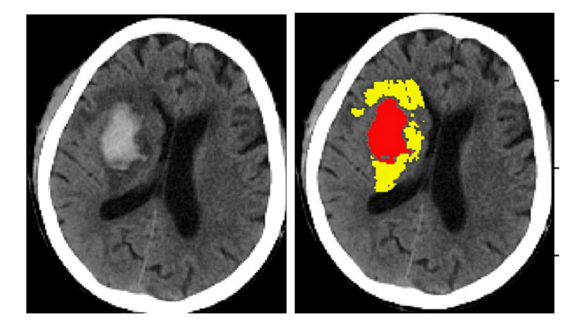

## 出血性脑卒中临床智能诊疗建模

# 背景介绍

出血性脑卒中指非外伤性脑实质内血管破裂引起的脑出血,占全部脑卒中发病率的10-15%。其病因复杂, 通常因脑动脉瘤破裂、脑动脉异常等因素,导致血液从破裂的血管涌入脑组织,从而造成脑部机械性损 伤,并引发一系列复杂的生理病理反应。出血性脑卒中起病急、进展快,预后较差,急性期内病死率高达 45-50%,约80%的患者会遗留较严重的神经功能障碍,为社会及患者家庭带来沉重的健康和经济负担。因 此,发掘出血性脑卒中的发病风险,整合影像学特征、患者临床信息及临床诊疗方案,精准预测患者预 后,并据此优化临床决策具有重要的临床意义。

出血性脑卒中后,血肿范围扩大是预后不良的重要危险因素之一。在出血发生后的短时间内,血肿范围可 能因脑组织受损、炎症反应等因素逐渐扩大,导致颅内压迅速增加,从而引发神经功能进一步恶化,甚至 危及患者生命。因此,监测和控制血肿的扩张是临床关注的重点之一。此外,血肿周围的水肿作为脑出血 后继发性损伤的标志,在近年来引起了临床广泛关注。血肿周围的水肿可能导致脑组织受压,进而影响神 经元功能,使脑组织进一步受损,进而加重患者神经功能损伤。综上所述,针对出血性脑卒中后的两个重 要关键事件,即血肿扩张和血肿周围水肿的发生及发展,进行早期识别和预测对于改善患者预后、提升其 生活质量具有重要意义。

医学影像技术的飞速进步,为无创动态监测出血性脑卒中后脑组织损伤和演变提供了有力手段。近年来, 迅速发展并广泛应用于医学领域的人工智能技术,为海量影像数据的深度挖掘和智能分析带来了全新机 遇。期望能够基于本赛题提供的影像信息,联合患者个人信息、治疗方案和预后等数据,构建智能诊疗模 型,明确导致出血性脑卒中预后不良的危险因素,实现精准个性化的疗效评估和预后预测。相信在不久的 将来,相关研究成果及科学依据将能够进一步应用于临床实践,为改善出血性脑卒中患者预后作出贡献。

图1. 左图脑出血患者CT平扫,右图红色为血肿,黄色为血肿周围水肿

# 数据集介绍及建模目标

赛题提供了160例(100例训练数据集+60例独立测试数据集)出血性脑卒中患者的个人史、疾病史、发病 及治疗相关信息、多次重复的影像学检查(CT平扫)结果及患者预后评估,该部分信息可在"**表1-患者列表 及临床信息"**中查询。如图1为脑出血患者CT平扫,红色为血肿区域,黄色为水肿区域。赛题提供影像学检 查数据,包括各个时间点血肿/水肿的体积、位置、形状特征及灰度分布等信息。体积及位置信息可在"表 2-患者影像信息血肿及水肿的体积及位置"中查询。形状及灰度分布信息可在"表3-患者影像信息血肿及 水肿的形状及灰度分布"中查询。

赛题目标:通过对真实临床数据的分析,研究出血性脑卒中患者血肿扩张风险、血肿周围水肿发生及演进规律,最终结合临床和影像信息,预测出血性脑卒中患者的临床预后。

#### 目标变量:

- •发病48小时内是否发生血肿扩张:1是;0否。
- •发病后90天 mRS0-6有序等级变量。其中mRS是评估卒中后患者功能状态的 重要工具,详见附件2相关概念。

### 临床信息:相关信息在"表1-患者列表及临床信息"中获 取。

- ID患者ID
  - ◦训练数据集: sub001至sub100共计100例。包含: 患者信息、首次及所有 随访影像数据及90天mRS
  - ◦测试数据集1: sub101至sub130共计30例。包含: 患者信息、首次影像数据。不包含: 随访影像数据及90天mRS
  - ◦测试数据集2: sub131至sub160共计30例。包含: 患者信息、首次及所有 随访影像数据。不包含: 90天mRS
- 入院首次影像检查流水号:一个14位数字编码。前8位代表年月日,后6位为顺序编号(注意:不是时分秒)。流水号是影像检查的唯一编码,具体影像检查时间点可通过对应流水号在"附表1-检索表格-流水号vs时间"中检索。
- •年龄:岁
- •性别:男/女
- 脑出血前mRS评分: 0-6, 有序等级变量
- •高血压病史:1是0否
- 卒中病史: 1是0否
- •糖尿病史:1是0否
- 房颤史: 1是0否
- •冠心病史:1是0否
- 吸烟史: 1是0否
- 饮酒史: 1是0否

#### 发病相关特征,共计2字段。

- 血压: 收缩压/舒张压。单位: 毫米汞柱
- •发病到首次影像检查时间间隔:单位:小时

## 治疗相关特征,共计7字段。

- 脑室引流: 1是0否
- •止血治疗: 1是0否
- •降颅压治疗:1是0否
- 降压治疗: 1是0否
- •镇静、镇痛治疗:1是0否
- •止吐护胃: 1是0否
- 营养神经: 1是0否

## 影像相关特征,共计84字段/时间点。

- 血肿及水肿的体积和位置信息在"表2-患者影像信息血肿及水肿的体积及位置"中获取,包含了:每个时间点血肿(Hemo)总体积及水肿(ED)总体积及不同位置的占比。体积占比定义:血肿/水肿在该位置的体积占总体积大小的比例,取值范围为:0-1。如:0代表该区域没有发生血肿/水肿,1则代表该患者所有血肿/水肿均发生在该区域,可通过占比换算出该位置绝对体积。本赛题采用通用模板,区分左右侧大脑前动脉(ACA\_LACA\_R),左右侧大脑中动脉(MCA\_LMCA\_R),左右侧大脑后动脉(PCA\_LPCA\_R),左右侧脑桥/延髓(Pons\_Medulla\_LPons\_Medulla\_R左右侧小脑(Cerebellum\_LCerebellum\_R)共十个不同位置,具体位置和参考文献见附件2-相关概念。综上,总体积:2个字段(单位:10-3ml位置:20个字段。在每个时间点,体积及位置特征共计22个字段。
- 血肿及水肿的形状及灰度分布在 "表3-患者影像信息血肿及水肿的形状及灰度分布"的两个不同标签页存放,可通过流水号检索对应数据。每个时间点血肿及水肿的形状及灰度特征,反映目标区域内体素信号强度的分布(17个字段)及三维形状的描述(14个字段),因此,在每个时间点,血肿及水肿的形状+灰度分布特征共62字段。
- 注: 重复影像数据根据临床真实情况提供, 重复时间个体间可能存在差异。

## 三、请建模回答如下问题

#### 血肿扩张风险相关因素探索建模。

1. 请根据"表1"(字段:入院首次影像检查流水号,发病到首次影像检查时间间隔),"表2"(字段:各时间点流水号及对应的HM\_volume),判断患者 sub001至sub100发病后48小时内是否发生血肿扩张事件。

结果填写规范:1是0否,填写位置: "表4"C字段(是否发生血肿扩张)。

如发生血肿扩张事件,请同时记录血肿扩张发生时间。

结果填写规范:如10.33小时,填写位置:"表4"D字段(血肿扩张时间)。

● 是否发生血肿扩张可根据血肿体积前后变化,具体定义为:后续检查比
首次检查绝对体积增加≥6 mL或相对体积增加≥33%。

注:可通过流水号至"附表1-检索表格-流水号vs时间"中查询相应影像检查时间点,结合发病到首次影像时间间隔和后续影像检查时间间隔,判断当前影像检查是否在发病48小时内。

 请以是否发生血肿扩张事件为目标变量,基于"表1"前100例患者(sub001至 sub100的个人史,疾病史,发病相关(字段E至W)、"表2"中其影像检查结 果(字段C至X)及"表3"其影像检查结果(字段C至AG注:只可包含对应患者 首次影像检查记录)等变量,构建模型预测所有患者(sub001至sub160)发生血 肿扩张的概率。

注: 该问只可纳入患者首次影像检查信息。

结果填写规范:记录预测事件发生概率(取值范围0-1,小数点后保留4位数);填写位置: "表4" E字段 (血肿扩张预测概率)。

#### 血肿周围水肿的发生及进展建模,并探索治疗干预和水肿进 展的关联关系。

1. 请根据"表2"前100个患者(sub001至sub100)的水肿体积
ED\_volume和重复检查时间点,构建 一条全体患者水肿体积随时间进展
曲线(x轴:发病至影像检查时间,y轴:水肿体积,y=f(x)),计算前100
个患者(sub001至sub100)真实值和所拟合曲线之间存在的残差。

结果填写规范:记录残差,填写位置"表4"F字段(残差(全体))。

 1. 请探索患者水肿体积随时间进展模式的个体差异,构建不同人群(分亚组: 3-5个)的水肿体积随时间进展曲线,并计算前100个患者(sub001至 sub100真实值和曲线间的残差。

结果填写规范:记录残差,填写位置"表4"G字段(残差(亚组)),同时将所属亚组填写在H段(所属 亚组)。

1. 请分析不同治疗方法("表1"字段Q至W)对水肿体积进展模式的影响。
2. 请分析血肿体积、水肿体积及治疗方法("表1"字段Q至W)三者之间的关系。

#### 出血性脑卒中患者预后预测及关键因素探索。

1. 请根据前100个患者(sub001至sub100)个人史、疾病史、发病相关( "表 1" 字段E至W及首次影像结果(表2, 表3中相关字段)构建预测模型, 预 测患者(sub001至sub160)90天mRS评分。

注: 该问只可纳入患者首次影像检查信息。

结果填写规范:记录预测mRS结果, 0-6, 有序等级变量。填写位置"表4" I字段(预测mRS基于首次 影像))。

 1. 根据前100个患者(sub001至sub100)所有已知临床、治疗(表1字段E到 W表2及表3的影像(首次+随访)结果,预测所有含随访影像检查的患者 sub001至sub100,sub131至sub16090天mRS评分。

结果填写规范:记录预测mRS结果,0-6,有序等级变量。填写位置"表4"J字段(预测mRS)。

 1. 请分析出血性脑卒中患者的预后(90天mRS)和个人史、疾病史、治疗方法 及影像特征(包括血肿/水肿体积、血肿/水肿位置、信号强度特征、形状特 征)等关联关系,为临床相关决策提出建议。

## 四、附件

- 表1-患者列表及临床信息.xlsx
- 表2-患者影像信息血肿及水肿的体积及位置.xlsx
- 表3-患者影像信息血肿及水肿的形状及灰度分布.xlsx
- 表4-答案文件.xlsx
- 附表1-检索表格-流水号vs时间.xlsx
- 附件2-相关概念.docx