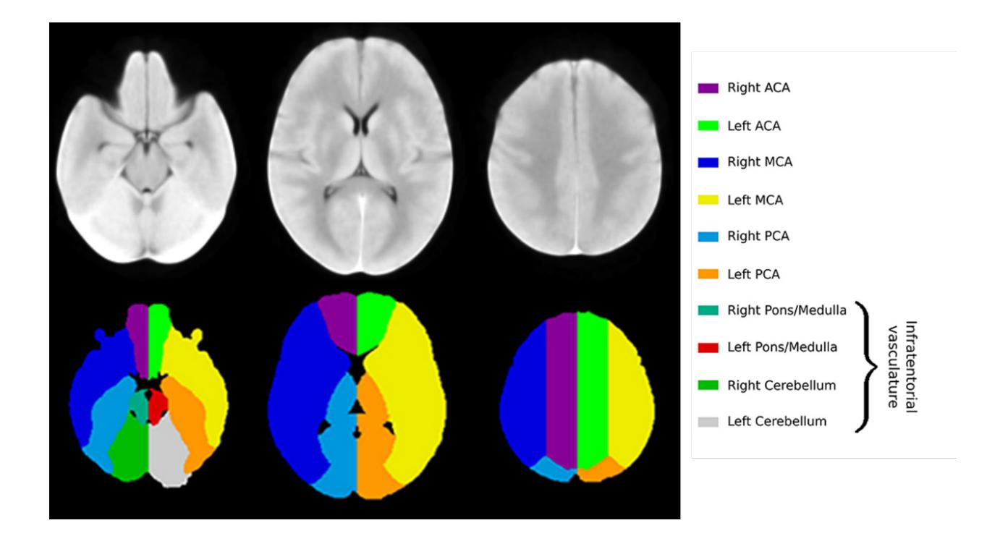

# 出血性脑卒中临床相关概念

- 治疗相关:出血性脑卒中的治疗是一个综合性的过程,需要综合考虑患者的病情、 颅内压力、血压控制、血液管理等因素,并由医生根据具体情况制定个体化的治疗 方案。
- **脑室引流:**用于治疗出血性脑卒中的手术干预方法,主要适用于脑出血导致脑室内积聚大量血液或引起脑积水。脑室引流是一种侵入性的手术干预,可能伴随一些并发症和风险。这包括感染、出血、导管堵塞、导管移位等。因此,脑室引流需要在专业医生的指导下进行,并密切监测患者的情况。
- **止血治疗:** 血凝酶是一种促进血液凝固的蛋白酶,可用于颅内动脉瘤破裂引起的蛛网膜下腔出血。血凝酶治疗可能伴随一些风险和并发症,在治疗前需要权衡治疗的潜在益处和风险,并仔细评估患者的收益和风险比例。
- **降颅压治疗**: 甘露醇、甘油果糖等药物可减轻颅内压力, 降低脑组织的水肿、调节脑血管的收缩和扩张、降低脑代谢率等。
- **降压治疗**:乌拉地尔、硝酸甘油等药物可控制患者血压,是出血性脑卒中治疗的重要一环。通过降低血压,可以减少血管的进一步破裂和出血,从而减轻脑损伤的程度。
- •镇静、镇痛治疗:相关治疗可减轻患者的疼痛和不适感,提供舒适的治疗环境。镇静镇痛药物使用可能伴随一些风险和并发症,包括呼吸抑制、低血压、过敏反应等。在给予镇静镇痛药物之前,需要评估患者的适应症和风险,并密切监测患者的病情和反应。
- 止吐护胃:可预防和缓解患者可能出现的恶心、呕吐和胃酸分泌增加等胃肠道并发症。
- **营养神经**:可提供适当的营养支持和促进神经功能恢复,维持免疫功能、促进伤口愈合和预防并发症的发生。
- **残差:**数理统计中残差指实际观察值与估计值(拟合值)之间的差。"残差"蕴含 了有关模型基本假设的重要信息。如果回归模型正确的话,可以将残差看作误差的 观测值。
- 2. 卒中患者预后:患者预后是指对患者疾病进展、康复或生存情况的预测/评估。卒中 后,医生和医疗专业人员可以根据患者的神经功能损伤情况和生活自理能力等状态 进行评估,据此预测/评估患者的病情发展、治疗反应、生存期望和功能恢复等。在 卒中相关临床研究中通常用改良的Rank评分(mRS),NIHSS评分或生活状态BI 评分等来量化患者的预后,来分析疾病进展或治疗疗效。本试题中应用mRS来评估 脑卒中患者的功能状态和残疾程度。

#### mRS评分范围从0到6,具体如下:

- 0:没有症状,没有残疾。
- 1: 没有明显的残疾,能够独立进行日常活动。
- 2: 有轻度残疾, 能够自理, 但在活动中存在一些限制。
- 3: 有中度残疾, 需要一定程度的帮助和照顾, 但能够坐立或站立。

- 4: 有中重度残疾, 需要全天候照顾和帮助, 无法行走或自理。
- 5:完全依赖他人,不能进行任何活动,床上活动有困难。
- 6:死亡。

#### 1. 血肿,水肿影像特征

• **位置:全脑共划分为10个不同位置,包括**ACA大脑前动脉,MCA大脑中动脉,PCA 大脑后动脉,Pons/Medulla脑桥/延髓,Cerebellum小脑(Schirmer,Giese et al. 2019)具体如下图所示。

- 灰度特征:基本的度量值,反映目标区域内体素强度的分布
- 1. 10Percentile
- 2. 90Percentile
- 3. Energy
- 4. Entropy
- 5. InterquartileRange
- 6. Kurtosis
- 7. Maximum
- 8. MeanAbsoluteDeviation
- 9. Mean
- 10. Median
- 11. Minimum
- 12. Range
- 13. RobustMeanAbsoluteDeviation
- 14. RootMeanSquared
- 15. Skewness

- 16. Uniformity
- 17. Variance

## •形状特征:对目标区域三维形状描述

- 1. Elongation
- 2. Flatness
- 3. LeastAxisLength
- 4. MajorAxisLength
- 5. Maximum2DDiameterColumn
- 6. Maximum2DDiameterRow
- 7. Maximum2DDiameterSlice
- 8. Maximum3DDiameter
- 9. MeshVolume
- 10. MinorAxisLength
- 11. Sphericity
- 12. SurfaceArea
- 13. SurfaceVolumeRatio
- 14. VoxelVolume

### 注: 以上特征定义可参考: <u>http://pyradiomics.readthedocs.io/</u>

## 参考文献

Schirmer, M. D., A.-K. Giese, P. Fotiadis, M. R. Etherton, L. Cloonan, A. Viswanathan, S. M. Greenberg, O. Wu and N. S. Rost (2019). "Spatial Signature of White Matter Hyperintensities in Stroke Patients." Frontiers in Neurology **10**.