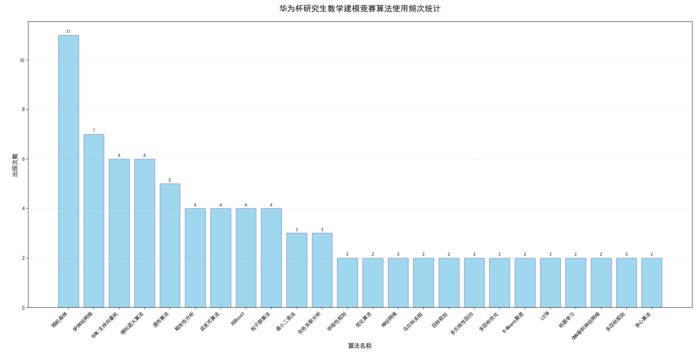

# 备赛计划
| 日期 | 学习计划 |
|------|----------|
| Day1 | 找到近3年的优秀论文，把理面用到的算法记下来 |
| Day2 | 学习数据预处理，由2023年研赛趋势，无论哪道题都会有数据处理的部分，所以数据预处理是必须学习的部分 |
| Day3 | 学习数据预处理，由2023年研赛趋势，无论哪道题都会有数据处理的部分，所以数据预处理是必须学习的部分 |
| Day4 | 把Day1的算法按照题目分类，开始学习，每天学习3到4个算法 |
| Day5 | 把Day1的算法按照题目分类，开始学习，每天学习3到4个算法 |
| Day6 | 把Day1的算法按照题目分类，开始学习，每天学习3到4个算法 |
| Day7 | 找好论文模板，下载好要用的软件，matlab,jupyter,spss等，并且选一年的赛题进行模拟练习 |

# 赛题分析
## 2024年赛题分析

| 分类 | 时间 | 题目 | 方向 | 主要算法和知识点 |
|------|------|------|------|---------------------|
| A题 | 2024年 | 风电场有功功率优化分配 | 新能源与电力系统优化 | 物理力学（能量守恒等）、优化理论（线性/非线性规划、随机优化）、随机逼近（处理不确定性因素） |
| B题 | 2024年 | WLAN组网中网络吞吐量建模 | 计算机网络与通信工程 | WLAN物理层与MAC层机制、统计分析（回归分析等）、机器学习（SVM、随机森林等分类/回归算法）、优化算法（用于精度提升） |
| C题 | 2024年 | 数据驱动下磁性元件的磁芯损耗建模 | 电气工程与材料科学交叉 | 信号处理（特征提取）、统计学（多元回归、方差分析）、机器学习（SVM、随机森林、神经网络）、优化算法（模型优化） |
| D题 | 2024年 | 大数据驱动的地理综合问题 | 地理信息与大数据分析 | 描述性统计、地理加权回归（GWR）、GIS空间分析、地理大数据挖掘算法 |
| E题 | 2024年 | 高速公路应急车道紧急启用模型 | 交通工程与智能决策 | 交通流理论（车流密度、流量、速度分析）、实时预警模型（时间序列分析、机器学习分类）、验证评估方法（对比分析、误差检验） |
| F题 | 2024年 | X射线脉冲星光子到达时间建模 | 天体物理与信号处理 | 卫星轨道力学（轨道根数计算位置速度）、几何传播时延模型（光速传播公式）、误差分析（多种时延因素综合）、泊松分布与脉冲轮廓折叠（光子到达时间仿真分析） |

## 历年赛题回顾

| 题目 | 年份 | 题目名称 | 主要算法和知识点 |
|------|------|----------|------------------|
| A题 | 2023年 | WLAN网络信道接入机制建模（华为题目） | 通信原理、排队论、马尔科夫链、二分法、牛顿迭代法 |
| A题 | 2022年 | 移动场景超分辨定位问题（华为题目） | 超分辨率定位、最小二乘法、变分贝叶斯、压缩感知算法 |
| A题 | 2021年 | 相关矩阵组的低复杂度计算和存储建模（华为题目） | 相关矩阵组、相关性分析、SVD算法 |
| A题 | 2020年 | ASIC芯片上的数波恢复DSP算法设计与实现 | LS算法、目标规划模型、装特卡洛模拟法、CR算法 |
| B题 | 2024年 | FFT矩阵快速分解与并行计算优化（假设华为题目） | 快速傅里叶变换、并行算法设计、稀疏矩阵分解、GPU加速计算模型 |
| B题 | 2023年 | DFT类矩阵的整数分解逼近（华为题目） | 离散傅里叶变换、稀疏优化、递传算法、蝶形运算分解法、模型逼近算法 |
| B题 | 2022年 | 方形件组批优化问题（华为题目） | 整数线性规划模型、启发式算法、深度优先搜索 |
| B题 | 2021年 | 空气质量预报二次建模 | XGBoost算法、BP神经网络、随机森林、向量自回归模型VAR、多元线性回归模型、灰色关联度分析 |
| B题 | 2020年 | 降低汽油精制过程中的辛烷值损失模型 | 灰色关联、BP神经网络、遗传算法、随机森林、相关性分析、粒子群算法、非线性规划模型 |
| C题 | 2023年 | 大规模创新类竞赛评审方案研究 | 混合整数规划模型、BP神经网络、随机森林、动态加权评分排序模型 |
| C题 | 2022年 | 汽车制造涂装-总装缓存调序区调度优化问题 | 启发式算法、多目标优化模型、遗传算法、马尔可夫决策、动态规划、模拟退火算法 |
| C题 | 2021年 | 帆金森病的脑深部电刺激治疗建模研究 | 最小二乘法、Hodgkin-Huxley模型、多目标优化 |
| C题 | 2020年 | 面向康复工程的脑电信号分析和判别模型 | 主成分分析、支持向量机、随机森林、K-Means聚类 |
| D题 | 2023年 | 区域双碳目标与路径规划研究 | 回归预测模型、路径规划、多元线性回归、随机森林算法、GA-MPSO最优化算法、LSTM模型 |
| D题 | 2022年 | PISA架构芯片资源调度问题（中兴题） | 0-1线性规划模型、模拟退火算法、图论、模拟退火、启发式算法、SVM、遗传算法 |
| D题 | 2021年 | 抗乳腺癌候选药物的优化建模 | 支持向量机、神经网络、目标规划、遗传算法、灰色关联分析、机器学习、相关性分析、随机森林 |
| D题 | 2020年 | 无人机集群协同对抗 | 对抗规划、博弈论、BP神经网络 |
| E题 | 2023年 | 出血性脑卒中临床智能诊疗建模 | 决策树回归、随机森林、CNN卷积神经网络、支持向量机、BP神经网络、XGBoost |
| E题 | 2022年 | 草原放牧策略研究 | 随机森林-LightGBM组合预测、熵值法-Topsis综合评价法、模拟退火算法、K-Means、XGBoost |
| E题 | 2021年 | 信号干扰下的超宽带（UWB）精确定位问题 | 机器学习、BP神经网络、分类预测、最小二乘法、粒子群算法 |
| E题 | 2020年 | 探索大雾演化规律，预测大雾变化趋势 | 灰度预测模型、卷积神经网络、多元回归分析、时间序列模型、相关性分析 |
| F题 | 2023年 | 强对流降水临近预报 | 集成学习、XGBoost、BP神经网络、熵权-TOPSIS评估模型、随机森林模型、LSTM |
| F题 | 2022年 | COVID-19疫情期间生活物资的科学管理问题 | 整数规划、遗传算法、模拟退火算法、ARIMA模型、粒子群算法、Dijkstra最短路径 |
| F题 | 2021年 | 航空公司机组优化排班问题 | 多目标规划、启发式算法、贪心算法、多目标规划 |
| F题 | 2020年 | 飞行器原心平衡供油策略优化研究 | 贪婪算法、模拟退火、差分优化、粒子群算法、分层优化 |

## 算法出现频次图(统计出现次数>=2的算法)

# 提示词模板

## 自用提示词
1.根据论文，列举出这篇论文中所有用到的算法，包含每个算法是为了解决哪一个问题，用途，任务类型，具体应用。内容写入到所用到的算法.md中

2.根据论文，在论文中找出关于xxx算法的描述，内容写入到名为xxx在论文中的描述.md中。注意：要保证完全和正文的描述一致，不要擅自修改文字

3.根据论文，分析作者为什么选用xxx算法，内容写入到名为什么选用xxx算法.md中

4.根据论文，使用Python实现一个最精简的xxx算法的通用模板，只需要有训练，预测，评估三个部分，内容写入到名为xxx通用模板.py中

## 提示词模板-题目分析类：

1.你是一位有20年数学建模竞赛指导经验的资深专家，请深度分析这道题目的核心问题、数学本质、求解难点，并从问题类型判定、变量识别、约束分析、目标函数设计、求解方法选择等角度给出详细的建模思路，同时评估各种可能方案的可行性、创新性和竞赛得分潜力。

2.请从实际应用专家的角度分析这个问题的现实背景和意义，识别问题中涉及的行业特点、利益相关者、实际约束条件，并提出符合现实情况的建模假设和简化策略。

## 提示词模板-数学建模类：

1.你是运筹优化领域的顶级专家，请为这个问题设计完整的数学模型，包括精确的变量定义、目标函数表达式、约束条件公式，并分析模型的数学性质（线性/非线性、凸性、可分解性等）。

2.请建立这个问题的多种数学模型（至少3种不同方法），对比分析每种模型的优缺点、适用条件、求解复杂度，并从模型精度、计算效率、可解释性、创新性等维度进行综合评价，推荐最佳建模方案。

3.作为应用统计学专家，请为这个数据驱动的问题设计统计建模方案，包括数据预处理策略、特征工程方法、模型选择准则、参数估计方法、假设检验程序，并考虑数据质量、样本大小、多重共线性等统计问题的处理。

4.请从机器学习角度重新审视这个建模问题，分析是否可以转化为监督学习、无监督学习或强化学习问题，设计特征提取方案、模型架构选择、训练策略制定，并与传统数学建模方法进行对比分析。

## 提示词模板-代码实现类：

1.你是算法工程师专家，请用Python实现这个数学模型的完整求解代码，要求使用面向对象设计、包含详细注释、具备异常处理、支持参数调优、提供可视化结果，并确保代码的可扩展性和可维护性，同时编写使用示例和性能测试。

2.请编写高质量的MATLAB代码实现这个优化模型，使用Optimization Toolbox或其他专业工具箱，包含完整的参数设置、求解器选择、结果分析、敏感性测试，并提供详细的代码注释和使用说明文档。

3.作为数值计算专家，请实现这个算法的高效版本，考虑向量化计算、内存优化、并行处理、数值稳定性等因素，提供多种求解器选项（精确算法、启发式算法、近似算法），并包含算法复杂度分析和性能基准测试。

4.请为这个建模问题编写完整的数据处理和分析代码，包括数据清洗、异常值检测、缺失值处理、特征工程、探索性数据分析、可视化展示。

## 提示词模板-结果分析类：

1.请从建模专家视角出发，评估以下模型的性能，使用MAE、RMSE、R²、AUC、F1、准确率等指标，并分析它们在本任务下的优缺点与适用性。

2.作为数据科学家，请深度分析这些计算结果的统计意义和实际含义，进行趋势分析、相关性分析、因果分析，识别数据中的模式和异常，并提出基于数据洞察的决策建议和风险预警。

3.请对模型结果进行全面的敏感性分析和稳定性测试，分析关键参数变化对结果的影响程度，识别模型的敏感参数和鲁棒性边界，并提出模型改进和风险控制建议。

## 提示词模板-论文写作类：

1.你是学术写作专家，请为这个数学建模问题撰写高质量的论文摘要，要求准确概括问题背景、建模方法、主要创新、核心结果和实际价值，语言严谨学术，逻辑清晰完整，突出亮点和贡献。

2.请撰写这个模型的详细建立过程，包括问题分析、假设条件、变量定义、模型推导、参数说明，要求数学表达严谨、推导过程清晰、符号使用规范、逻辑层次分明，体现深度的数学思维和扎实的理论基础。

3.作为竞赛论文写作导师，请写一段高水平的结果分析段落，要求深入解读数据含义、挖掘结果规律、分析实际意义、提出改进建议，语言表达专业严谨，分析深度到位，展现出色的洞察力和专业素养。

4.请写一段模型评价与推广应用的内容，客观分析模型的优势和局限性，讨论适用范围和改进方向，探讨在相关领域的推广价值，要求评价全面客观、建议具体可行、视野开阔前瞻。

## 提示词模板-创新类：

1.作为算法专家，请分析这个模型的渐进和改进空间，从算法复杂度、数值稳定性、收敛速度、解的质量等角度提出具体的优化策略，设计改进方案并评估改进效果，确保优化方案的理论正确性和实际可行性。

2.请对这个建模方案进行创新性改进，考虑引入新的数学理论、算法技术或建模思路，分析改进方案的理论依据、技术优势、实现难度，并评估改进后的模型在精度、效率、创新性等方面的提升潜力。